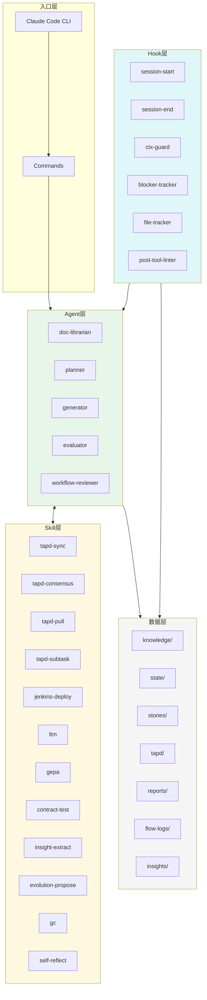
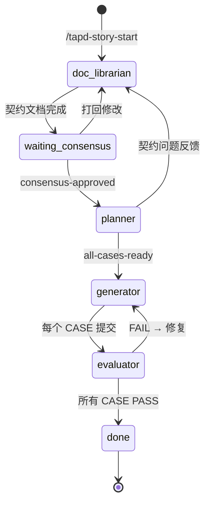

# 系统架构

## 整体架构



## 模块依赖关系

### Agent → Agent

```
doc-librarian ──▶ planner
    ▲
    └── feedback (契约问题)
```

### Agent → Skill

```
planner ──▶ tapd-subtask
planner ──▶ tapd-init

generator ──▶ tapd-sync
generator ──▶ jenkins-deploy
generator ──▶ contract-test

evaluator ──▶ contract-test

workflow-reviewer ──▶ insight-extract
workflow-reviewer ──▶ evolution-propose
workflow-reviewer ──▶ self-reflect

session-start hook ──▶ tapd-sync
session-start hook ──▶ gc
session-start hook ──▶ ltm
```

### Skill → Hook

```
tapd-consensus ──▶ session-start (事件触发)
tapd-subtask ──▶ session-start (事件触发)

gc ──▶ session-start (自动触发)
self-reflect ──▶ session-end (自动触发)
```

## 领域模型

### Story（故事/工单）

```python
class Story:
    story_id: str           # STORY-001 或 TAPD ID
    phase: Phase            # doc-librarian/planner/generator/done
    verdicts: dict          # CASE-N -> PASS/FAIL/PENDING
    contract_version: str   # 契约版本
    contract_hash: str      # 契约哈希（校验用）
```

### Case（任务用例）

```python
class Case:
    case_id: str            # CASE-01
    story_id: str           # 所属 Story
    status: Status          # pending/in_progress/done
    blocked_by: list        # 依赖的 Case
    verdit: Verdict         # PASS/FAIL/null
```

### Phase（阶段）

```
doc-librarian → waiting-consensus → planner → generator → evaluator → done
```

### Event（事件）

```python
class Event:
    event_type: str         # tapd:consensus-approved / planner:all-cases-ready 等
    timestamp: str          # ISO8601
    payload: dict           # 事件数据
    source: str             # 发布者
```

## 文件路由表

| 功能 | 文件路径 |
|------|----------|
| Story 状态 | `.chatlabs/state/workflow-state.json` |
| 事件总线 | `.chatlabs/state/events.jsonl` |
| 契约文档 | `.chatlabs/stories/{story_id}/contract.md` |
| 技术 Spec | `.chatlabs/stories/{story_id}/spec.md` |
| 案例列表 | `.chatlabs/stories/{story_id}/cases/` |
| Evaluator 报告 | `.chatlabs/reports/` |
| 知识库索引 | `.chatlabs/knowledge/README.md` |
| Flow 来源 | `.claude/.flow-source.json` |

## 状态流转图

