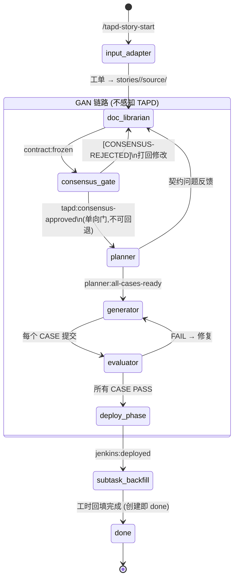

# 系统架构

## 整体架构

```mermaid
flowchart TB
    subgraph 入口层
        CLI[Claude Code CLI]
        CMDS[Commands]
    end

    CLI --> CMDS

    subgraph Agent层
        DL[doc-librarian]
        PL[planner]
        GN[generator]
        EV[evaluator]
        WR[workflow-reviewer]
    end

    subgraph Skill层
        TAPD_S[tapd-sync]
        TAPD_C[tapd-consensus]
        TAPD_P[tapd-pull]
        TAPD_SUB[tapd-subtask]
        JD[jenkins-deploy]
        ~~LTM[ltm]~~
        IR[insight-extract]
        GC[gc]
        SF[self-reflect]
    end

    subgraph Hook层
        SS[session-start]
        SE[session-end]
        CG[ctx-guard]
        BT[blocker-tracker]
        FT[file-tracker]
        PF[post-tool-linter]
    end

    subgraph 数据层
        KC[knowledge/]
        STATE[state/]
        STORIES[stories/]
        TAPD[tapd/]
        REPORTS[reports/]
        FLOW_LOGS[flow-logs/]
        INSIGHTS[insights/]
    end

    CMDS --> Agent层
    Agent层 <--> Skill层
    Agent层 --> 数据层
    Hook层 --> Agent层
    Hook层 --> 数据层

    style Agent层 fill:#e8f5e9
    style Skill层 fill:#fff8e1
    style Hook层 fill:#e0f7fa
    style 数据层 fill:#f5f5f5
```

## 模块依赖关系

### Agent → Agent

```
doc-librarian ──▶ planner
    ▲
    └── feedback (契约问题)
```

### Agent → Skill

```
planner ──▶ tapd-subtask
planner ──▶ tapd-init

generator ──▶ tapd-sync
generator ──▶ jenkins-deploy

workflow-reviewer ──▶ insight-extract
workflow-reviewer ──▶ self-reflect

session-start hook ──▶ tapd-sync
session-start hook ──▶ gc
~~session-start hook ──▶ ltm~~
```

### Skill → Hook

```
tapd-consensus ──▶ session-start (事件触发)
tapd-subtask ──▶ session-start (事件触发)

gc ──▶ session-start (自动触发)
self-reflect ──▶ session-end (自动触发)
```

## 领域模型

### Story（故事/工单）

```python
class Story:
    story_id: str           # STORY-001 或 TAPD ID
    phase: Phase            # doc-librarian/planner/generator/done
    verdicts: dict          # CASE-N -> PASS/FAIL/PENDING
    contract_version: str   # 契约版本
    contract_hash: str      # 契约哈希（校验用）
```

### Case（任务用例）

```python
class Case:
    case_id: str            # CASE-01
    story_id: str           # 所属 Story
    status: Status          # pending/in_progress/done
    blocked_by: list        # 依赖的 Case
    verdit: Verdict         # PASS/FAIL/null
```

### Phase（阶段）

```
doc-librarian → waiting-consensus → planner → generator → evaluator → done
```

### Event（事件）

```python
class Event:
    event_type: str         # tapd:consensus-approved / planner:all-cases-ready 等
    timestamp: str          # ISO8601
    payload: dict           # 事件数据
    source: str             # 发布者
```

## 文件路由表

| 功能 | 文件路径 |
|------|----------|
| Story 状态 | `.chatlabs/state/workflow-state.json` |
| 事件总线 | `.chatlabs/state/events.jsonl` |
| 契约文档 | `.chatlabs/stories/{story_id}/contract.md` |
| 技术 Spec | `.chatlabs/stories/{story_id}/spec.md` |
| 案例列表 | `.chatlabs/stories/{story_id}/cases/` |
| Evaluator 报告 | `.chatlabs/reports/` |
| 知识库索引 | `.chatlabs/knowledge/README.md` |

## 状态流转图(v2 — TAPD 与 GAN 解耦)



**关键变化(v2)**:
- **input_adapter 步骤**:`/tapd-story-start` 把工单素材落地 `source/`,doc-librarian 不感知来源
- **consensus_gate 是单向门**:GAN 内任何阶段不可回退到评审(只有评审被 REJECTED 时回到 doc-librarian)
- **subtask_backfill 在 deploy 后**:`/tapd-subtask-emit` 批量创建 done 状态 subtask + AI 估算工时
- **父工单状态不动**:由 PM 手工管理,GAN 不联动 TAPD 父工单

## 角色责任分布(v2)

| 模块 | 是否感知 TAPD | 说明 |
|------|--------------|------|
| `/tapd-story-start` command | ✅ 感知 | 输入适配:把工单 → source/ |
| `doc-librarian` agent | ❌ 不感知 | 只读 source/,不知道来源 |
| `planner` agent | ❌ 不感知 | 只关心拆 case + 写 affected_files |
| `generator` agent | ❌ 不感知 | 只关心代码实现 |
| `evaluator` agent | ❌ 不感知 | 只关心契约测试 |
| `/tapd-consensus-push/fetch` | ✅ 感知 | 评审门的 TAPD 实现 |
| `/tapd-subtask-emit` command | ✅ 感知 | 输出回填:工时台账 |
| `estimator` subagent | ❌ 不感知 | 只关心 case + diff → 工时