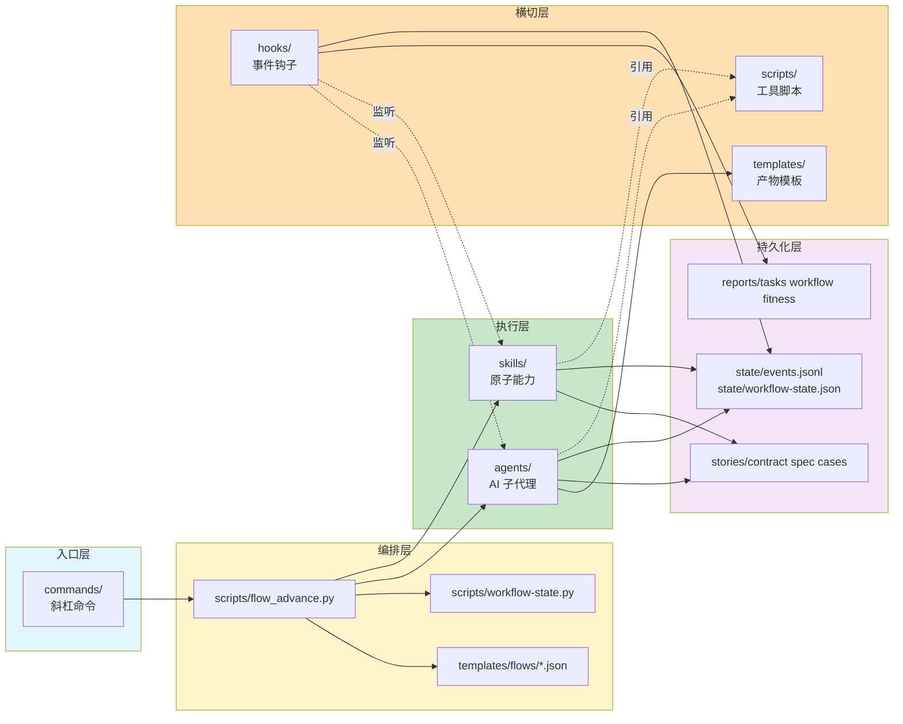
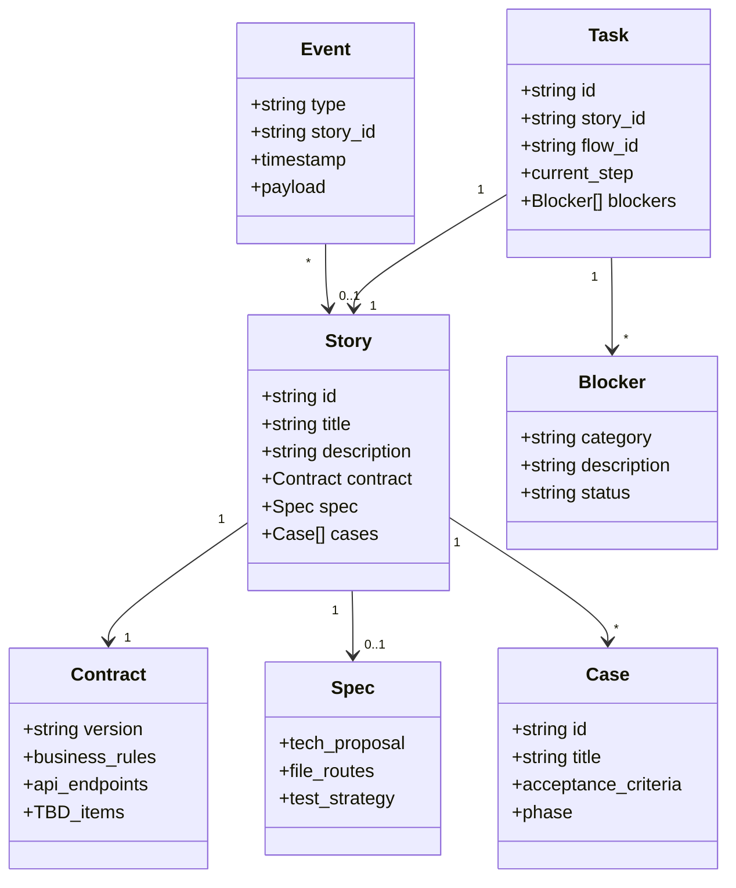

# 架构 — architecture

## 1. 架构模式

**事件驱动 + 数据化流程编排**。没有传统 MVC / DDD / Clean 分层，因为本项目不是业务系统而是 Claude Code 配置框架。

核心机制：

| 机制 | 实现 |
|------|------|
| 流程编排 | JSON 模板（`.claude/templates/flows/*.json`）+ flow_advance.py 解释器 |
| 事件总线 | `.chatlabs/state/events.jsonl`（append-only） |
| 状态机 | `.chatlabs/state/workflow-state.json` |
| 路径 SSOT | `.claude/scripts/paths.py` |
| 产物布局 SSOT | `.claude/artifacts-layout.md` |
| 契约 SSOT | `.chatlabs/stories/<id>/contract.md` |

## 2. 模块依赖图


```mermaid
flowchart LR
    subgraph entry[入口层]
        CMD[commands/<br/>斜杠命令]
    end

    subgraph control[编排层]
        FA[scripts/flow_advance.py]
        WS[scripts/workflow-state.py]
        FT[templates/flows/*.json]
    end

    subgraph workers[执行层]
        AGT[agents/<br/>AI 子代理]
        SK[skills/<br/>原子能力]
    end

    subgraph cross[横切层]
        HK[hooks/<br/>事件钩子]
        SC[scripts/<br/>工具脚本]
        TPL[templates/<br/>产物模板]
    end

    subgraph store[持久化层]
        STA[state/events.jsonl<br/>state/workflow-state.json]
        STO[stories/contract spec cases]
        REP[reports/tasks workflow fitness]
    end

    CMD --> FA
    FA --> FT
    FA --> WS
    FA --> AGT
    FA --> SK
    AGT --> TPL
    AGT --> STO
    SK --> STO
    HK -. 监听 .-> AGT
    HK -. 监听 .-> SK
    HK --> REP
    AGT --> STA
    SK --> STA
    HK --> STA
    AGT -. 引用 .-> SC
    SK -. 引用 .-> SC

    style entry fill:#e1f5ff
    style control fill:#fff4cc
    style workers fill:#c8e6c9
    style cross fill:#ffe0b2
    style store fill:#f3e5f5
```

### 依赖方向硬规则

- **入口层 → 编排层 → 执行层 → 持久化层**（单向）
- **横切层（hooks/scripts/templates）** 不依赖业务模块，只被引用
- ❌ 禁止：执行层（agents/skills）反向依赖入口层
- ❌ 禁止：skill 引用其他 skill（AGENTS.md 明令）
- ✅ 允许：agent 调用 skill；command 调用 agent + skill

## 3. 模块清单

| 模块 | 职责 | 文件数 | 详见 |
|------|------|--------|------|
| `agents/` | AI 子代理（doc-librarian / planner / generator / evaluator / session-auditor / workflow-reviewer） | 6 | [modules/agents.md](../tech/backend/modules/agents.md) |
| `commands/` | 斜杠命令（init-project / start-dev-flow / story-start / session-review / sprint-review / workflow-review + tapd/* + task/* + worktree/*） | 18 | [modules/commands.md](../tech/backend/modules/commands.md) |
| `skills/` | 原子能力（context-reset / fitness-run / gc / git-commit-push / jenkins-deploy / tapd-* x5） | 10 | [modules/skills.md](../tech/backend/modules/skills.md) |
| `hooks/` | 事件钩子（block-sensitive-files / blocker-tracker / ctx-guard / file-tracker / post-tool-linter-feedback / session-start / session-end） | 7 | [modules/hooks.md](../tech/backend/modules/hooks.md) |
| `scripts/` | Python 工具（paths SSOT / flow_advance / workflow-state / task / task_store） | 5 | [modules/scripts.md](../tech/backend/modules/scripts.md) |
| `templates/` | 产物骨架（contract / spec / evaluator-rubric + flows/ + story/ + task-report/） | 多个 | [modules/templates.md](../tech/backend/modules/templates.md) |

## 4. 领域模型（数据实体）


```mermaid
classDiagram
    class Story {
        +string id
        +string title
        +string description
        +Contract contract
        +Spec spec
        +Case[] cases
    }
    class Contract {
        +string version
        +business_rules
        +api_endpoints
        +TBD_items
    }
    class Spec {
        +tech_proposal
        +file_routes
        +test_strategy
    }
    class Case {
        +string id
        +string title
        +acceptance_criteria
        +phase
    }
    class Task {
        +string id
        +string story_id
        +string flow_id
        +current_step
        +Blocker[] blockers
    }
    class Blocker {
        +string category
        +string description
        +string status
    }
    class Event {
        +string type
        +string story_id
        +timestamp
        +payload
    }

    Story "1" --> "1" Contract
    Story "1" --> "0..1" Spec
    Story "1" --> "*" Case
    Task "1" --> "1" Story
    Task "1" --> "*" Blocker
    Event "*" --> "0..1" Story
```

## 5. 三层目录边界

```
.claude/      → Flow 基础设施（agents/commands/skills/hooks/scripts/templates）
              → 提交到 Git，所有用户共享
              → 改这里 = 改 Flow 行为

.chatlabs/    → 运行时数据 + 项目配置
              → 部分提交（stories/reports/knowledge）
              → 部分忽略（state/tapd/tickets/）
              → 改这里 = 改产物或状态

docs/         → 人工撰写的规范文档
              → 提交到 Git，仅供阅读
              → 改这里 = 改团队工作约定
```

边界由 `.claude/scripts/paths.py` 强制（Python 侧）+ doc-librarian.md 声明（防写入）。

## 6. 关键状态机

### Story 状态机

```
draft → contract-frozen → spec-ready → in-progress → done
                                  ↓
                              qa-rejected → in-progress（reopen）
```

### Task flow 状态机

由 `flow_advance.py` 解释 `templates/flows/*.json`，每步状态：

```
pending → running → succeeded → (next step)
                  ↓
                  failed → blocker + 暂停
```

## 7. 跨流程通信

唯一通道：`.chatlabs/state/events.jsonl`。

```jsonl
{"ts":"2026-05-06T10:00:00Z","type":"contract:frozen","story_id":"05-06-login","payload":{"version":"v1.0"}}
{"ts":"2026-05-06T10:30:00Z","type":"consensus-approved","story_id":"05-06-login","payload":{"approver":"PM"}}
```

任何模块都可以追加事件；`session-start.py` hook 在新 session 启动时回放近期事件还原状态。

## 8. 进化机制

`.chatlabs/flow-logs/` 是 Flow 的"记忆体"：

- 每完成一个 task 写一条 `flow-logs/YYYY-MM/FL-*.json`
- `insights/` 提取共性模式
- `evolution-proposals/` 由 AI 提出改进建议（待人工确认 → 应用）

形成 **观察 → 提议 → 应用 → 观察** 的闭环，让 Flow 自身随使用进化。
