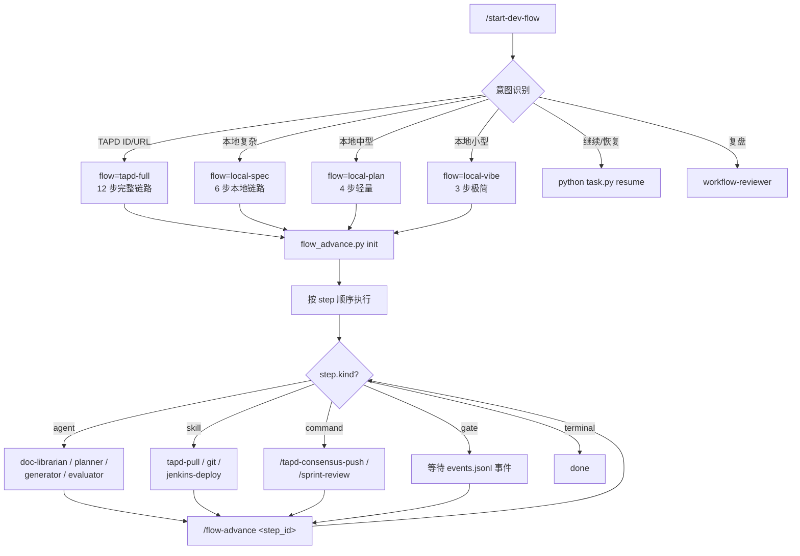

# 核心业务功能 — core-functions

## 1. 主流程：流程编排数据化

整个系统围绕"**用户描述意图 → 自动路由到 flow 模板 → 按 step 顺序执行**"展开。



### 4 个流程模板

| flow_id | 适用场景 | 步骤序列 |
|---------|---------|---------|
| **tapd-full** | TAPD 工单完整开发 | tapd-pull → doc-librarian → consensus-push → wait-approve → planner → subtask-emit → generator → evaluator → git-push → deploy → subtask-close → sprint-review → done |
| **local-spec** | 本地复杂需求 | doc-librarian → planner → generator → evaluator → git-push → deploy → done |
| **local-plan** | 本地中型需求 | todo-write → edit → git-push → deploy → done |
| **local-vibe** | 本地小修改 | edit → git-push → deploy → done |

模板存放：`.claude/templates/flows/<flow_id>.json`。**改流程 = 改 JSON，不改代码**。

---

## 2. Story 生命周期

```
新建 Story
  ↓ doc-librarian
contract.md（业务契约 / openapi.yaml）
  ↓ consensus-push（推 TAPD Wiki 评审）
PM 评审通过 → 契约冻结
  ↓ planner
spec.md + cases/CASE-*.md
  ↓ generator
代码实现（含单元测试）
  ↓ evaluator（无偏验收）
契约测试 verdict
  ↓ git-push + jenkins-deploy
部署到测试环境
  ↓ subtask-close（QA）
QA 通过 → done
```

### 关键产物路径

| 产物 | 路径 | 产出方 |
|------|------|--------|
| 业务契约 | `.chatlabs/stories/<story_id>/contract.md` | doc-librarian |
| 接口契约 | `.chatlabs/stories/<story_id>/openapi.yaml` | doc-librarian |
| 实现规格 | `.chatlabs/stories/<story_id>/spec.md` | planner |
| 任务用例 | `.chatlabs/stories/<story_id>/cases/CASE-*.md` | planner |
| 反馈 | `.chatlabs/stories/<story_id>/feedback/` | 外部系统 / 人工 |
| 原始素材 | `.chatlabs/stories/<story_id>/source/` | 入口命令归档（**只读**） |

完整布局参见 `.claude/artifacts-layout.md`。

---

## 3. 事件总线

所有跨模块通信通过 `.chatlabs/state/events.jsonl`（append-only）：

| 事件 | 发出方 | 监听方 |
|------|--------|--------|
| `contract:frozen` | doc-librarian | tapd-sync（推契约到 TAPD） |
| `consensus-approved` | tapd-sync | flow_advance（推进 wait-approve gate） |
| `evaluator:passed` | evaluator | flow_advance（推进到 git-push） |
| `deploy:success` | jenkins-deploy skill | subtask-close |
| `qa:passed` | 人工 / 外部 | subtask-close → done |
| `qa:rejected` | 人工 / 外部 | tapd-subtask-reopen |

events.jsonl 是**事实总账**——出错可重放。

---

## 4. TAPD 集成

### 命令矩阵

| 命令 | 作用 |
|------|------|
| `/tapd-init` | 引导式初始化项目配置（`.chatlabs/project-config.json`） |
| `/tapd-story-start <id>` | 从 TAPD 工单一键开工 |
| `/tapd-ticket-sync` | 拉取我的工单到本地缓存 |
| `/tapd-consensus-push` | 推契约到 TAPD Wiki 评审 |
| `/tapd-consensus-fetch` | 拉取 TAPD 评论中的反馈到本地 |
| `/tapd-subtask-emit` | 部署后批量创建 subtask + 回填工时 |
| `/tapd-subtask-close` | 标记 subtask 完成（QA 通过） |
| `/tapd-subtask-reopen` | QA 打回 → subtask 回退到开发态 |

### 缓存机制

- 工单 JSON 存 `.chatlabs/tapd/tickets/<id>.json`
- 索引在 `.chatlabs/tapd/tickets/_index.jsonl`
- 缓存 stale 时由 `gc` skill 清理

---

## 5. CI/CD 集成

`/jenkins-deploy` skill 触发构建并轮询状态：

```
1. mcp__jenkins__build_item   触发构建
2. 轮询 mcp__jenkins__get_build  → status
3. 构建成功 → emit deploy:success 事件
4. 构建失败 → 写 blocker + 通知群
```

---

## 6. 自我进化机制

当前实现：

- `blocker-tracker` hook：Bash exit≠0 时自动写 `reports/tasks/<task_id>/blockers.md`
- `/sprint-review`：每个 task 结束时即时复盘单任务 blocker
- `/workflow-review`：周/月聚合所有 blocker，调 `workflow-reviewer` agent 输出 `reports/workflow/blockers-summary.md`
- 人工 review 报告 → 改对应 agent/skill/hook 定义文件

**待规划**：洞察提炼、自动进化提案、提案验证三个环节暂不实现，等积累足够 blocker 样本后再设计。

---

## 7. Worktree 并行开发

`/worktree new <name>` → 创建独立 worktree，每个 worktree 拥有自己的 `.chatlabs/` 状态。多需求并行不会互相污染。

详见 `.claude/scripts/worktree-manager.py`。

---

## 8. 上下文管理

`ctx-guard.py` hook 监控 context 占用：

- ≤ 60% → 放行
- &gt; 60% → 阻断 + 提示用 `/context-reset` 产出 handoff 工件，新 session 接续

阈值在 `config/thresholds.yaml`（缺失则用默认值 0.60）。
