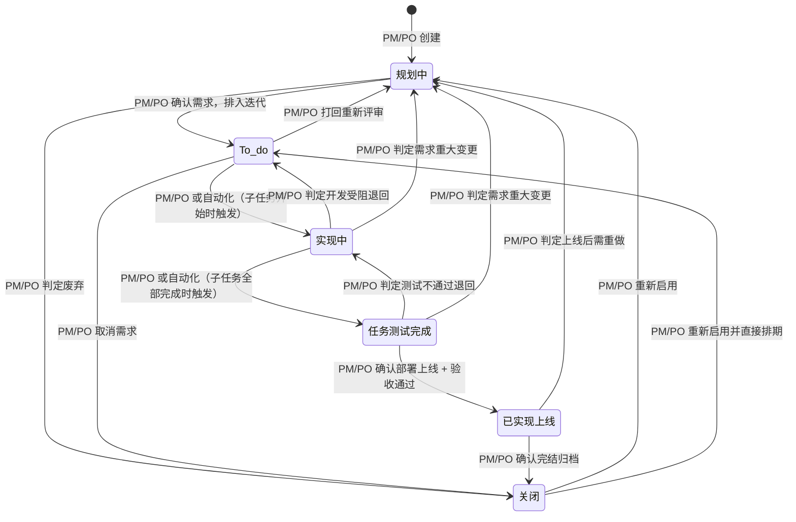
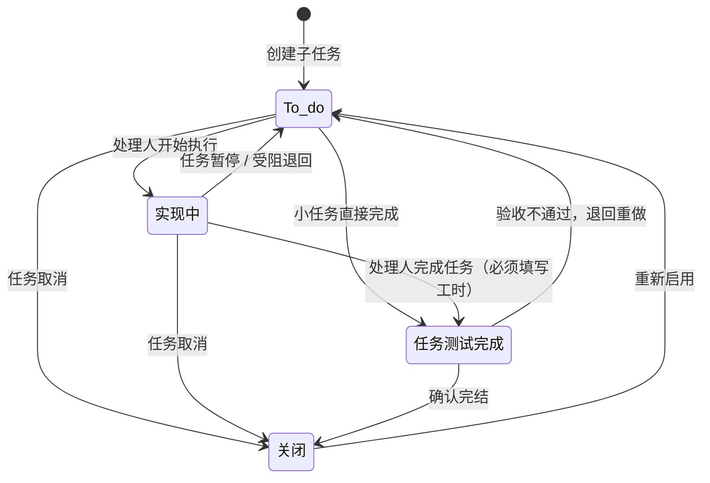
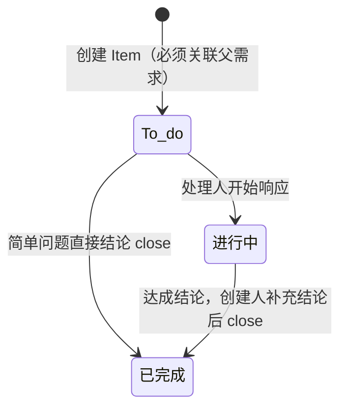

# TAPD Ticket 操作规范

*TAPD Ticket Operation Specification*

版本 v1.0 | 适用范围：全体 AI + 全体成员 | 维护人：PMO

> **本文档目的：** 将 TAPD 每种 ticket 类型的字段名、字段值、状态流转、API 调用方式全部写死为常量，
> 所有人的 AI 通过 MCP 操作 TAPD 时，统一引用本文档，禁止按自己的理解猜值。

---

## 0. 修改记录

| 版本 | 日期 | 修改内容 | 修改人 |
|------|------|---------|--------|
| v1.0 | 2026-05-14 | 初始版本：Story（需求）类型完整定义，含跨项目验证 | 何杰辉 |

---

## 1. 通用铁律（所有 ticket 类型适用）

### 1.1 状态更新：必须用 `v_status`，禁止用 `status`

| 参数 | 说明 | 能否写死 | 结论 |
|------|------|---------|------|
| `v_status` | 中文别名（如 `规划中`） | ✅ 跨项目一致 | **唯一允许使用的状态参数** |
| `status` | API key（如 `planning` / `status_18`） | ❌ 跨项目不一致 | **禁止使用** |

> 实测验证：同一个 Portal 显示名"已实现/上线"，在不同项目中 API key 分别为
> `resolved`（Moto 项目）和 `status_18`（Test 项目）。用 `status` 写死必错，用 `v_status` 写死必对。

### 1.2 创建 ticket：统一用两步法（查 ID → 用 ID 创建）

> ⚠️ **已验证：MCP 的 `workitem_type_name` 参数会触发交互式选择列表，无法自动匹配。**
> 即使同时传 `workitem_type_id` + `workitem_type_name`，MCP 也会被 name 参数拦截。
> **创建 ticket 时永远不传 `workitem_type_name`，只传 `workitem_type_id`。**

**统一创建流程（所有类型通用）：**

```
# 第 1 步：查询 workitem_type_id（每个对话首次创建某类型时执行一次，后续复用）
tapd:get_workitem_types
  workspace_id: {项目ID}
  options:
    name: "{类型中文名}"    # ← 需求 / 子任务 / 待确认项 / 长故事 / 长期任务
# 返回结果中取 id 字段

# 第 2 步：用 workitem_type_id 创建（禁止传 workitem_type_name）
tapd:create_story_or_task
  workspace_id: {项目ID}
  name: "{标题}"
  options:
    entity_type: "stories"
    workitem_type_id: "{第1步返回的id}"
    ... 其他字段
```

**需求类别名称常量表（用于第 1 步查询 `get_workitem_types` 的 name 参数）：**

| Portal 显示名 | `get_workitem_types` name 参数 | 用途 |
|---|---|---|
| 需求 | `需求` | 标准开发需求 Story |
| 子任务 | `子任务` | Dev/QA 个人任务拆分 |
| 待确认项 | `待确认项` | Q/CO Item |
| 长故事 | `长故事` | Epic |
| 长期任务 | `长期任务` | 长周期运营/维护任务 |

### 1.3 流转规则：API 不强制，AI 必须自行遵守

> ⚠️ **TAPD API 不强制执行流转矩阵。** 已验证：待确认项「已完成 → 进行中」在 Portal 上被禁止，
> 但 API 调用成功。**所有流转矩阵中标 ❌ 的转换，AI 必须自行拒绝执行，不能靠 API 拦截。**

### 1.3 优先级：必须用 `priority_label`，禁止用 `priority`

| 参数 | 说明 | 结论 |
|------|------|------|
| `priority_label` | 显示名（`High` / `Middle` / `Low` / `Nice To Have`） | **唯一允许使用** |
| `priority` | 数字（`4` / `3` / `2` / `1`） | **禁止使用** |

### 1.4 自定义字段常量表（跨项目一致，已验证）

以下字段的 API field name 和枚举值在所有项目中完全一致，可直接写死：

| Portal 字段名 | API field name | 类型 | 枚举值 |
|---|---|---|---|
| 需求性质 | `custom_field_199` | 单选 | `新需求` / `需求变更` / `内部优化` / `手动调整数据` |
| 协作类型 | `custom_field_198` | 单选 | `FE + BE + QA` / `FE + QA` / `BE + QA` |
| 来源 | `custom_field_197` | 单选 | `项目初始范围` / `生产疑问` / `生产事故` / `开发期间客户反馈` / `UAT客户反馈` / `第三方团队` / `QA内部验收` / `PO内部验收` / `AM内部验收` / `UI内部验收` / `安全规范要求` / `性能规范要求` |
| 前端LOE(h) | `custom_field_196` | 数值 | — |
| 后端LOE(h) | `custom_field_195` | 数值 | — |
| QA LOE(h) | `custom_field_194` | 数值 | — |
| 关联业务线 | `custom_field_193` | 多选 | `定制项目` / `CLM` / `CLS` / `CLD` / `360` / `CLL` / `DC Connector` / `MC Connector` / `SXP` / `LANBAO` |
| 受影响客户 | `custom_field_192` | 多选 | `其他` / `Chopard 萧邦贸易（上海）有限公司` / `Forevermark 永恒印记市场营销策划（上海）有限公司` / `Richemont 历峰商业有限公司` / `Swatch 上海琪亨商贸有限公司` / `Artnet` / `AXA` / `EDB` / `Genting` / `Graff` / `Gulfstream` / `HSBC` / `S&P` / `Pirelli 倍耐力` / `Accenture` / `De Beers Jewellers` / `Shangri-La` / `LVMH (Guerlain)` / `Alexander Wang` / `Canada Goose` / `Cathay Pacific` / `CAIS` / `Dolce & Gabbana` / `Ebury` / `Hong Kong Palace Museum` / `J.P. Morgan Private Bank` / `Shiseido Hong Kong` / `VT Markets` |
| 需求完整度评分 | `custom_field_200` | 数值 | — |

### 1.5 标签常量表（跨项目一致）

| API field name | 值（多选，`|` 分隔） |
|---|---|
| `label` | `阻塞` / `开发受阻` / `有风险` / `等待设计走查` / `方案已沟通` / `等待转测` |

### 1.6 动态字段（不可写死，每次必须查询）

| 字段 | 原因 | 查询方式 |
|---|---|---|
| `iteration_id` | 每项目每迭代不同 | `get_stories_fields_info` 或直接用 `iteration_name` |
| `owner` | 人员列表每项目不同 | 输入中文名即可 |
| `parent_id` | 父需求 ID 每票不同 | 查询获取 |

### 1.8 禁止事项清单

1. ❌ 禁止用 `status` 参数更新状态（必须用 `v_status`）
2. ❌ 禁止在 `create_story_or_task` 中传 `workitem_type_name` 参数（会触发 MCP 交互式列表，必须用 `workitem_type_id`）
3. ❌ 禁止用 `priority` 数字设置优先级（必须用 `priority_label`）
4. ❌ 禁止凭记忆猜测自定义字段的枚举值（必须引用本文档 §1.4 常量表）
5. ❌ 禁止跳过回读验证（写入后必须 `get_stories_or_tasks` 回读确认）
6. ❌ 禁止混淆 `entity_type` 值：需求/子任务的增删改查用 `stories`（复数），工时 API 用 `story`（单数）
7. ❌ 禁止依赖 TAPD API 拦截非法流转（API 不强制流转矩阵，AI 必须自行遵守本文档中的流转规则）

---

## 2. 需求（Story）

### 2.1 定位

标准开发需求，对应一个可交付的功能单元。项目中最核心的 ticket 类型。

### 2.2 角色权限

**创建权限：**

| 角色 | 能否创建 Story | 说明 |
|------|---------------|------|
| PM / PO | ✅ | Story 的唯一创建者 |
| Dev（FE / BE） | ❌ | 有需求应通过 Q/CO Item 反馈给 PM |
| QA | ❌ | 同上 |
| UI | ❌ | 同上 |
| AM | ❌ | 同上 |

**状态流转权限：**

| 角色 | 能否更新 Story 状态 | 说明 |
|------|-------------------|------|
| PM / PO | ✅ | Story 全部状态流转由 PM/PO 操作或自动化触发 |
| Dev（FE / BE） | ❌ | 不允许 Dev 直接修改 Story 状态 |
| QA | ❌ | 不允许 QA 直接修改 Story 状态 |
| UI | ❌ | — |
| AM | ❌ | — |
| 自动化 | ✅ | 自动化工作流可触发状态流转（等同 PM 权限） |

> **铁律：Story 的创建和全部状态流转，只有 PM/PO 和自动化能操作。
> Dev / QA / UI / AM 对 Story 只有只读权限。
> Dev/QA 的工作进度通过「子任务」体现，不通过修改 Story 状态体现。**

### 2.3 创建规范

**MCP 调用模板：**

```
tapd:create_story_or_task
  workspace_id: {项目ID}
  name: "【M{编号}-F{编号}】{功能名称}"
  options:
    entity_type: "stories"
    workitem_type_id: "{通过get_workitem_types查到的需求ID}"  # ← 禁止用 workitem_type_name
    owner: "{处理人中文名}"
    priority_label: "Middle"            # ← High / Middle / Low / Nice To Have
    custom_field_199: "新需求"           # ← 需求性质（必填）
    custom_field_197: "项目初始范围"      # ← 来源（必填）
    custom_field_196: {前端工时}         # ← 前端LOE(h)
    custom_field_195: {后端工时}         # ← 后端LOE(h)
    custom_field_194: {QA工时}          # ← QA LOE(h)
    iteration_name: "{迭代名称}"
    description: "{HTML富文本描述}"
```

**创建时必填字段：**

| 字段 | 参数 | 必填 | 默认值 |
|------|------|------|--------|
| 标题 | `name` | ✅ | — |
| 处理人 | `owner` | ✅ | 当前登录用户 |
| 优先级 | `priority_label` | ✅ | `Middle` |
| 需求性质 | `custom_field_199` | ✅ | — |
| 来源 | `custom_field_197` | ✅ | — |

**需求性质选值规则：**

| 场景 | 选值 |
|------|------|
| 项目 kickoff 后首次创建的需求 | `新需求` |
| 客户 / 内部发起的需求变更（走 CO Item 流程后创建） | `需求变更` |
| 非客户驱动的技术优化、代码重构、性能改进 | `内部优化` |
| 数据修复、手工数据调整 | `手动调整数据` |

**来源选值规则：**

| 场景 | 选值 |
|------|------|
| 项目 SOW / 需求分析文档中定义的功能 | `项目初始范围` |
| 上线后客户/内部对已有功能提出疑问 | `生产疑问` |
| 上线后发现的功能故障（非 Bug 类型） | `生产事故` |
| 开发期间客户提出的新增/调整 | `开发期间客户反馈` |
| UAT 阶段客户提出的修改 | `UAT客户反馈` |
| 第三方团队（其他开发商/客户内部团队）提出 | `第三方团队` |
| QA 测试中发现需要补充的需求 | `QA内部验收` |
| PO/PM 验收时发现需要补充的需求 | `PO内部验收` |
| AM 验收时发现需要补充的需求 | `AM内部验收` |
| UI 走查后发现需要补充的需求 | `UI内部验收` |
| 安全审计/渗透测试要求的功能改造 | `安全规范要求` |
| 性能测试要求的功能改造 | `性能规范要求` |

### 2.4 上下级关系

| 配置 | 值 |
|------|------|
| 允许的下级类别 | `子任务`、`待确认项` |
| 创建时强制选父需求 | 否 |

### 2.5 状态定义与流转

**工作流名称：** Implement 需求管理工作流

**状态常量表（6 个状态）：**

| 序号 | `v_status` 传入值 | 起始状态 | 结束状态 | 语义说明 | 谁能推进到此状态 |
|------|-------------------|---------|---------|---------|----------------|
| 1 | `规划中` | ✅ | | PM 创建 ticket，需求处于规划/评审阶段 | PM / PO（创建时自动） |
| 2 | `To do` | | | 需求已确认，待 Dev 排期开发 | PM / PO |
| 3 | `实现中` | | | Dev 正在开发 | PM / PO / 自动化 |
| 4 | `任务/测试完成` | | | Dev 开发完成 + QA 测试通过 | PM / PO / 自动化 |
| 5 | `已实现/上线` | | ✅ | 已部署上线，PO 验收通过 | PM / PO |
| 6 | `关闭` | | ✅ | 需求关闭（正常完结 / 废弃 / 不做） | PM / PO |

> **Dev / QA / UI / AM 不允许推进 Story 到任何状态。**
> Dev/QA 的工作进度通过子任务状态体现，Story 状态由 PM/PO 根据子任务完成情况统一推进或由自动化触发。

**状态流转图：**



**流转规则矩阵（完整版）：**

| 从 ＼ 到 | 规划中 | To do | 实现中 | 任务/测试完成 | 已实现/上线 | 关闭 |
|---------|--------|-------|--------|-------------|-----------|------|
| 规划中 | — | ✅ | ✅ | ✅ | ✅ | ✅ |
| To do | ✅ | — | ✅ | ✅ | ✅ | ✅ |
| 实现中 | ✅ | ✅ | — | ✅ | ✅ | ✅ |
| 任务/测试完成 | ✅ | ✅ | ✅ | — | ✅ | ✅ |
| 已实现/上线 | ✅ | ✅ | ❌ | ❌ | — | ✅ |
| 关闭 | ✅ | ✅ | ❌ | ❌ | ❌ | — |

> 核心约束：结束状态（已实现/上线、关闭）不可回退到中间状态（实现中、任务/测试完成），
> 但可以回退到起始区（规划中、To do）做重新规划。

**MCP 状态更新模板：**

```
tapd:update_story_or_task
  workspace_id: {项目ID}
  options:
    entity_type: "stories"
    id: "{ticket_id}"
    v_status: "To do"    # ← 只允许填写上方 6 个中文状态名之一
```

### 2.6 标准工作流（谁在什么时候推进到什么状态）

| 阶段 | 触发条件 | 推进到状态 | 操作人 | Dev/QA 视角 |
|------|---------|----------|--------|------------|
| 创建 | PM 创建需求 ticket | `规划中`（自动） | PM / PO | 不可见（尚未排入迭代） |
| 需求评审 | PM 确认需求，排入迭代 | `To do` | PM / PO | 可查看，准备评估 |
| 开发启动 | 子任务状态变为进行中 | `实现中` | PM / PO / 自动化 | Dev 更新自己的子任务 |
| 开发完成 | 全部子任务完成 + QA 测试通过 | `任务/测试完成` | PM / PO / 自动化 | QA 更新自己的子任务 |
| 上线验收 | 部署上线，PO/PM 验收通过 | `已实现/上线` | PM / PO | — |
| 归档 | 确认完结 | `关闭` | PM / PO | — |

> **核心设计：Dev/QA 只操作自己的子任务状态，Story 状态由 PM/PO 或自动化根据子任务完成情况统一推进。**

---

## 3. 子任务（Subtask）

### 3.1 定位

Dev / QA 个人的任务拆分单元，挂在 Story 下。每个子任务只属于一个人，用于体现个人工作进度和实际工时消耗。Story 的状态由 PM/PO 根据子任务完成情况统一推进。

### 3.2 角色权限

**创建权限：**

| 角色 | 能否创建子任务 | 说明 |
|------|-------------|------|
| Dev（FE / BE） | ✅ | 在需求评审后，拆解自己需要完成的开发子任务 |
| QA | ✅ | 拆解自己的测试子任务（用例编写、功能测试、接口测试等） |
| PM / PO | ✅ | 可创建待办事项类子任务（素材确认、字段规则确认等） |
| UI | ✅ | 可创建设计走查类子任务 |
| AM | ✅ | 可创建需要各角色配合的子任务（数据查询、客户问题排查等），处理人指定给对应角色 |

**状态流转权限：**

| 角色 | 能否更新子任务状态 | 说明 |
|------|-----------------|------|
| 子任务处理人（Owner） | ✅ | 只能更新自己名下的子任务 |
| PM / PO | ✅ | 可更新任何子任务状态（管理权限） |
| 其他人 | ❌ | 不允许更新他人的子任务状态 |

> **铁律：子任务的处理人只能是一个人，谁的任务谁更新状态，不代劳。**

### 3.3 创建规范

**MCP 调用模板：**

```
tapd:create_story_or_task
  workspace_id: {项目ID}
  name: "【{角色}】{任务描述}"
  options:
    entity_type: "stories"
    workitem_type_id: "{通过get_workitem_types查到的子任务ID}"  # ← 禁止用 workitem_type_name
    owner: "{处理人中文名}"              # ← 必填，只能是一个人
    priority_label: "Middle"            # ← 必填
    effort: "{预估工时}"                # ← 必填，单位：人时
    iteration_name: "{迭代名称}"         # ← 必填，见下方迭代规则
    parent_id: "{父Story的ID}"          # ← 强烈建议填写
    description: "{任务描述}"
```

**创建时必填字段：**

| 字段 | 参数 | 必填 | 默认值 | 说明 |
|------|------|------|--------|------|
| 标题 | `name` | ✅ | — | 格式：`【{角色}】{任务描述}`，角色用中括号标注（如【FE】【BE】【QA】【PM】【UI】） |
| 处理人 | `owner` | ✅ | 当前登录用户 | 只填一个人，谁做谁填 |
| 预估工时 | `effort` | ✅ | — | 单位：人时（h），单个子任务不超过 16h，超过则继续拆分 |
| 迭代 | `iteration_name` | ✅ | — | 见下方迭代规则 |
| 优先级 | `priority_label` | ✅ | `Middle` | High / Middle / Low / Nice To Have |

**标题角色标注规则：**

| 角色 | 标题前缀 | 示例 |
|------|---------|------|
| 前端开发 | `【FE】` | 【FE】静态页面搭建 - 用户列表页 |
| 后端开发 | `【BE】` | 【BE】用户列表接口开发 |
| QA | `【QA】` | 【QA】用户模块功能测试 |
| PM | `【PM】` | 【PM】确认用户角色权限规则 |
| UI | `【UI】` | 【UI】用户列表页设计走查 |
| AM | `【AM】` | 【AM】客户确认首页 Banner 素材 |

**迭代字段铁律：**

> 1. 有父 Story → 子任务的迭代**必须与父 Story 一致**，AI 自动从父 Story 读取迭代值填入，禁止询问
> 2. 无父 Story → AI 必须询问创建人「该子任务属于哪个迭代？」，不允许留空
> 3. 迭代不一致 = 创建失败，必须修正

**子任务拆分原则：**

1. 每个子任务预估工时 ≤ 16 人时（2 天），超过则继续拆分为多个子任务
2. 每个子任务处理人只能是一个人，不允许多人共享一个子任务
3. 每个子任务应能独立验收（有明确的完成标准）

### 3.4 上下级关系

| 配置 | 值 |
|------|------|
| 允许的下级类别 | `子任务`（可嵌套拆分） |
| 创建时强制选父需求 | 否（但强烈建议关联父 Story） |

### 3.5 状态定义与流转

**工作流名称：** Implement 子任务工作流

**状态常量表（4 个状态）：**

| 序号 | `v_status` 传入值 | 起始状态 | 结束状态 | 语义说明 | 谁能推进到此状态 |
|------|-------------------|---------|---------|---------|----------------|
| 1 | `To do` | ✅ | | 创建后待开始 | 自动（创建时） |
| 2 | `实现中` | | | 正在执行 | 处理人 / PM |
| 3 | `任务/测试完成` | | ✅ | 任务完成 | 处理人 / PM |
| 4 | `关闭` | | ✅ | 关闭（含正常关闭 + 废弃） | 处理人 / PM |

**状态流转图：**



**流转规则矩阵：**

| 从 ＼ 到 | To do | 实现中 | 任务/测试完成 | 关闭 |
|---------|-------|--------|-------------|------|
| To do | — | ✅ | ✅ | ✅ |
| 实现中 | ✅ | — | ✅ | ✅ |
| 任务/测试完成 | ✅ | ❌ | — | ✅ |
| 关闭 | ✅ | ❌ | ❌ | — |

> 核心约束：结束状态（任务/测试完成、关闭）不可回退到实现中，但可以回退到 To do 重新开始。

**MCP 状态更新模板：**

```
tapd:update_story_or_task
  workspace_id: {项目ID}
  options:
    entity_type: "stories"
    id: "{子任务ticket_id}"
    v_status: "实现中"    # ← 只允许填写上方 4 个中文状态名之一
```

### 3.6 工时填写铁律

> **子任务流转到「任务/测试完成」或「关闭」时，必须填写实际工时，不允许 0 工时完成。**

**规则：**

1. 流转到结束状态前，AI 必须检查是否已填写工时；未填写 → 阻止流转，提示先填工时
2. 工时精度为 0.5h（半小时），最小可填 0.1h（特殊情况如 5 分钟修复）
3. 每人每天每个 ticket 只能填写 1 次花费，重复填写会覆盖（非累加）
4. 花费谁填写就记录在谁名下，不能代填

> ⚠️ **entity_type 陷阱：** 工时 API 的 `entity_type` 必须传 `story`（单数），
> 而状态更新 API 的 `entity_type` 必须传 `stories`（复数）。搞反必报错。

| API | entity_type 值 |
|---|---|
| `create_story_or_task` / `update_story_or_task` / `get_stories_or_tasks` | `stories` |
| `add_timesheets` / `get_timesheets` / `update_timesheets` | `story` |

**MCP 工时填写流程（先查后写）：**

```
# 第 1 步：查询该 ticket 当天是否已有工时记录
tapd:get_timesheets
  workspace_id: {项目ID}
  options:
    entity_id: "{子任务ticket_id}"
    owner: "{处理人中文名}"
    spentdate: "YYYY-MM-DD"

# 第 2 步：根据查询结果决定新增或更新
# 情况 A：无记录 → 新增
tapd:add_timesheets
  workspace_id: {项目ID}
  options:
    entity_type: "story"              # ← 注意是 story（单数），不是 stories
    entity_id: "{子任务ticket_id}"
    owner: "{处理人中文名}"
    spentdate: "YYYY-MM-DD"
    timespent: "{实际工时}"            # ← 单位：人时，精度 0.5
    memo: "{工作内容描述}"

# 情况 B：有记录 → 更新（传 timesheet 的 id）
tapd:update_timesheets
  workspace_id: {项目ID}
  options:
    id: "{已有工时记录的id}"
    timespent: "{新的工时}"
    memo: "{更新后的描述}"
```

### 3.7 标准工作流（谁在什么时候做什么）

| 阶段 | 触发条件 | 推进到状态 | 操作人 | 附加动作 |
|------|---------|----------|--------|---------|
| 创建 | 需求评审完成后，各角色拆解自己的子任务 | `To do`（自动） | Dev / QA / PM | 必填：处理人 + 预估工时 + 迭代 + 优先级 |
| 开始执行 | 处理人开始工作 | `实现中` | 处理人 | — |
| 完成任务 | 处理人完成工作 | `任务/测试完成` | 处理人 | **必须填写实际工时** |
| 归档 | PM 确认或自动关闭 | `关闭` | 处理人 / PM | 未填工时的必须补填 |

> **核心设计：子任务是 Dev/QA 的个人看板，每人只管自己的子任务。
> PM/PO 通过查看子任务完成情况来决定是否推进父 Story 状态。**

---

## 4. 待确认项（Item）

### 4.1 定位

跨角色沟通的留痕工具，所有需求确认和变更必须通过 Item 归档。包含两类用途：Q（Question，提问确认）和 CO（Change Order，变更补充）。Item 有独立的状态生命周期和 Assignee，替代口头沟通和纯评论。

### 4.2 角色权限

**创建权限：**

| 角色 | 能否创建待确认项 | 典型场景 |
|------|---------------|---------|
| Dev（FE / BE） | ✅ | [Q] 需求有疑问，需要 PM/PO 确认 |
| QA | ✅ | [Q] 测试中发现需求不明 |
| PM / PO | ✅ | [CO] 补充或调整需求 |
| UI | ✅ | [Q] 设计规范确认 |
| AM | ✅ | [Q] 客户反馈确认 / [CO] 客户变更 |

**状态流转权限：**

| 角色 | 能否更新状态 | 说明 |
|------|-----------|------|
| 处理人（Assignee） | ✅ | 推进到「进行中」表示开始处理 |
| 创建人 | ✅ | 创建人负责最终 close（补充结论后推进到「已完成」） |
| PM / PO | ✅ | 管理权限，可更新任何 Item 状态 |

> **铁律：创建人负责 close。** 流程：创建人发起 → 处理人响应 → 达成结论后，创建人补充结论 → 创建人 close。

### 4.3 创建规范

**创建前置条件（铁律）：**

> 1. **必须有父需求** — TAPD 配置强制要求选择父需求（需求 / 长故事），不允许游离 Item
> 2. **迭代必须与父需求一致** — 有父需求迭代 → 自动继承；父需求迭代为空 → 必须询问创建人
> 3. **标题必须带 Prefix** — `[Q]` 或 `[CO]`，便于 AI 和人一眼识别

**⚠️ 创建待确认项的特殊处理：**

`workitem_type_name: "待确认项"` 在 MCP 中无法自动匹配（已验证）。必须通过以下两步创建：

```
# 第 1 步：查询当前项目的待确认项 workitem_type_id（每个对话首次创建时执行，后续复用）
tapd:get_workitem_types
  workspace_id: {项目ID}
  options:
    name: "待确认项"
# 返回结果中取 id 字段，在当前对话内缓存复用

# 第 2 步：用 workitem_type_id 创建
tapd:create_story_or_task
  workspace_id: {项目ID}
  name: "[Q] {问题描述}" 或 "[CO] {变更描述}"
  options:
    entity_type: "stories"
    workitem_type_id: "{通过get_workitem_types查到的待确认项ID}"  # ← 禁止用 workitem_type_name
    owner: "{处理人中文名}"
    priority_label: "Middle"
    parent_id: "{父Story的ID}"             # ← 必填（TAPD 配置强制）
    iteration_name: "{与父需求一致的迭代}"    # ← 必填
    description: "{详细描述}"
```

**Prefix 规则：**

| Prefix | 用途 | 示例 |
|--------|------|------|
| `[Q]` | 待确认项 — 提问确认 | [Q] 用户角色权限规则确认 |
| `[CO]` | 变更单 — 需求变更/补充 | [CO] 新增导出功能字段 |

**创建时必填字段：**

| 字段 | 参数 | 必填 | 说明 |
|------|------|------|------|
| 标题 | `name` | ✅ | 格式：`[Q] xxx` 或 `[CO] xxx` |
| 处理人 | `owner` | ✅ | Q 类 → PO/PM；CO 类 → 对应 Dev |
| 优先级 | `priority_label` | ✅ | 默认 Middle |
| 迭代 | `iteration_name` | ✅ | 必须与父需求一致 |
| 父需求 | `parent_id` | ✅ | TAPD 强制要求 |

### 4.4 上下级关系

| 配置 | 值 |
|------|------|
| 允许的下级类别 | `长期任务`、`子任务`、`待确认项` |
| 创建时强制选父需求 | ✅ 是（父需求类别：`需求` / `长故事`） |

### 4.5 状态定义与流转

**工作流名称：** 默认工作流

**状态常量表（3 个状态）：**

| 序号 | `v_status` 传入值 | 起始状态 | 结束状态 | 语义说明 | 谁能推进到此状态 |
|------|-------------------|---------|---------|---------|----------------|
| 1 | `To do` | ✅ | | Item 已创建，待处理人响应 | 自动（创建时） |
| 2 | `进行中` | | | 处理人已开始处理 | 处理人 / PM |
| 3 | `已完成` | | ✅ | 达成结论，创建人 close | 创建人 / PM |

**状态流转图：**



> **单向流转，不可回退。** 进行中不可退回 To do，已完成不可退回任何状态。
> 如果结论有误需重议，应创建新的 Item 而非重新打开已完成的 Item。

**流转规则矩阵：**

| 从 ＼ 到 | To do | 进行中 | 已完成 |
|---------|-------|--------|--------|
| To do | — | ✅ | ✅ |
| 进行中 | ❌ | — | ✅ |
| 已完成 | ❌ | ❌ | — |

> ⚠️ **API 不强制流转矩阵。** AI 必须自行遵守上方矩阵，不能靠 API 拦截。
> 特别注意：进行中 → To do 和已完成 → 任何状态，API 会成功但业务上禁止。

**MCP 状态更新模板：**

```
tapd:update_story_or_task
  workspace_id: {项目ID}
  options:
    entity_type: "stories"
    id: "{待确认项ticket_id}"
    v_status: "已完成"    # ← 只允许填写：To do / 进行中 / 已完成
```

### 4.6 Q 流程（待确认项）

```
发起人(Dev/QA/AM)           处理人(PM/PO)
  [To do] ──────────────→ [进行中]（处理人开始响应）
                               │
                               ↓
  创建人补充结论，close → [已完成]
```

**简化状态：** To do → 进行中 → 已完成

### 4.7 CO 流程（变更单）

```
发起人(PM/PO)               处理人(Dev)
  [To do] ──────────────→ [进行中]（Dev 评估 + 接受/拒绝）
                               │
                     ┌─────────┼─────────┐
                     ↓                   ↓
               Dev 接受并实施        Dev 拒绝
                     │                   │
                     ↓                   ↓
  创建人补充结论 → [已完成]      创建人记录拒绝原因 → [已完成]
```

**简化状态：** To do → 进行中 → 已完成（不管接受还是拒绝，都由创建人 close）

### 4.8 标准工作流

| 阶段 | 触发条件 | 推进到状态 | 操作人 | 附加动作 |
|------|---------|----------|--------|---------|
| 创建 | 任何跨角色沟通需求 | `To do`（自动） | 任何角色 | 必填：父需求 + 迭代 + 处理人 + Prefix |
| 响应 | 处理人开始处理 | `进行中` | 处理人 | — |
| 结论 | 达成结论 | `已完成` | 创建人 | 创建人在描述中补充「结论」字段 |

> **核心设计：Item 是 Q/CO 治理的基石。所有跨角色沟通必须建 Item，即使已口头沟通也必须补建归档。
> 单向流转不可回退：如需重议，创建新 Item，不重新打开旧 Item。**

---

## 5. 长故事（Epic）

> 🚧 待补充

### 5.1 定位
### 5.2 创建规范
### 5.3 上下级关系
### 5.4 状态定义与流转
### 5.5 标准工作流

---

## 6. 长期任务（Long-term Task）

> 🚧 待补充

### 6.1 定位
### 6.2 创建规范
### 6.3 上下级关系
### 6.4 状态定义与流转
### 6.5 标准工作流

---

## 7. 缺陷（Bug）

> 🚧 待补充（含普通 Bug + Production Incident 两个子类型）

### 7.1 定位
### 7.2 创建规范
### 7.3 状态定义与流转
### 7.4 标准工作流

---

## 附录 A：跨项目验证记录

以下为 v1.0 发布前的实际验证记录，证明本文档中的常量值跨项目可用。

**验证项目：**
- Moto test（workspace_id: 41664282）
- Test Test（workspace_id: 66400652）

**状态轮转验证（v_status 方式，12/12 通过）：**

| 状态 | v_status 传入值 | Moto 底层返回 | Test 底层返回 | Portal 显示一致 |
|------|----------------|--------------|--------------|----------------|
| 1 | `规划中` | `planning` | `planning` | ✅ |
| 2 | `To do` | `status_10` | `status_10` | ✅ |
| 3 | `实现中` | `developing` | `developing` | ✅ |
| 4 | `任务/测试完成` | `status_9` | `status_9` | ✅ |
| 5 | `已实现/上线` | `resolved` | `status_18` | ✅ 底层 key 不同但 v_status 屏蔽差异 |
| 6 | `关闭` | `rejected` | `status_19` | ✅ 底层 key 不同但 v_status 屏蔽差异 |

**自定义字段验证（API field name + 枚举值，两项目完全一致）：**

| 字段 | API name | Moto | Test | 一致 |
|------|----------|------|------|------|
| 需求性质 | custom_field_199 | 4 枚举值 | 4 枚举值 | ✅ |
| 协作类型 | custom_field_198 | 3 枚举值 | 3 枚举值 | ✅ |
| 来源 | custom_field_197 | 12 枚举值 | 12 枚举值 | ✅ |
| 前端LOE(h) | custom_field_196 | float | float | ✅ |
| 后端LOE(h) | custom_field_195 | float | float | ✅ |
| QA LOE(h) | custom_field_194 | float | float | ✅ |
| 关联业务线 | custom_field_193 | 10 枚举值 | 10 枚举值 | ✅ |
| 受影响客户 | custom_field_192 | 27 枚举值 | 27 枚举值 | ✅ |
| 需求完整度评分 | custom_field_200 | float | float | ✅ |
| 优先级 | priority_label | 4 枚举值 | 4 枚举值 | ✅ |
| 标签 | label | 6 枚举值 | 6 枚举值 | ✅ |

**子任务状态轮转验证（Test Test 项目，4/4 通过）：**

| 状态 | v_status 传入值 | 底层返回 | 结果 |
|------|----------------|---------|------|
| 1 | `To do` | `status_10` | ✅ |
| 2 | `实现中` | `developing` | ✅ |
| 3 | `任务/测试完成` | `status_9` | ✅ |
| 4 | `关闭` | `status_19` | ✅ |

**工时 API 验证：**

| 操作 | API | entity_type | 结果 |
|------|-----|-------------|------|
| 查询工时 | `get_timesheets` | （无需传） | ✅ |
| 新增工时 | `add_timesheets` | `story`（单数） | ✅ |
| 更新工时 | `update_timesheets` | （无需传，传 id） | ✅ |
| 用 `stories` 新增工时 | `add_timesheets` | `stories`（复数） | ❌ 422 ParamError |

**待确认项状态轮转验证（Test Test 项目，3/3 通过 + 2 项额外发现）：**

| 状态 | v_status 传入值 | 底层返回 | 结果 |
|------|----------------|---------|------|
| 1 | `To do` | `status_10` | ✅ |
| 2 | `进行中` | `status_14` | ✅ |
| 3 | `已完成` | `status_15` | ✅ |

**待确认项关键发现：**

| 发现 | 详情 |
|------|------|
| `workitem_type_name` 不生效 | 传 `"待确认项"` 时返回类型列表而非自动匹配，必须用两步创建法 |
| API 不强制流转矩阵 | 已完成 → 进行中在 Portal 禁止但 API 成功，AI 必须自行遵守 |
