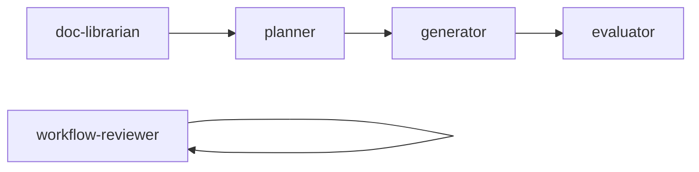

# Agents 模块

## 概述

`.claude/agents/` 目录定义了 Flow 中的 AI Agent 角色，每个 Agent 有明确的职责边界。

## 模块列表

| Agent | 职责 | 核心输入 |
|-------|------|---------|
| doc-librarian | 产品契约整理 | 需求描述 |
| planner | 技术规划 | 契约文档 |
| generator | 代码实现 | 技术 Spec |
| evaluator | 契约测试 | 代码 + 契约 |
| workflow-reviewer | 周期复盘 | Flow Logs |
| session-auditor | Session 审计 | Session 数据 |

## doc-librarian

**文件**: `.claude/agents/doc-librarian.md`

**职责**:
- 将散乱需求整理为结构化契约文档
- 生成 OpenAPI 3.0 接口定义
- 维护契约变更日志

**输入**: TAPD 工单或本地需求描述
**输出**: `contract.md`, `openapi.yaml`, `changelog.md`

**关键规则**:
- 不写代码
- 所有业务规则必须有来源标注
- TBD 标注必须包含"需谁确认、截止时间"

## planner

**文件**: `.claude/agents/planner.md`

**职责**:
- 理解契约文档
- 设计系统架构
- 拆分可执行 CASE
- 初始化状态文件

**输入**: `contract.md` (status: frozen)
**输出**: `spec.md`, `cases/*.md`, `state.json`, `sprint-contract.md`

**关键规则**:
- 不修改契约的业务字段
- 发现问题向 doc-librarian 反馈

## generator

**文件**: `.claude/agents/generator.md`

**职责**:
- 按 Spec 实现功能代码
- 维护 OpenAPI 同步
- 通过 Evaluator 验收

**输入**: `spec.md`, `cases/CASE-NN.md`
**输出**: 实现代码 + 测试

**关键规则**:
- 不自评通过（必须交 Evaluator）
- 不修改 Spec（发现问题向 Planner 发 issue）
- 所有 CASE PASS 后才能进入收尾阶段

## evaluator

**文件**: `.claude/agents/evaluator.md`

**职责**:
- 独立运行契约测试
- 产出无偏 verdict

**输入**: 代码路径 + `openapi.yaml` + `sprint-contract.md`
**输出**: `verdict` (PASS/FAIL)

**关键规则**:
- 不读 Generator 自述
- verdict 是唯一关卡

## workflow-reviewer

**文件**: `.claude/agents/workflow-reviewer.md`

**职责**:
- 周期复盘
- 触发洞察提炼
- 产出进化提案

**输入**: `flow-logs/`
**输出**: `insights/`, `evolution-proposals/`

## session-auditor

**文件**: `.claude/agents/session-auditor.md`

**职责**:
- 审计 Session 质量
- 记录执行指标

## 文件路由表

```
agents/
├── doc-librarian.md       # 13,856 bytes
├── planner.md            # 9,186 bytes
├── generator.md          # 8,530 bytes
├── evaluator.md          # 5,166 bytes
├── workflow-reviewer.md  # 5,550 bytes
└── session-auditor.md    # 5,556 bytes
```

## 依赖关系

