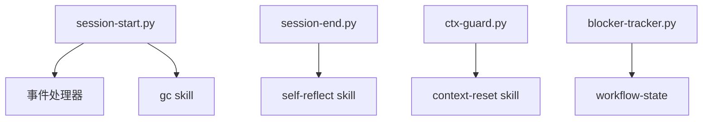

# Hooks 模块

## 概述

`.claude/hooks/` 目录定义了自动执行的 Hook 脚本，在特定时机触发。

## Hook 列表

| Hook | 触发时机 | 功能 |
|------|----------|------|
| session-start.py | 每次新 session | 加载上下文、事件监听、gc |
| session-end.py | session 结束 | 保存 flow-logs、触发自审 |
| ctx-guard.py | 每次提交前 | Context >80% 阻断 |
| blocker-tracker.py | Bash 失败 | 分析错误、追加 blockers |
| file-tracker.py | 文件操作 | 追踪到 file-reads/diff-log |
| post-tool-linter-feedback.py | Edit/Write 后 | 运行 fitness rule |
| danger-block.py | 危险操作 | 阻断破坏性操作 |
| block-sensitive-files.py | 敏感文件访问 | 阻止凭证泄露 |
| contract-path-guard.py | 契约路径访问 | 确保契约存在 |

## session-start.py

**触发**: 每次新 Claude Code session

**功能**:
1. 加载 workflow-state.json
2. 监听事件总线（events.jsonl）
3. 自动触发挂起的事件处理器
4. ~~注入 LTM 相关记忆~~（已移除）
5. 检查 gc（每日 3:00）

```python
# 核心逻辑
def on_session_start():
    state = load_workflow_state()
    events = read_event_bus()
    for event in pending_events:
        trigger_handler(event)
    ~~inject_ltm_memory()~~
```

## session-end.py

**触发**: session 结束前

**功能**:
1. 保存执行摘要到 flow-logs
2. 触发 self-reflect 自审

## ctx-guard.py

**触发**: 每次工具调用提交前

**功能**:
- 检查 context 使用率
- >80% 时阻断，提示 `/context-reset`

## blocker-tracker.py

**触发**: Bash 工具返回非零状态

**功能**:
- 分析错误原因
- 追加到 blockers 列表
- 给出修复建议

## 文件路由表

```
hooks/
├── session-start.py           # 10,244 bytes
├── session-end.py             #
├── ctx-guard.py               #
├── blocker-tracker.py         #
├── file-tracker.py            #
├── post-tool-linter-feedback.py
├── danger-block.py            #
├── block-sensitive-files.py   #
└── contract-path-guard.py     #  新增
```

## 依赖关系

