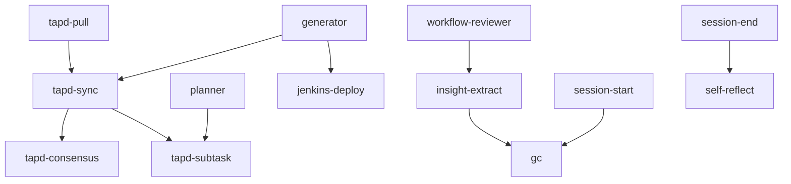

# Skills 模块

## 概述

`.claude/skills/` 目录定义了可复用的 Skill 能力，被 Agent 调用。

## 模块列表

| Skill | 用途 | 触发关键词 |
|-------|------|-----------|
| tapd-sync | TAPD 事件同步 | tapd同步、TAPD事件 |
| tapd-consensus | Wiki 模式共识评审 | tapd-consensus |
| tapd-pull | 工单拉取缓存 | tapd拉取、ticket sync |
| tapd-subtask | 子任务派发管理 | 子任务派发、subtask emit |
| tapd-init | TAPD 集成初始化 | tapd初始化、tapd init |
| jenkins-deploy | Jenkins 构建部署 | jenkins-deploy |
| ltm | ~~长期记忆系统~~（已移除） | ~~LTM、长期记忆~~ |
| insight-extract | 洞察提炼 | insight-extract、提炼洞察 |
| gc | 工作流熵管理 | gc、垃圾回收 |
| self-reflect | AI 自审 | 自审、self-reflect |
| fitness-run | 架构适应度检查 | fitness、架构检查 |
| context-reset | 上下文重置 | context reset、上下文重置 |

## 使用规范

### 调用方式

```python
# 通过 Skill tool 调用
Skill(skill="tapd-pull", args="1140062001234567")
```

### 触发关键词

Skills 根据用户输入的关键词自动触发，详见各 SKILL.md 的 trigger 字段。

## 文件路由表

```
skills/
├── tapd-sync/SKILL.md
├── tapd-consensus/SKILL.md
├── tapd-pull/SKILL.md
├── tapd-subtask/SKILL.md
├── tapd-init/SKILL.md
├── jenkins-deploy/SKILL.md
├── ltm/SKILL.md            # ~~长期记忆~~（已移除）
├── insight-extract/SKILL.md
├── gc/SKILL.md
├── self-reflect/SKILL.md
├── fitness-run/SKILL.md
└── context-reset/SKILL.md
```

## 依赖关系

