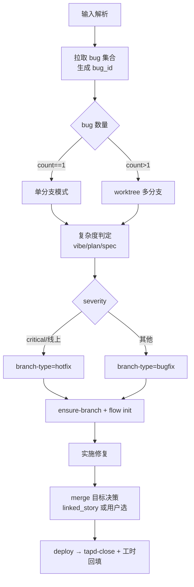

# /bug-fix

> Bug 修复统一入口——按数量决定分支模式、按复杂度路由档位、自动合并部署回填。

## 用法

```bash
/bug-fix <tapd_bug_url>     # 单个 TAPD bug
/bug-fix --all              # 批量拉取所有未处理 bug
/bug-fix --local "<描述>"    # 本地 bug（无 TAPD 关联）
```

## 触发

| 输入形态 | 行为 |
|---------|------|
| TAPD URL / 纯数字 ID | 调 tapd skill 拉 bug → 生成 `{MM}-{dd}-{slug}` bug_id |
| `--all` | tapd skill `pull --type bug --all`，遍历未完成 bug |
| `--local "<描述>"` | 不调 TAPD，从描述首行生成 slug |

## 流程



**slug 规则**（与 /tapd start、/story-start 一致）：标题或描述首行 → LLM 译英文 → 小写 + `-` → 仅保留 `[a-z0-9-]` → 截断 30 字 → 翻译失败用 `bug-untitled` → 同名追加 `-2/-3`。

**复杂度档位**：

| 档位 | 条件 | flow_id |
|------|------|---------|
| vibe | 单点修改 / 常量 / 文案 / 笔误 | `bugfix-vibe` |
| plan | 多步骤逻辑 / ≤ 2 文件 / 有分支 | `bugfix-plan` |
| spec | 跨模块 / 涉契约 / severity=critical | `bugfix-spec` |

判定不确定 → AskUserQuestion 让用户选。

**vibe 档强制痕迹（防"无痕修改"）**：

flow 在 `edit` 与 `git-push` 之间插入 `patch-record` step，主 Claude 必须填 4 段 patch.md（问题/根因/修复/影响面，模板 `.claude/templates/patch-template.md`），落地路径 `.chatlabs/task/bug-fix/<bug_id>/patch.md`。

- 字段是否填全由主 Claude 自检（不上 hook 强校验）
- 任一段落显著超出 3 行 → 主 Claude 主动提示用户升档到 plan，不硬塞 vibe
- 写完即冻结，再发现新事实 → 追加 commit + 新 patch，不改旧 patch

**分支创建**：source / merge_targets 全由 `project-config.json.git.branches.<bugfix|hotfix>` 决定。

```bash
python .claude/skills/git/scripts/ensure_branch.py <branch-type>/<bug_id> --branch-type <bugfix|hotfix>
python .claude/skills/task/scripts/task.py bind-branch <task_id> --branch <branch> --branch-type <bugfix|hotfix>
```

**worktree 默认开启**（`worktree.auto_create=true`,`skip_for_complexity` 内的档位豁免）：

```bash
# vibe 档默认豁免(skip_for_complexity=["vibe"]);plan/spec 强制开
if [ "$complexity" != "vibe" ]; then
  worktree_path=".chatlabs/worktrees/<bug_id>"
  git worktree add "$worktree_path" <branch>
  python .claude/skills/task/scripts/task.py bind-branch <task_id> --branch <branch> --worktree-path "$worktree_path"
  # 后续 edit / 测试均在 worktree 目录内进行
fi
```

完成时由 flow 的 `branch-cleanup` step 统一收尾(删 worktree + 按 `cleanup.allowed_prefixes` 决定分支去留:`bugfix/` 删,`hotfix/` 保留)。

**合并目标决策**：
1. 有 `linked_story_id` → 读 store 任务的 `task.json.git.branch` 作目标
2. 无关联 → 列活跃 `feature/*` 让用户选，或选"直接合 dev"
3. hotfix 特例 → 默认 `["master", "dev"]`，master → dev 回流

## 输入参数

| 参数 | 必填 | 说明 |
|------|------|------|
| `<tapd_bug_url>` | 三选一 | 单个 TAPD bug 链接或纯数字 ID |
| `--all` | 三选一 | 拉取所有未处理 bug 批量修复 |
| `--local "<描述>"` | 三选一 | 本地 bug，无 TAPD 关联 |
| `--worktree` | 否 | 强制 worktree 模式 |
| `--single` | 否 | 强制单分支模式 |
| `--mode` | 否 | 强制档位 vibe/plan/spec |

## 产出

- `.chatlabs/task/bug-fix/<bug_id>/task.json`（bug_id = `{MM}-{dd}-{slug}`，含 `task_type="bug-fix"` + `bug_fix` section + `tapd.ticket_id`）
- `.chatlabs/task/bug-fix/<bug_id>/description.md`
- `bugfix/<bug_id>` 或 `hotfix/<bug_id>` 分支（单分支模式）
- `.chatlabs/worktrees/<bug_id>/`（多分支模式）
- TAPD bug 推到"待测试" + 工时回填（有 TAPD 关联时）

## 失败处理

| 场景 | 行为 |
|------|------|
| TAPD bug URL 无效 / 无权限 | 报错退出，不创建 task 目录 |
| `--all` 无未处理 bug | 输出"无可处理 bug"，正常退出 |
| ensure-branch 失败（工作区脏 / 分支冲突） | 阻塞，提示处理 |
| `source unresolved`（config 缺 git section） | AskUserQuestion 让用户在 candidates 中选 |
| worktree 路径冲突 | 报错，提示先清理或换 slug |
| 修复过程出错 | 保留 task.json + 分支，写 blockers，flow 停在当前 step |
| merge 冲突 | git skill 保留冲突现场，提示手工解决后重 merge |
| jenkins 构建失败 | 写 blockers，flow 停在 deploy step |
| tapd-close 失败 | WARN 输出，flow 仍标 done，提示手工去 TAPD 操作 |

## 关联

- 上游：`/start-dev-flow` 识别到 bug 关键词后路由到本命令
- 下游 skill：`tapd` / `git` / `jenkins-deploy` / `flow-engine`
- 下游 agent（spec 档）：`doc-librarian` / `planner` / `generator` / `evaluator`
- 状态：`.chatlabs/task/bug-fix/<bug_id>/task.json`
