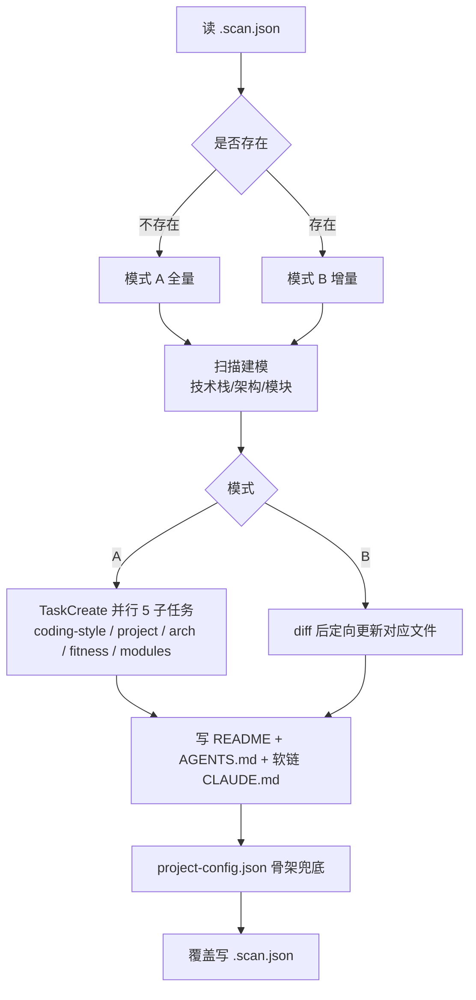

# /init-project

> 扫描项目，生成或增量更新知识库 + 入口文档 + 项目级配置骨架。

## 用法

```bash
/init-project    # 无参数，对当前 git 仓库根执行
```

## 触发

| 场景 | 行为 |
|------|------|
| 首次接入新项目 | 模式 A 全量生成 |
| 架构重构 / 文档过时 | 模式 B 按 diff 增量更新 |
| `.scan.json` 损坏 | 视为模式 A，旧文件按 B 红线保留 |

## 流程



**模式 B 兜底**：AGENTS.md 缺失或格式退化 → 重新生成；CLAUDE.md 不是软链则补齐。

**模式 B 更新映射**：

| 变化 | 操作 |
|------|------|
| 新增/删除模块 | 创建/删除 `tech/backend/modules/<name>.md` + README 同步 |
| 模块内文件变化 | 仅更新对应模块的「文件路由表」段 |
| 技术栈变化 | 更新 `project/overview.md` + README 元信息 |
| 编码规范变化 | 追加到 `coding-style.md`（不删旧） |
| 架构模式变化 | 更新 `project/architecture.md` + README |
| `team/` 新增文档 | 更新 `knowledge/README.md` + `team/INDEX.md` |
| `experience/` | 不自动处理（由 sprint-review 人工写入） |

**project-config.json 骨架**（文件不存在才生成，存在则不动）：

```json
{
  "ssh_servers": [],
  "log": { "paths": [], "output_dir": ".chatlbs/logs_query/{env}" },
  "jenkins": {
    "notify_on_success": true, "notify_on_failure": true,
    "poll_interval_seconds": 30, "timeout_minutes": 15, "envs": []
  },
  "tapd": {
    "enabled": false, "workspace_id": null, "workspace_name": null, "last_sync_at": null,
    "status_enum": {
      "story": ["规划中", "To do", "实现中", "任务/测试完成", "已实现/上线", "关闭"],
      "task":  ["To do", "实现中", "任务/测试完成", "关闭"],
      "item":  ["To do", "进行中", "已完成"],
      "bug":   []
    },
    "status_map": {
      "story": { "to_dev": "To do", "to_review": "规划中", "to_test": "任务/测试完成", "done": "已实现/上线" },
      "task":  { "to_dev": "To do", "to_review": null,     "to_test": "任务/测试完成", "done": "关闭" },
      "item":  { "to_do":  "To do", "in_progress": "进行中", "done": "已完成" },
      "bug":   { "to_dev": null,    "to_review": null,     "to_test": null,            "done": null }
    },
    "comment_markers": {
      "consensus_approved": "[CONSENSUS-APPROVED]",
      "consensus_rejected": "[CONSENSUS-REJECTED:",
      "qa_passed": "[QA-PASSED]", "qa_rejected": "[QA-REJECTED:",
      "subtask_emitted": "[SUBTASK-EMITTED]"
    },
    "team_roles": { "pm": [], "be": [], "fe": [], "qa": [], "other": [] }
  },
  "git": {
    "branches": {
      "feature": { "prefix": "feature/", "source": "master",  "merge_targets": ["dev", "uat"] },
      "bugfix":  { "prefix": "bugfix/",  "source": "current", "merge_targets": ["current-feature"] },
      "hotfix":  { "prefix": "hotfix/",  "source": "master",  "merge_targets": ["dev", "uat"] },
      "release": { "prefix": "release/", "source": "develop", "merge_targets": ["main", "develop"] }
    },
    "merge": { "strategy": "chained", "no_ff": true, "pull_before_merge": true, "allow_force_push": false, "return_to_branch": "current" },
    "commit_push": { "conventional_zh": true, "allow_no_verify": false, "auto_set_upstream": true, "auto_add_all": false },
    "worktree": { "root": ".chatlabs/worktrees" },
    "cleanup": { "allowed_prefixes": ["bugfix/"], "require_merged_to": "current", "delete_remote": true }
  }
}
```

**字段归集原则**：相关配置按职责对象聚合到同一对象下（`log.*` / `jenkins.*` / `tapd.*` / `git.*`），禁止顶层散落。`git.branches.<type>.source` 支持特殊值 `current`（当前分支）/ `current-feature`（最近活跃 feature 分支）。

## 输入参数

无参数。命令对当前 git 仓库根执行。

## 产出

- `AGENTS.md`（纯索引，统一入口）+ `CLAUDE.md`（软链）
- `.chatlabs/project-config.json`（缺失才生成空骨架）
- `.chatlabs/knowledge/README.md` + `.chatlabs/knowledge/.scan.json`
- `.chatlabs/knowledge/{team,project,tech/backend,asset}/`（含 `modules/`、`asset/{contract,frozen,tech-proposals,test-cases,tech-debt}/`）
- `.chatlabs/knowledge/project/experience/`（空目录占位，sprint-review 写入）

## 失败处理

| 场景 | 行为 |
|------|------|
| 技术栈推断失败 | 写 Blocker，跳过空骨架占位，仍生成 README + AGENTS.md |
| 模式 A 检测到 `knowledge/` 已部分存在 | 视为模式 B 按 diff 补齐 |
| 模式 B 团队自定义受保护段落 | 不覆盖，仅追加新模式 |
| 模式 B 无 diff | 仅做 AGENTS.md 兜底校验后退出 |
| 单子任务失败 | 该文件留 placeholder + Blocker，不阻塞其他 |

## AGENTS.md 红线

- **必须是纯索引**：一句话项目描述 + 知识库目录指向 + coding-style / fitness-rules 路径。不得内联技术栈详情、模块列表、集成说明、运行环境（归 `knowledge/project/overview.md`）。
- `CLAUDE.md` 必须是指向 `AGENTS.md` 的相对软链接（`ln -s AGENTS.md CLAUDE.md`），不得是副本。
- 受保护段落不覆盖：`asset/` 全部、`modules/*.md` 的「注意事项」「设计决策」、`project/core-functions.md` 手动补充段、`coding-style.md` / `fitness-rules.md` 团队补充段（只允许追加）。

## 关联

- Skill: `init-project`（扫描器，承担所有 ripgrep / 框架检测细节）
- 入口文档: `AGENTS.md` / `.chatlabs/knowledge/README.md`
- 后续: `/start-dev-flow`、`/tapd init`
