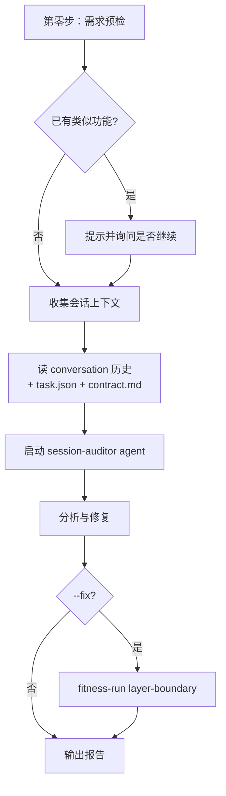

# /session-review

> 实时审查当前会话执行情况，识别问题，可选自动修复 Flow。

## 用法

```bash
/session-review                  # 全部历史
/session-review --since 10m      # 最近 10 分钟
/session-review --since 1h       # 最近 1 小时
/session-review --fix            # 发现问题后自动更新 Flow 配置
```

## 触发

| 场景 | 行为 |
|------|------|
| 用户怀疑流程跑歪 | 输出审查报告 |
| 创建新功能前 | 第零步预检：搜现有 agent/command/skill 是否已覆盖 |
| `--fix` | 修完后跑 fitness-run 验证 |

## 流程



## 输入参数

| 参数 | 必填 | 说明 |
|------|------|------|
| `--since <time>` | 否 | 时间窗口（10m / 1h / 不传则全部） |
| `--fix` | 否 | 发现问题后自动更新 Flow 配置 |

## 产出

- Session 输出审查报告（问题列表 + 建议 + 受影响文件）
- `--fix` 时：直接 Edit 修改对应 agent / hook / template 文件
- 验证：`fitness-run layer-boundary` 通过

## 失败处理

| 场景 | 行为 |
|------|------|
| 无会话历史 | 输出 `ℹ️ 暂无会话历史可审查` |
| 无需修复 | 输出 `✅ 当前会话无明显问题` |
| 无 workflow-state | 跳过，使用默认状态继续分析 |
| `--fix` 但无写权限 | 警告，跳过写入但继续分析 |
| 检测到重复功能 | 提示已有类似 command，询问是否继续 |

## 关联

- Agent: `.claude/agents/session-auditor.md`
- 架构检查: `.claude/skills/fitness-run/SKILL.md`
- 周期对照: `/workflow-review`（周/月聚合）/ `/sprint-review`（每次 task 结束）
