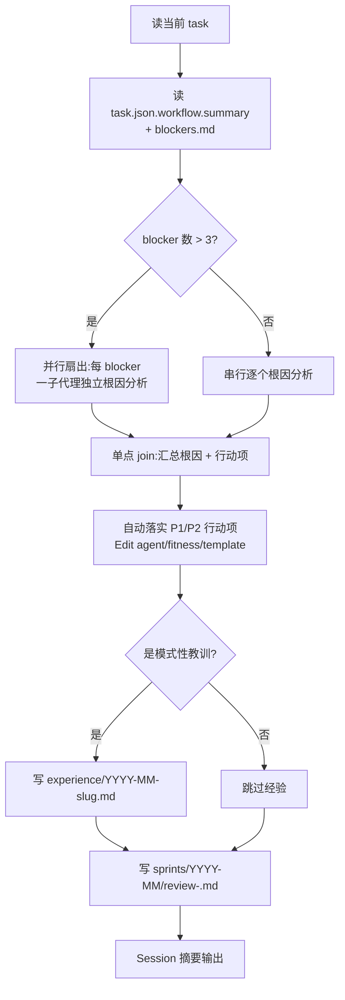

# /sprint-review

> 每个 task 结束后立即轻量复盘——分析 Blocker 根因，输出行动项 + 沉淀经验。

## 用法

```bash
/sprint-review                  # 当前 task
/sprint-review --task <task_id> # 指定 task
```

## 触发

| 维度 | `/sprint-review` | `/workflow-review` |
|------|------------------|--------------------|
| 频率 | 每次 task 结束 | 周 / 每月 |
| 范围 | 当前 task 的 blockers | 全量任务 |
| 输出 | 5-10 行行动建议 | 200 行聚合报告 |
| 写入 | `sprints/<date>/review.md` | `workflow/blockers-summary.md` |
| 粒度 | 单 Blocker 根因 | 频次聚合 + 趋势 |

## 流程



**多 Blocker 并行扇出**：blocker 数 > 3 时，按 `protocols/fan-out-synthesize.md` 把每个 blocker 扇出一个 `general-purpose` 子代理**并行**做根因分析（各自只返回结构化根因 + 建议，不回贴正文），在 J 点**单点 join** 汇总后再统一落实 P1/P2 行动项。**安全阀**：blocker 数 ≤ 3 退串行（轻量场景不值扇出开销）；环境不支持子代理则降级串行，不阻塞复盘。

**Blocker 根因模板**：问题是什么 → 为什么发生（疏忽/规则缺失/工具配置/信息不足）→ 以后怎么减少（改 agent / hook / template / 人工注意）。

**自动落实**：P1/P2 行动项 AI 直接 Edit，不询问；目标文件不存在则追加到 `docs/tech-debt-backlog.md`（状态 open）。

**经验沉淀判定**（≥ 1 条即写 experience）：
- 同类问题已发生 ≥ 2 次（查 workflow-review 趋势）
- 根因涉及"团队规范盲区"或"工具陷阱"，非一次性配置错误
- 解决方案需要"下次警惕"而非"代码修复"
- 涉及外部系统行为（TAPD/Jenkins/MCP）的非显式约束

**约束**：每个有效 Blocker 至少产出一个——`tech-debt`（待还）/ `experience`（已学）/ 或两者皆有，不可同时跳过。

## 输入参数

| 参数 | 必填 | 说明 |
|------|------|------|
| `--task <task_id>` | 否 | 默认当前 task |

## 产出

- `docs/reports/sprints/YYYY-MM/review-<task_id>.md`（完整复盘报告）
- `docs/tech-debt-backlog.md`（自动追加行动项 — 待修复债务）
- `docs/knowledge/project/experience/YYYY-MM-<slug>.md`（模式性教训，按需）
- 直接修改 agent / fitness / template 文件

## 失败处理

| 场景 | 行为 |
|------|------|
| blockers.md 为空 | 输出"无 Blocker，干得漂亮！"，仍写 review.md |
| `task.json.workflow.summary` 未填写 | 警告，用 blockers.md 单独分析 |
| 无需行动项 | 输出 PASS，跳过 tech-debt-backlog 写入 |

## 关联

- Agent: `.claude/agents/workflow-reviewer.md`（全量分析，供趋势对比）
- Command: `/workflow-review`（周/月聚合）
- 协议: `.claude/protocols/fan-out-synthesize.md`（多 blocker 并行扇出 + 单点 join）
- 经验入口: `docs/knowledge/project/experience/INDEX.md`
- 模板: `.claude/templates/sprint-review.md`
