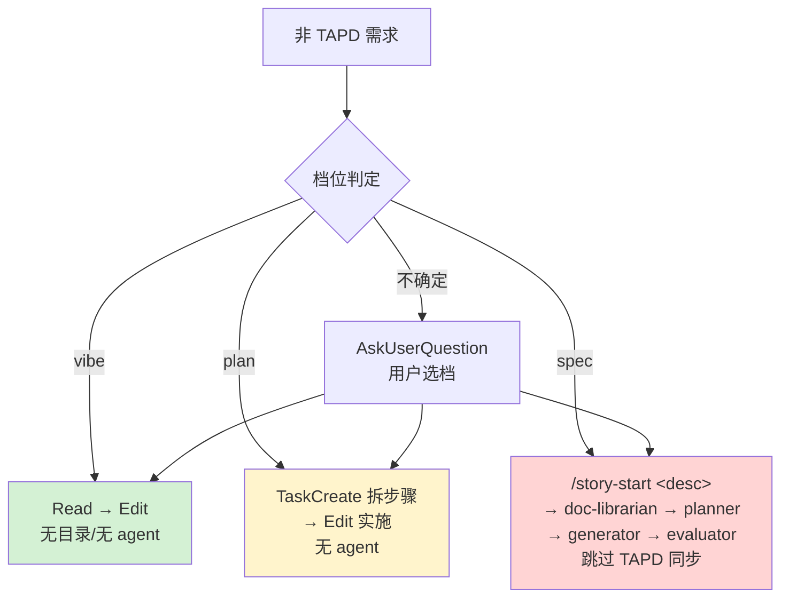

# /start-dev-flow

> **唯一入口命令**。用户只需描述意图，AI 自动识别并路由到对应流程。
> 其他 slash commands（如 `/tapd-story-start`、`/story-start`、`/task-resume`）由 AI 根据意图自动调用，用户无需手动选择。

## 意图识别（一级路由）

| 识别条件 | 自动行为 |
|---------|---------|
| 包含 TAPD 工单 ID（纯数字 / 10+ 位 / TAPD URL） | TAPD 链路（见下） |
| 包含 "tapd" 关键词 | 检测 project-config.json → 按需 tapd-init → 拉工单 → TAPD 链路 |
| 描述功能/需求/bug（**无** TAPD 标记） | **非 TAPD 链路：三档分级路由**（见下） |
| 包含 "继续" / "恢复" / "上次的任务" | 读 `.current_task` → `/task-resume` |
| 包含 "复盘" / "review" / "迭代" | 调 `workflow-reviewer` agent |
| 纯命令词（无具体内容） | 输出当前状态，等待补充 |

---

## TAPD 链路（保持不变）

检测到 TAPD 意图时：

1. 无 `.chatlabs/project-config.json` → 调用 `tapd-init` skill
2. 有配置 → 解析 ticket_id → 调用 `/tapd-story-start <ticket_id>`
3. 工单格式错误 → 反馈原因

TAPD 链路 = **doc-librarian → contract.md → planner → spec.md → cases → generator → evaluator** + **TAPD 同步动作**（wiki 推送、产品评审、subtask 派发、工单回写）。

---

## 非 TAPD 链路：三档分级路由

> **核心规则**：非 TAPD 需求 **跳过 TAPD 工作流**（不推 wiki、不需产品评审、不派发 TAPD subtask、不回写工单）。
>
> **agent 链路按需启用**：复杂需求依然调用 `doc-librarian / planner / generator / evaluator`——它们不是 TAPD 专属，而是承载"需求理解 → 技术拆解 → 实现 → 验收"的通用能力。
>
> 由主 Claude 根据需求规模自评档位，路由到不同入口：

### 档位判定规则

| 档位 | 判定条件（任一升档） | flow_id | 路由行为 |
|------|---------------------|---------|----------|
| **vibe** | • 用户给出明确文件路径 + 具体改动<br>• 纯改值 / 常量 / 文案 / 枚举项<br>• 不涉对外 API、不涉数据迁移 | `local-vibe` | 直接 `Read` → `Edit`，**不创建任何目录、不调 agent** |
| **plan** | • 单一逻辑模块、≤ 2 文件<br>• 有判断分支但无契约变化<br>• 用户描述清晰但需要拆步骤 | `local-plan` | `TaskCreate` 列拆解 → `Edit` 实施 → 完成时 `TaskUpdate completed`；**不调 agent、不进 STORY 体系** |
| **spec** | • 跨模块 / 多角色（前+后 / 前+QA / 后+DBA）<br>• 改动对外 API 或新增端点<br>• 涉数据迁移 / schema 变更<br>• 用户描述模糊、需要先正式拆解 | `local-spec` | 调用 `/story-start <description>`：进 STORY 体系，走完整 `doc-librarian → planner → generator → evaluator`，**跳过 TAPD 同步动作** |

### 边界处理

- **LLM 判定不确定** → 用 `AskUserQuestion` 让用户三选一（vibe / plan / spec）。
- **用户强制档位** → 支持前缀语法：`vibe: <描述>` / `plan: <描述>` / `spec: <描述>`，前缀优先于自动判定。
- **错档了想升级** → 用户中途说 "这个比想的复杂" → 主动升档；vibe→plan 用 TaskCreate；plan→spec 调用 /story-start 接续。

### flow 实例化(必做)

档位选定后,**必须**实例化 flow 子对象,这是后续 `/task-resume` / `/flow-advance` 的前提:

```bash
# 1. 创建 task(如未创建)
/task-new <story_id>

# 2. 实例化 flow(关键步骤,不可跳过)
python .claude/scripts/flow_advance.py --story-id <story_id> init \
  --flow-id <local-vibe|local-plan|local-spec|tapd-full> \
  --task-id <TASK-id>
```

vibe/plan 档位由于不进 STORY 体系,使用全局 state 文件(不传 `--story-id`):
```bash
python .claude/scripts/flow_advance.py init --flow-id local-vibe --task-id <TASK-id>
```

每完成一个 step,调 `/flow-advance <step_id>` 推进。流程结束时 flow 自动到达 terminal。

### 三档行为对照



### 与 TAPD 链路的关键区别

| 环节 | TAPD 任意规模 | 非 TAPD spec |
|------|--------------|--------------|
| contract.md / spec.md / cases | ✅ | ✅ |
| doc-librarian / planner / generator / evaluator | ✅ | ✅ |
| **TAPD wiki 同步**（tapd-consensus-push） | ✅ | ❌ |
| **产品评审等待**（waiting-consensus） | ✅ | ❌ |
| **TAPD subtask 派发**（tapd-subtask-emit） | ✅ | ❌ |
| **TAPD 工单状态回写** | ✅ | ❌ |

非 TAPD spec 的"跳过同步"由 `/story-start` 内部根据 `tapd_ticket_id == null` 自动判定，无需用户操心。

---

## 环境预检（静默，不主动输出）

```
.chatlabs/project-config.json  →  存在/不存在
.current_task                  →  有/无
git status                     →  clean/有变更
```

只在用户询问 "当前状态" 或路由需要时展示。

---

## 设计原则

- **用户只需说 "我要做 xxx"**，不需要知道具体命令。
- AI 据语义自动路由：TAPD 标记 → TAPD 链路；本地需求 → 三档分级。
- **agent 链路是通用能力，TAPD 同步才是 TAPD 专属**——非 TAPD 复杂需求依然享有完整链路的好处（结构化契约、可测试 case、独立验收），只是不向外部 TAPD 系统同步。
- 成本与收益匹配：vibe/plan 不调重型 agent 链路；spec 才进 STORY 体系。

## 反模式（必须拒绝）

- ❌ 非 TAPD 简单改动也强制走 doc-librarian + 完整链路（vibe/plan 应直接 Edit，不调 agent）
- ❌ 非 TAPD spec 模式调用 tapd-consensus-push / tapd-subtask-emit（同步动作只属于 TAPD 链路）
- ❌ TAPD 链路被裁剪（contract→spec→cases 是 TAPD 闭环，必须完整）
- ❌ vibe/plan 创建 `.chatlabs/stories/STORY-XXX/` 目录（污染 STORY 体系）
- ❌ spec 模式跳过 EnterPlanMode 风格的用户确认（spec 入 STORY 是重操作，必须走 /story-start 流程）
