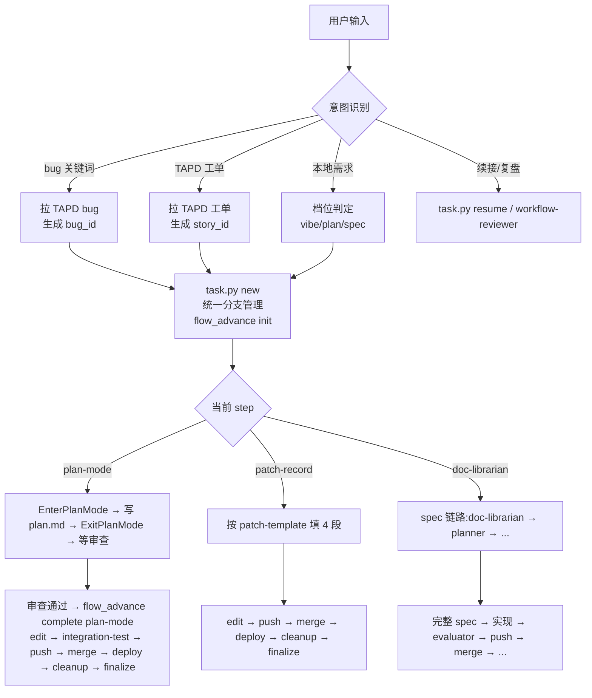

# /start-dev-flow

> 唯一入口命令——AI 据语义自动路由,**所有档位的分支管理 + 任务创建 + flow 初始化都在本命令内统一执行**,不再委托子命令。

## 用法

```bash
/start-dev-flow <自然语言描述>
```

## 开工前的历史参考(软引导)

接到新任务后,主 Claude **应**先调一次:

```bash
python .claude/skills/task/scripts/task.py search --keyword "<核心词>" --limit 5 [--include-archive]
```

- 关键词从用户描述提取(模块名 / 业务术语 / 接口名)
- 命中 ≥ 1 条 → 输出"发现 N 条相似历史任务,是否参考?"+ 候选清单(task_id / one_liner / key_decisions)
- 用户同意 → Read 对应 task 目录的 contract.md / plan.md / patch.md 作为开工参考
- 命中 0 条 → 直接进入下方意图识别

软引导,不强制——AI 自行判断是否值得查历史(纯文案 typo 不必查)。

## 触发(意图识别)

| 识别条件 | 后续处理(由本命令统一执行) |
|---------|--------------------------|
| TAPD bug 链接 / "修 bug" / "缺陷" / "hotfix" | 拉 bug → 复杂度判定 → 统一分支管理 → init `bugfix-{vibe\|plan\|spec}` flow |
| "修所有 bug" / `--all` | 逐 bug 循环上述流程(可走 worktree 并行) |
| TAPD 工单 ID(非 bug)/ URL | 拉工单 → 统一分支管理 → init `tapd-full` flow |
| 功能/需求描述(无 TAPD 标记) | 三档判定 → 统一分支管理 → init `local-{vibe\|plan\|spec}` flow |
| "继续" / "恢复" / "上次的任务" | `task.py resume <task_id>` |
| "复盘" / "review" / "迭代" | `workflow-reviewer` agent |

**TAPD 工单 vs bug 区分**:URL 含 `/bugtrace_detail` / `bugtrace/` → bug;含 `/stories_detail` / `story/` / `tasks/` → 普通 TAPD。模糊时看描述里是否含"bug/修复/缺陷"。

**关键变化(2026-05-29):** 不再委托给 `/bug-fix` / `/tapd start` / `/story-start` 子命令,**所有路径都在本命令内统一处理**(详见下方"统一分支管理"段)。子命令保留独立调用兼容,但 /start-dev-flow 不再触发它们。

## 流程


```mermaid
flowchart TD
    A[用户输入] --> B{意图识别}
    B -->|bug 关键词| C1[拉 TAPD bug<br/>生成 bug_id]
    B -->|TAPD 工单| C2[拉 TAPD 工单<br/>生成 story_id]
    B -->|本地需求| C3[档位判定<br/>vibe/plan/spec]
    B -->|续接/复盘| F[task.py resume / workflow-reviewer]
    C1 --> D[task.py new<br/>统一分支管理<br/>flow_advance init]
    C2 --> D
    C3 --> D
    D --> E{当前 step}
    E -->|plan-mode| P[EnterPlanMode → 写 plan.md → ExitPlanMode → 等审查]
    E -->|patch-record| V[按 patch-template 填 4 段]
    E -->|doc-librarian| S[spec 链路:doc-librarian → planner → ...]
    P --> G[审查通过 → flow_advance complete plan-mode<br/>edit → integration-test → push → merge → deploy → cleanup → finalize]
    V --> H[edit → push → merge → deploy → cleanup → finalize]
    S --> I[完整 spec → 实现 → evaluator → push → merge → ...]
```

## 三档判定(本地任务)

| 档位 | 条件(任一升档) | flow_id | 行为 |
|------|---------------|---------|------|
| vibe | 明确文件 + 具体改动 / 纯改值 / 不涉 API / 不涉迁移 | `local-vibe` | Edit → patch.md → push |
| plan | ≤ 2 文件 / 有分支无契约变化 / 需拆步骤 | `local-plan` | **EnterPlanMode → 写 plan.md → ExitPlanMode 等审查 → 通过后一路自动跑** Edit / 集成测试 / push / merge / deploy / cleanup |
| spec | 跨模块 / 改对外 API / 涉数据迁移 / 用户描述模糊 | `local-spec` | doc-librarian → planner → arbiter → generator → evaluator → push → ... |

**强制档位**:前缀 `vibe:` / `plan:` / `spec:` 优先于自动判定。

**plan 档语义说明(2026-05-29 新)**:

plan 档使用 **Claude Code 原生 planner**——主 Claude 在 `plan-mode` step 时:
1. 调 `EnterPlanMode` 工具进入 plan mode
2. 在 plan mode 内调研代码(可调 Explore 子代理) + 按 `.claude/templates/plan-template.md` 写 `.chatlabs/task/store/<story_id>/plan.md`
3. 调 `ExitPlanMode` 提交方案给用户审查
4. **用户审查通过后**,主 Claude 调 `flow_advance complete plan-mode` 推进
5. 后续 `edit` / `integration-test` / `git-push` / `merge` / `deploy` / `branch-cleanup` / `finalize` **一路自动跑**,中间不再每步问询

**vibe 档强制痕迹**:flow 在 `edit` 与 `git-push` 之间有 `patch-record` step,主 Claude 必须按 `.claude/templates/patch-template.md` 填 4 段 patch.md。字段是否填全由主 Claude 自检;超出 3 行任一段 → 提示升档到 plan。

## 统一分支管理 + flow 实例化(★ 核心改造)

档位/链路确定后,**所有路径**按以下顺序执行(不再委托子命令):

```bash
# 1. 决定 branch_type
case "$intent" in
  bug-critical | hotfix-keyword)
    branch_type="hotfix" ;;
  bug)
    branch_type="bugfix" ;;
  *)
    branch_type="feature" ;;   # 本地任务(vibe/plan/spec) 与 TAPD 普通工单均用 feature
esac

# 2. 生成 task_id 与 branch(命名规范见 docs/git-brance-spec.md ★ 两者不同维度,不要混用)
#    - task_id / story_id(按时间组织): <MM-dd>-<description>   统一,不论本地/TAPD
#    - branch 名(按工单关联):
#        本地任务(无 TAPD): <description>
#        TAPD 工单 / bug:    <ticket_short>-<description>(ticket 后 6 位)
#    description 由用户描述 → LLM 译英文 slug,小写 + `-`,仅 [a-z0-9-],3-40 字
task_id="$(date +%m-%d)-${description}"     # task/story 目录名,统一带 MM-dd 前缀
if [ -n "$ticket_id" ]; then
  ticket_short="${ticket_id: -6}"           # TAPD 工单 ID 后 6 位
  branch_id="${ticket_short}-${description}"
else
  branch_id="${description}"
fi
branch="${branch_type}/${branch_id}"

# 3. 创建任务目录(story_id = task_id = <MM-dd>-<description>;同名冲突 task.py 自动加 timestamp 兜底)
python .claude/skills/task/scripts/task.py new "$task_id" --name "$task_id"

# 4. 分支幂等创建(source 由 project-config.json.git.branches.<type>.source 决定)
python .claude/skills/git/scripts/ensure_branch.py "$branch" --branch-type "$branch_type"

# 5. worktree(按 project-config.json.git.worktree.skip_for_complexity 跳过)
if [ "$complexity" != "vibe" ]; then
  worktree_path=".chatlabs/worktrees/${task_id}"
  git worktree add "$worktree_path" "$branch"
  python .claude/skills/task/scripts/task.py bind-branch "$task_id" \
    --branch "$branch" --branch-type "$branch_type" --worktree-path "$worktree_path"
else
  python .claude/skills/task/scripts/task.py bind-branch "$task_id" \
    --branch "$branch" --branch-type "$branch_type"
fi

# 6. flow init(按档位/链路选 flow_id)
python .claude/skills/flow-engine/scripts/flow_advance.py --story-id "$task_id" init \
  --flow-id <local-vibe|local-plan|local-spec|bugfix-vibe|bugfix-plan|bugfix-spec|tapd-full> \
  --task-id "$task_id"
```

**示例:**

| 场景 | description | ticket_id | task_id / story_id | branch |
|------|-------------|-----------|--------------------|--------|
| 本地 plan 档 | `ec-user-exists-api` | — | `05-29-ec-user-exists-api` | `feature/ec-user-exists-api` |
| TAPD 工单 | `add-payment` | `1152676229001000123` | `05-29-add-payment` | `feature/000123-add-payment` |
| 本地 bug | `token-expire-retry` | — | `05-29-token-expire-retry` | `bugfix/token-expire-retry` |
| TAPD bug | `token-expire-retry` | `1152676229001001234` | `05-29-token-expire-retry` | `bugfix/001234-token-expire-retry` |

**配置驱动**(读 `.chatlabs/project-config.json`):
- `git.branches.feature.source: master` / `prefix: feature/`
- `git.branches.bugfix.source: current` / `prefix: bugfix/`(从当前 feature 分支拉)
- `git.branches.hotfix.source: master` / `prefix: hotfix/`
- `git.worktree.auto_create: true` / `skip_for_complexity: ["vibe"]`

**所有档位均由 `task.py new` 创建 `.chatlabs/task/store/<story_id>/`**(vibe 存 patch.md;plan 存 plan.md;spec 存 contract/spec/cases)。

## 输入参数

| 参数 | 必填 | 说明 |
|------|------|------|
| `<描述>` | 是 | 自然语言意图(含工单 ID / bug URL / 功能描述等) |

## 产出

- task 目录:`.chatlabs/task/store/<task_id>/` 或 `.chatlabs/task/bug-fix/<task_id>/`(task_id = `<MM-dd>-<description>`)
- 分支:`<type>/<branch_id>`(branch_id = `<ticket-short>-<description>`,本地无工单则 `<description>`,已 checkout)
- worktree(非 vibe):`.chatlabs/worktrees/<task_id>/`
- task.json.workflow.flow 已初始化,当前 step 待主 Claude 推进

## 失败处理

| 场景 | 行为 |
|------|------|
| 纯命令词(无具体内容) | 输出当前状态,等待补充 |
| TAPD 工单 URL 格式错误 | 反馈原因 |
| 无 `.chatlabs/project-config.json` 且检测到 TAPD 意图 | 提示后自动 `/tapd init` → 续跑 |
| LLM 档位判定不确定 | AskUserQuestion 让用户三选一 |
| 错档想升级 | vibe→plan:走新 plan 任务;plan→spec:走新 spec 任务(不在同任务内升档) |
| `ensure-branch` 失败(工作区脏 / 分支冲突) | 阻塞,提示用户处理 |
| `worktree add` 已存在路径 | 提示用户清理或选其他 id |
| `flow_advance init` 失败 | 阻塞,检查 flow 模板与 story_id 对应 |

## 关联

- **flow 模板**:`.claude/templates/flows/*.json`
- **方案模板**(plan 档):`.claude/templates/plan-template.md`
- **痕迹模板**(vibe 档):`.claude/templates/patch-template.md`
- **下游 agents**(spec 档与 TAPD 链路):`doc-librarian` / `planner` / `arbiter` / `generator` / `evaluator`
- **集成测试**:`integration-test` skill → `java-testing` adapter(plan / spec 档均会走)
- **独立子命令兼容**:`/bug-fix` / `/tapd start` / `/story-start` 仍可独立调用,但 `/start-dev-flow` 不再委托

## GAN 三角(spec 档与 TAPD 链路)

GAN 链路对本地 spec 与 TAPD 路径完全相同;TAPD 仅在"输入适配 + 输出回填"边界,不渗透 GAN 内部。详见 `.claude/agents/{planner,generator,evaluator}.md`。
