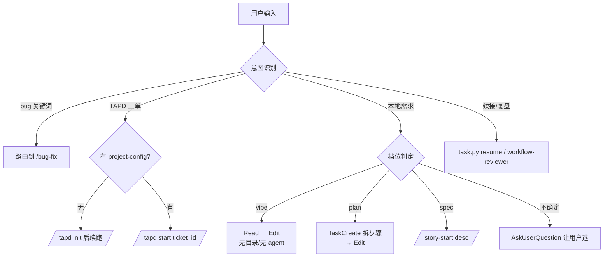

# /start-dev-flow

> 唯一入口命令——AI 据语义自动路由，用户只需说"我要做 xxx"。

## 用法

```bash
/start-dev-flow <自然语言描述>
```

## 开工前的历史参考（软引导）

接到新任务后,主 Claude **应**先调一次:

```bash
python .claude/skills/task/scripts/task.py search --keyword "<核心词>" --limit 5 [--include-archive]
```

- 关键词从用户描述提取(模块名 / 业务术语 / 接口名)
- 命中 ≥ 1 条 → 输出"发现 N 条相似历史任务,是否参考?"+ 候选清单(task_id / one_liner / key_decisions)
- 用户同意 → Read 对应 task 目录的 contract.md / patch.md 作为开工参考上下文
- 命中 0 条 → 直接进入下方意图识别,不打扰用户

软引导,不强制——AI 自行判断本任务是否值得查历史(纯文案 typo 之类不必查)。

## 触发（意图识别）

| 识别条件 | 路由 |
|---------|------|
| TAPD bug 链接 / "修 bug" / "缺陷" / "hotfix" | `/bug-fix` |
| "修所有 bug" / `--all` | `/bug-fix --all` |
| TAPD 工单 ID（非 bug）/ URL | TAPD 链路（按需先 `/tapd init`） |
| 功能/需求描述（无 TAPD 标记） | 三档分级路由 |
| "继续" / "恢复" / "上次的任务" | `task.py resume <task_id>` |
| "复盘" / "review" / "迭代" | `workflow-reviewer` agent |

**TAPD 工单 vs bug 区分**：URL 含 `/bugtrace_detail` / `bugtrace/` → bug；含 `/stories_detail` / `story/` / `tasks/` → 普通 TAPD。模糊时看描述里是否含"bug/修复/缺陷"。

## 流程


```mermaid
flowchart TD
    A[用户输入] --> B{意图识别}
    B -->|bug 关键词| C[路由到 /bug-fix]
    B -->|TAPD 工单| D{有 project-config?}
    B -->|本地需求| E{档位判定}
    B -->|续接/复盘| F[task.py resume / workflow-reviewer]
    D -->|无| G[/tapd init 后续跑/]
    D -->|有| H[/tapd start ticket_id/]
    E -->|vibe| I[Read → Edit<br/>无目录/无 agent]
    E -->|plan| J[TaskCreate 拆步骤<br/>→ Edit]
    E -->|spec| K[/story-start desc/]
    E -->|不确定| L[AskUserQuestion 让用户选]
```

**三档判定**：

| 档位 | 条件（任一升档） | flow_id | 行为 |
|------|----------------|---------|------|
| vibe | 明确文件 + 具体改动 / 纯改值 / 不涉 API / 不涉迁移 | `local-vibe` | Edit → patch.md → push |
| plan | ≤ 2 文件 / 有分支无契约变化 / 需拆步骤 | `local-plan` | TaskCreate → Edit |
| spec | 跨模块 / 改对外 API / 涉数据迁移 / 用户描述模糊 | `local-spec` | `/story-start <desc>` |

**强制档位**：前缀 `vibe:` / `plan:` / `spec:` 优先于自动判定。

**vibe 档强制痕迹**：flow 在 `edit` 与 `git-push` 之间有 `patch-record` step，主 Claude 必须按 `.claude/templates/patch-template.md` 填 4 段 patch.md，落地 `.chatlabs/task/store/<story_id>/patch.md`。字段是否填全由主 Claude 自检；超出 3 行任一段 → 提示升档到 plan。

**flow 实例化**（档位选定后必做）：
```bash
slug="${story_id#??-??-}"
python .claude/skills/task/scripts/task.py new "<story_id>" --name "$slug"
python .claude/skills/flow-engine/scripts/flow_advance.py --story-id <story_id> init \
  --flow-id <local-vibe|local-plan|local-spec|tapd-full> --task-id <task_id>
```

所有档位均由 `task.py new` 创建 `.chatlabs/task/store/<story_id>/` 目录（vibe 也建，存放 patch.md；plan 存放 plan.md；spec 存放 contract/spec/cases）。flow_advance 总是传 `--story-id`，状态写入 task.json。

## 输入参数

| 参数 | 必填 | 说明 |
|------|------|------|
| `<描述>` | 是 | 自然语言意图（含工单 ID / bug URL / 功能描述等） |

## 产出

按路由的子命令产出，详见各下游 command 文档。

## 失败处理

| 场景 | 行为 |
|------|------|
| 纯命令词（无具体内容） | 输出当前状态，等待补充 |
| TAPD 工单格式错误 | 反馈原因 |
| 无 `.chatlabs/project-config.json` 且检测到 TAPD 意图 | 提示后自动 `/tapd init` → 续跑 |
| LLM 档位判定不确定 | AskUserQuestion 让用户三选一 |
| 错档想升级 | vibe→plan 用 TaskCreate；plan→spec 调 `/story-start` 接续 |

## 关联

- 下游 commands：`/bug-fix` / `/tapd start` / `/story-start` / `/tapd init`
- 下游 agents（spec 档与 TAPD 链路）：`doc-librarian` / `planner` / `generator` / `evaluator`
- GAN 链路对两条路径完全相同；TAPD 仅在"输入适配 + 输出回填"边界，不渗透 GAN 内部
