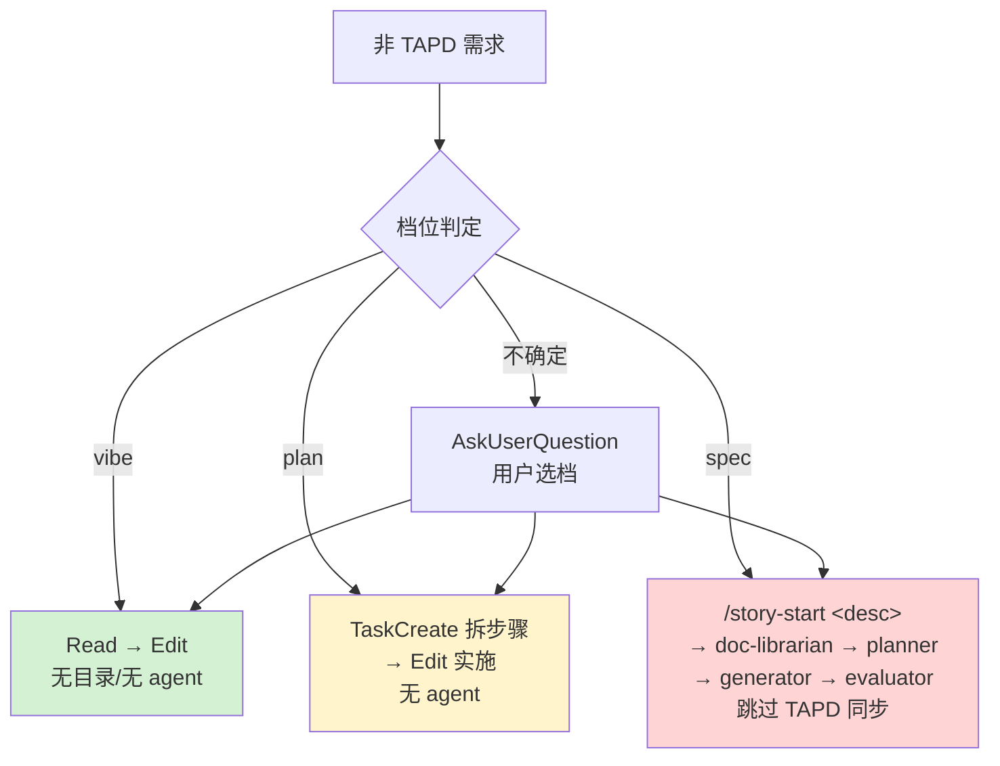

# /start-dev-flow

> **唯一入口命令**。用户只需描述意图，AI 自动识别并路由到对应流程。
> 其他 slash commands（如 `/tapd start`、`/story-start`）由 AI 根据意图自动调用，用户无需手动选择。
> 任务续接通过 `python .claude/scripts/task.py resume <task_id>`。

## 意图识别（一级路由）

| 识别条件 | 自动行为 |
|---------|---------|
| 包含 **TAPD bug** 链接 / bug ID / "修复 bug" / "fix bug" / "hotfix" / "缺陷" | **Bug-fix 链路**：调用 `/bug-fix`（详见下） |
| 包含 "修所有 bug" / "处理所有未处理 bug" / `--all` 意图 | 调用 `/bug-fix --all`（批量 worktree 模式） |
| 包含 TAPD 工单 ID（纯数字 / 10+ 位 / TAPD URL，且**不是** bug 链接） | TAPD 链路（见下） |
| 包含 "tapd" 关键词（非 bug） | 检测 project-config.json → 按需 tapd-init → 拉工单 → TAPD 链路 |
| 描述功能/需求（**无** TAPD 标记，**非** bug 修复） | **非 TAPD 链路：三档分级路由**（见下） |
| 包含 "继续" / "恢复" / "上次的任务" | 读 `.current_task` → `python .claude/scripts/task.py resume <task_id>` |
| 包含 "复盘" / "review" / "迭代" | 调 `workflow-reviewer` agent |
| 纯命令词（无具体内容） | 输出当前状态，等待补充 |

> **TAPD 工单 vs TAPD bug 区分**：URL 中含 `/bugtrace_detail`、`bugtrace/` 路径 → bug 链路；含 `/stories_detail`、`story/`、`tasks/` 路径 → 普通 TAPD 链路。模糊时优先看用户描述里是否含"bug/修复/缺陷"等关键词。

---

## Bug-fix 链路

检测到 bug 意图时：

1. 单 bug URL → 调 `/bug-fix <url>`
2. `--all` 或"修所有 bug" → 调 `/bug-fix --all`
3. 用户描述 bug 但无 TAPD 链接 → 调 `/bug-fix --local "<描述>"`

`/bug-fix` 内部按 bug 数量自动决定单分支 / worktree 模式，按复杂度路由 vibe/plan/spec，最后合并 → 部署 → TAPD 回填。详见 `.claude/commands/bug-fix.md`。

---

## TAPD 链路

检测到 TAPD 意图时:

1. 无 `.chatlabs/project-config.json` →
   先输出一行提示：`未检测到 .chatlabs/project-config.json，自动初始化 TAPD 配置（智能匹配，仅失配时询问）...`
   然后调用 `/tapd init`；初始化完成后**直接续跑**到第 2 步，不要求用户额外确认
2. 有配置 → 解析 ticket_id → 调用 `/tapd start <ticket_id>`
3. 工单格式错误 → 反馈原因

TAPD 链路结构:

```
[输入适配] /tapd start: 拉工单 → 落地 stories/<id>/source/
    ↓
[GAN 链路] doc-librarian → 评审门(consensus-gate 单向) → planner → generator → evaluator
    ↓
[CI/CD] git-push → jenkins-deploy
    ↓
[输出回填] /tapd emit: 读 cases + 估工时 → 批量创建 subtask 立即 done
```

**关键纪律**:
- GAN 链路内不感知 TAPD(doc-librarian 只读 source/,不读 ticket)
- 评审门是单向门:GAN 内任何阶段不可回退到评审
- subtask 是工时台账,不是任务派发(创建即 done,父工单状态由 PM 手工管理)

---

## 非 TAPD 链路：三档分级路由

> **核心规则**：非 TAPD 需求 **跳过 TAPD 工作流**（不推 wiki、不需产品评审、不派发 TAPD subtask、不回写工单）。
>
> **agent 链路按需启用**：复杂需求依然调用 `doc-librarian / planner / generator / evaluator`——它们不是 TAPD 专属，而是承载"需求理解 → 技术拆解 → 实现 → 验收"的通用能力。
>
> 由主 Claude 根据需求规模自评档位，路由到不同入口：

### 档位判定规则

| 档位 | 判定条件（任一升档） | flow_id | 路由行为 |
|------|---------------------|---------|----------|
| **vibe** | • 用户给出明确文件路径 + 具体改动<br>• 纯改值 / 常量 / 文案 / 枚举项<br>• 不涉对外 API、不涉数据迁移 | `local-vibe` | 直接 `Read` → `Edit`，**不创建任何目录、不调 agent** |
| **plan** | • 单一逻辑模块、≤ 2 文件<br>• 有判断分支但无契约变化<br>• 用户描述清晰但需要拆步骤 | `local-plan` | `TaskCreate` 列拆解 → `Edit` 实施 → 完成时 `TaskUpdate completed`；**不调 agent、不进 STORY 体系** |
| **spec** | • 跨模块 / 多角色（前+后 / 前+QA / 后+DBA）<br>• 改动对外 API 或新增端点<br>• 涉数据迁移 / schema 变更<br>• 用户描述模糊、需要先正式拆解 | `local-spec` | 调用 `/story-start <description>`：进 STORY 体系，走完整 `doc-librarian → planner → generator → evaluator`，**跳过 TAPD 同步动作** |

### 边界处理

- **LLM 判定不确定** → 用 `AskUserQuestion` 让用户三选一（vibe / plan / spec）。
- **用户强制档位** → 支持前缀语法：`vibe: <描述>` / `plan: <描述>` / `spec: <描述>`，前缀优先于自动判定。
- **错档了想升级** → 用户中途说 "这个比想的复杂" → 主动升档；vibe→plan 用 TaskCreate；plan→spec 调用 /story-start 接续。

### flow 实例化(必做)

档位选定后,**必须**实例化 flow 子对象,这是后续 `task.py resume` / `/flow-advance` 的前提:

```bash
# 1. 创建 task(如未创建)
python .claude/scripts/task.py new <story_id>

# 2. 实例化 flow(关键步骤,不可跳过)
python .claude/skills/flow-engine/scripts/flow_advance.py --story-id <story_id> init \
  --flow-id <local-vibe|local-plan|local-spec|tapd-full> \
  --task-id <TASK-id>
```

vibe/plan 档位由于不进 STORY 体系,使用全局 state 文件(不传 `--story-id`):
```bash
python .claude/skills/flow-engine/scripts/flow_advance.py init --flow-id local-vibe --task-id <TASK-id>
```

每完成一个 step,调 `/flow-advance <step_id>` 推进。流程结束时 flow 自动到达 terminal。

### 三档行为对照


```mermaid
flowchart TD
    A[非 TAPD 需求] --> B{档位判定}
    B -->|vibe| C[Read → Edit<br/>无目录/无 agent]
    B -->|plan| D[TaskCreate 拆步骤<br/>→ Edit 实施<br/>无 agent]
    B -->|spec| E["/story-start &lt;desc&gt;<br/>→ doc-librarian → planner<br/>→ generator → evaluator<br/>跳过 TAPD 同步"]
    B -->|不确定| F[AskUserQuestion<br/>用户选档]
    F --> C
    F --> D
    F --> E

    style C fill:#d4f1d4
    style D fill:#fff4cc
    style E fill:#ffd4d4
```

### 与 TAPD 链路的关键区别

| 环节 | TAPD 任意规模 | 非 TAPD spec |
|------|--------------|--------------|
| **GAN 链路**(doc-librarian/planner/generator/evaluator) | ✅ 完全相同 | ✅ 完全相同 |
| contract.md / spec.md / cases | ✅ | ✅ |
| **输入侧**:工单 → stories/<id>/source/ 适配 | ✅(/tapd start 命令) | 不需要(/story-start 直接写 source/) |
| **评审门**(consensus-gate,wiki + 单向门) | ✅ | ❌ |
| **输出侧**:部署后工时回填 subtask | ✅(/tapd emit 创建即 done) | ❌ |

> GAN 链路在两条路径完全相同。TAPD 仅作为"输入适配 + 输出回填"的边界,不渗透 GAN 内部。非 TAPD spec 的"跳过 TAPD 联动"由 `/story-start` 内部根据 `tapd_ticket_id == null` 自动判定。

---

## 环境预检（静默，不主动输出）

```
.chatlabs/project-config.json  →  存在/不存在
.current_task                  →  有/无
git status                     →  clean/有变更
```

只在用户询问 "当前状态" 或路由需要时展示。

---

## 设计原则

- **用户只需说 "我要做 xxx"**，不需要知道具体命令。
- AI 据语义自动路由：TAPD 标记 → TAPD 链路；本地需求 → 三档分级。
- **agent 链路是通用能力，TAPD 同步才是 TAPD 专属**——非 TAPD 复杂需求依然享有完整链路的好处（结构化契约、可测试 case、独立验收），只是不向外部 TAPD 系统同步。
- 成本与收益匹配：vibe/plan 不调重型 agent 链路；spec 才进 STORY 体系。

## 反模式（必须拒绝）

- ❌ 非 TAPD 简单改动也强制走 doc-librarian + 完整链路（vibe/plan 应直接 Edit，不调 agent）
- ❌ 非 TAPD spec 模式调用 `/tapd push` / `/tapd emit`（同步动作只属于 TAPD 链路）
- ❌ TAPD 链路被裁剪（contract→spec→cases 是 TAPD 闭环，必须完整）
- ❌ vibe/plan 创建 `.chatlabs/task/store/STORY-XXX/` 目录（污染 STORY 体系）
- ❌ spec 模式跳过 EnterPlanMode 风格的用户确认（spec 入 STORY 是重操作，必须走 /story-start 流程）
