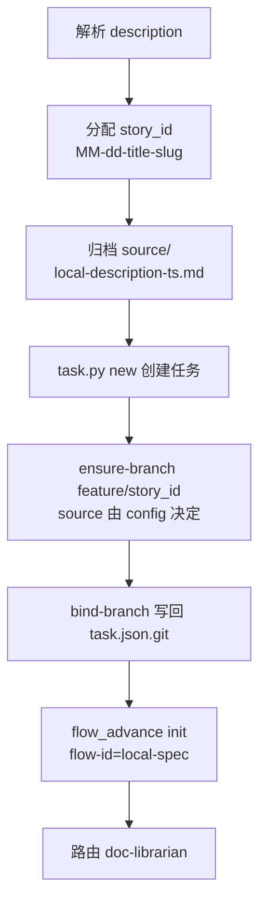

# /story-start

> 本地 Story 入口（spec 档标准入口）——直接从 description 开工，走完整 GAN 链路，跳过 TAPD 工作流。

## 用法

```bash
/story-start <description>    # 描述可多行，可用 heredoc
```

## 触发

| 场景 | 行为 |
|------|------|
| 技术债 refactor / 跨模块 / 多角色协同 | 走完整 spec 链路 |
| 对外 API 变更 / 数据迁移 / 需契约归档 | 必走 |
| `/start-dev-flow` 判定 spec 档 | 自动调用本命令 |

## 流程



**story_id 规则**：description 首行 → LLM 译英文 → slugify → 截断 30 字 → 拼 `{MM-dd}-{slug}`。同名追加 `-2/-3`。首次生成的 slug 是稳定 ID，写入 `task.json` 顶层，后续只读不重译。

**task 创建**：
```bash
slug="${story_id#??-??-}"   # story_id 例: 04-30-wechat-login → slug = wechat-login
python .claude/skills/task/scripts/task.py new "<story_id>" --name "$slug" --trigger first-start
```
返回 `task_id` 与 `story_id` 完全一致。

**分支创建**：source 与 merge_targets 全由 `project-config.json.git.branches.feature` 决定，命令不硬编码。
```bash
python .claude/skills/git/scripts/ensure_branch.py feature/<story_id> --branch-type feature
python .claude/skills/task/scripts/task.py bind-branch <task_id> --branch <branch> --branch-type feature
```

**worktree 默认开启**（`worktree.auto_create=true`,story-start 走 spec 档不在 `skip_for_complexity` 内）：
```bash
worktree_path=".chatlabs/worktrees/<story_id>"
git worktree add "$worktree_path" feature/<story_id>
python .claude/skills/task/scripts/task.py bind-branch <task_id> --branch feature/<story_id> --worktree-path "$worktree_path"
# 后续 doc-librarian / planner / generator / evaluator 均在 worktree 目录内运行
```

完成时由 flow 的 `branch-cleanup` step 统一收尾:删 worktree,`feature/*` 不在 `cleanup.allowed_prefixes` 内 → **保留分支作为记录**。

**doc-librarian 入参**：
- `story_id` / `task_id`（两者完全一致）
- `contract_path`: `.chatlabs/task/store/<story_id>/contract.md`
- `source_dir`: `.chatlabs/task/store/<story_id>/source/`
- `tapd_ticket_id: null` / `tapd_ticket_url: null` / `comments_ref: []`

## 输入参数

| 参数 | 必填 | 说明 |
|------|------|------|
| `<description>` | 是 | Story 描述（纯文本，可多行） |

## 产出

- `.chatlabs/task/store/<story_id>/`（含 `source/local-description-*.md`）
- `task.json`（含 `workflow` + `git` 两个 section）
- `feature/<story_id>` 分支
- flow 初始化为 `local-spec` 模板，启动 doc-librarian

## 与 /tapd start 的关系

| 维度 | /tapd start | /story-start |
|------|-------------|--------------|
| 来源 | TAPD 工单 | 本地 description |
| contract / spec / cases | ✅ 同 | ✅ 同 |
| GAN 链路（doc-librarian → planner → generator → evaluator） | ✅ 同 | ✅ 同 |
| TAPD wiki 同步 / 评审 / subtask 派发 / 工单回写 | ✅ | ❌ 跳过 |

两者最终都路由到 doc-librarian，GAN 链路完全一致；区别仅在 TAPD 输入适配 + 输出回填。

## 失败处理

| 场景 | 行为 |
|------|------|
| description 为空 | 输出用法，退出 |
| STORY 目录已存在 | 幂等，扫描逻辑保证不冲突 |
| `task.py new` 返回 ok=false | 回滚 story 目录写入 |
| `git status` 脏 | 阻塞，提示先 commit/stash |
| ensure-branch 失败（分支冲突 / source 不存在） | 阻塞，不继续 flow 初始化 |
| `source unresolved`（config 缺 git section） | AskUserQuestion 让用户选 candidates |
| `bind-branch` 失败 | 提示但不阻塞（分支已建好，可后续补写） |

## 关联

- 上游：`/start-dev-flow` spec 档自动调用
- 下游：`doc-librarian` → `planner` → `generator` → `evaluator`
- 后续（可选）：`/tapd push`（如需补 TAPD 评审，需手动绑定 ticket）
