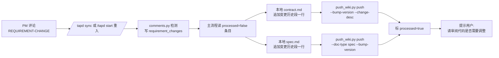

# /tapd

> TAPD 统一入口——子命令路由 init/start/sync/push/fetch/emit/close/reopen。

> MCP 调用强约束：所有 TAPD 调用必须遵守铁律 R-01 ~ R-07。**参数常量、状态枚举、流转矩阵、调用模板全部查 `.claude/skills/tapd/references/tapd-api-constants.md`。** command 文档不复述。

## @ 人格式约定（强制 / 否则不通知）

凡通过 `mcp__chopard-tapd__create_comments` 发评论或推 Wiki 内容中需要 @ 人，**必须使用 HTML `at-who` 标签**，普通文字 `@xxx` 不会触发通知：

```html
<b class="at-who" contenteditable="false" data-userid="<user>" data-type="user">@<user>(<nick>)</b>
```

**三个属性缺一不可**：`class="at-who"` + `data-userid="<user>"` + `data-type="user"`。

| 字段 | 含义 | 取值来源 |
|------|------|---------|
| `data-userid` | TAPD 用户标识 | `project-config.json.tapd.team_roles[<role>][i]` 拆出的中文名（如 `"许迪智(DDXu)"` → `许迪智`） |
| 内部文本 | 展示给阅读者 | `@<user>(<nick>)` 或仅 `@<user>`（无 nick 时） |

**多人 @ 用空格分隔多个标签**（不是顿号）：

```html
<b class="at-who" ... data-userid="许迪智" ...>@许迪智(DDXu)</b> <b class="at-who" ... data-userid="李四" ...>@李四(LiSi)</b>
```

**Python 代码生成入口**：`.claude/skills/tapd/scripts/push_wiki.py` 中的 `format_user_mention(member)` / `format_user_list_mention(user_list)`（入参为 `"中文名(拼音名)"` 串）。主 Claude 通过 MCP 拼接评论时同样按此格式输出。

## 用法

```bash
/tapd <subcommand> [args...]
/tapd 123456789                        # 快捷：自动识别为 start
/tapd https://tapd.cn/...              # 快捷：解析 URL 后 start
/tapd                                  # 无参数 → 输出子命令帮助
```

## 触发（子命令总览）

| 子命令 | 用法 | 场景 |
|--------|------|------|
| `init` | `/tapd init [--workspace-id <id>]` | 首次配置 / 配置缺失 |
| `start` | `/tapd start <ticket_id\|url>` | 从 TAPD 工单开工 / 重入 |
| `sync` | `/tapd sync [--type] [--all] [--iteration <id>]` | 同步工单到本地缓存 |
| `push` | `/tapd push <story_id> [--dry-run]` | 推送契约到 Wiki |
| `fetch` | `/tapd fetch <ticket_id> [--purpose] [--entry-type] [--no-md]` | 拉评论 + 生成 MD |
| `emit` | `/tapd emit <ticket_id> [--dry-run] [--force]` | 派发 subtask + 回填工时 |
| `close` | `/tapd close <case_id>` | case 通过推到待测 |
| `reopen` | `/tapd reopen <case_id> --reason <text>` | QA 打回重开 |

## 流程

```mermaid
flowchart TD
    A[用户输入] --> B{子命令}
    B -->|init| C[发现项目 → 探测工作流<br/>→ 拉成员 → 写 project-config.json]
    B -->|start| D[解析 ticket_id → pull → 分支判断<br/>first-start: 建 task + 分支 + flow init<br/>re-entry: flow_advance check]
    B -->|sync| E[拉 todo / get_stories → 写 task.json.tapd]
    B -->|push| F[校验 contract.frozen<br/>→ ensure Wiki 三层 共识/store/v{seq}]
    B -->|fetch| G[comments.py fetch → 识别 markers<br/>→ purpose=startup/review 分流]
    B -->|emit| H[spec.md §7 角色分组 + git diff 估时<br/>→ 批量 create subtask + done + 工时]
    B -->|close| I[本地 verdict=PASS → 推 v_status=任务/测试完成]
    B -->|reopen| J[v_status → 实现中 + 评论 QA-REJECTED]
```

---

## init

引导式生成 `.chatlabs/project-config.json`。

1. `get_user_participant_projects` 发现项目（已传 `--workspace-id` 则跳过）
2. 探测工作流：`get_workflows_status_map(system="story|task")` → 智能匹配语义键
3. 拉成员持久化角色：`python .claude/skills/tapd/scripts/init.py setup --workspace-id <wid> --workspace-name "<name>"`
   - 走 `GET https://api.tapd.cn/workspaces/users`，需 `${TAPD_TOKEN}` 环境变量
   - 仅当 `tapd.team_roles` 全空时写入（保护已有分类，幂等）
   - 脚本基于 `nick/user/email` 关键字自动猜测角色
   - `AskUserQuestion` 复核 `other` 桶（支持一人多角色），归类到 pm/be/fe/qa 或保留在 other（emit 遇特殊角色时从 other 选 owner）
   - `${TAPD_TOKEN}` 缺失时回退到 MCP `get_workspace_members`
4. 写 `.chatlabs/project-config.json` + 追加 `.gitignore`

**产出**：`tapd.enabled` / `tapd.workspace_id` / `tapd.workspace_name` / `tapd.team_roles`

---

## start

从 TAPD 工单一键开工或重入。

1. **解析**：URL → 正则 `(\d{10,})` 提取 ticket_id；纯数字直接用
2. **刷新缓存**：tapd skill `pull` → 写 `task.json.tapd`（保留 local_mapping / subtasks / comments_cache）
3. **分支判断**：读 `task.json.tapd.local_mapping.story_id`

| 情形 | 分支 |
|------|------|
| 未关联（story_id == null） | first-start |
| 已关联 | re-entry |

**first-start**（命名见 docs/git-brance-spec.md ★ story_id 与 branch 是不同维度,不要混用）：
- 生成 `title-slug`：`ticket.name` → LLM 译英文 → slugify → 截断 30 字；校验 `[a-z0-9-]` 长度 3-40
- 生成 `story_id = {MM-dd}-{title-slug}`（task 目录名,按时间组织）
- 生成 `branch_id = {ticket-short}-{title-slug}`（ticket-short = ticket_id 后 6 位；分支名按工单关联）
- 写 `task.json.tapd.local_mapping`（`tapd_ticket_id` / `story_id`）
- 归档 source 到 `.chatlabs/task/store/<story_id>/source/tapd-ticket-<ticket_id>-<ts>.md`
- `task.py new <story_id> --name <story_id>` 创建 task
- **强制创建分支**：`ensure_branch.py feature/<branch_id> --branch-type feature`（source 由 config 决定，禁止硬编码）
- `task.py bind-branch <story_id> --branch feature/<branch_id> --branch-type feature`
- **worktree 默认开启**（`worktree.auto_create=true`,TAPD 走 spec 档不在 `skip_for_complexity` 内）：
  ```bash
  worktree_path=".chatlabs/worktrees/<story_id>"
  git worktree add "$worktree_path" feature/<branch_id>
  task.py bind-branch <story_id> --branch feature/<branch_id> --worktree-path "$worktree_path"
  ```
  完成时由 flow 的 `branch-cleanup` step 统一收尾(删 worktree,`feature/*` 不在 `cleanup.allowed_prefixes` 内 → 保留分支)
- `flow_advance.py init --flow-id tapd-full` → 路由 doc-librarian

**re-entry**：`flow_advance.py --story-id <story_id> check` 读状态：
- `is_terminal == true` → 输出"已完成"，提示 `--force` 重启
- `is_terminal == false` → 按 flow 状态路由
- TAPD description 修改 → 归档新 source + 走变更检查

---

## sync

拉 TAPD 工单到本地缓存（脚本直调 HTTP API）。

1. 校验 `.chatlabs/project-config.json` 存在（无 → 提示先 `/tapd init`）
2. `get_todo(workspace_id, entity_type)` 拉清单
3. `--all` → 改用 `get_stories_or_tasks(owner, status!=完成)`
4. `--iteration <id>` → 加 `iteration_id` 过滤
5. 对每条调 `description.py fetch --story-id <local-id> --ticket-id <tapd-id> --workspace-id <wid>`
6. 合并到 `task.json.tapd`（保留 local_mapping / subtasks / comments_cache）+ schema 校验
7. 更新 `project-config.json.tapd.last_sync_at`

---

## push

推 contract.md 或 spec.md 到 TAPD Wiki 评审。

**调用区分**：自动化（flow 触发）`dry_run=false`；手动 `dry_run=true` 预览，加 `--force` 才真推。

**前置**：`contract.md` frontmatter `status == "frozen"`，否则拒绝（spec 模式无此前置）。

**新 Wiki 三层结构**（2026-05-29 起，由 `push_wiki.py` 自动 ensure，幂等）:

```
共识文档（root，全局唯一，parent=0）
└── {ticket_id}-{slug}（store 节点，每 story 一个，ticket_id 完整 19 位）
    ├── 共识文档（leaf，contract.md 正文 + 变更历史段）
    └── spec文档（leaf，spec.md 正文 + 变更历史段）
```

- root id 缓存到 `task.json.tapd.consensus_root_wiki_id`
- store id 缓存到 `consensus_store_wiki_id`（节点名 = `{ticket_id_full}-{story_id_slug}`）
- leaf 名固定为 `共识文档` / `spec文档`（不再含版本号）
- **版本号在正文末尾"变更历史"段维护**，不再创建 v1/v2 多版本子节点

### 用法

```bash
# contract（默认 doc-type）
python push_wiki.py push --story-id <story-id>

# spec
python push_wiki.py push --story-id <story-id> --doc-type spec

# 新版本（version+1 + 追加变更历史一行）
python push_wiki.py push --story-id <story-id> --bump-version --change-desc "PM 答复 TBD-001"

# 指定 @ 范围（默认按 task.json.tapd.roles_required；缺失则 pm,be,qa）
python push_wiki.py push --story-id <story-id> --roles pm,be,fe,qa
```

### @ 范围（roles_required）

| 来源 | 优先级 | 说明 |
|------|-------|------|
| `--roles pm,be,fe,qa` CLI | 最高 | 调试 / 临时覆盖 |
| `task.json.tapd.roles_required` | 中 | 主流程在 consensus-push 之前 AskUserQuestion 询问"是否涉前端"后写入 |
| 默认 `["pm","be","qa"]` | 低 | 不含 FE |

主流程在 `consensus-push` step 之前应检测 `task.json.tapd.roles_required`：
- 缺失 → `AskUserQuestion`「本需求是否涉前端?」→ Yes 写 `["pm","be","fe","qa"]` / No 写 `["pm","be","qa"]`
- 已有 → 不重问，直接复用

### Footer 措辞按 doc_type 区分

| doc_type | 标题 | 主审人 | 工单评论指引 |
|---------|------|--------|-----------|
| `contract` | "评审说明(请 PM 审核)" | `mentions.pm` | `[CONSENSUS-APPROVED]` / `[CONSENSUS-REJECTED:...]` / `[REQUIREMENT-CHANGE]` |
| `spec` | "技术评审说明(请 BE 复审)" | `mentions.be` | 同上（spec 通过仍走 [CONSENSUS-APPROVED]） |

### 变更历史段

push_wiki.py 自动在正文末尾插入：

```markdown
---

## 变更历史

| 版本 | 时间 | 变更内容 |
|------|------|---------|
| v3 | 2026-05-29 14:30 | 响应增加 traceId 字段(来自 PM [REQUIREMENT-CHANGE] 评论) |
| v2 | 2026-05-28 10:00 | 合并 TBD-001 答复 |
| v1 | 2026-05-27 09:00 | 初版 |
```

历史条目存储在 `task.json.tapd.{consensus_change_log|spec_change_log}`，push 时自动渲染。

### 产出（按 doc_type 写不同字段）

| doc_type | task.json.tapd 字段 |
|---------|---------------------|
| `contract` | `consensus_wiki_id` / `consensus_wiki_url` / `consensus_version` / `consensus_change_log` |
| `spec` | `spec_wiki_id` / `spec_wiki_url` / `spec_version` / `spec_change_log` |
| 共享 | `consensus_root_wiki_id` / `consensus_store_wiki_id` / `last_wiki_pushed_at` |

---

## fetch

拉评论 + 生成评论 MD。

| 参数 | 说明 | 默认 |
|------|------|------|
| `--purpose` | 场景路由 | `startup` |
| `--entry-type` | stories/tasks/bugs | 读 `task.json.tapd.entity_type` 或 `stories` |
| `--since` | 只拉指定时间后 | `task.json.tapd.last_synced_at` |
| `--no-md` | 不生成 MD | false |

**purpose 分流**：

| markers | startup | review |
|---------|---------|--------|
| APPROVED | 仅输出状态 | 写 feedback + meta.phase="planner" + 路由 planner |
| REJECTED | 写 Blocker | 写 Blocker + 写 feedback |
| QA-* | 提示（不动子任务状态） | 同左，由 `close`/`reopen` 处理 |
| REQUIREMENT-CHANGE | 累积到 `requirement_changes` | 同左 + 触发"需求变更处理"流程（见下） |

**实现**：`comments.py fetch --story-id <id> --ticket-id <id> --workspace-id <wid> --limit 50`，脚本自动去重 + 累积写 `comments_cache` + 生成 `tapd-comment.md`。markers 按 `project-config.json.tapd.comment_markers` 模式匹配。

**requirement_change 提取**：comments.py 自动扫描 `[REQUIREMENT-CHANGE]` 标签 + 下方变更内容(支持多行),新条目写入 `task.json.tapd.requirement_changes`（去重 by comment_id，`processed=false`）。主流程在 `/tapd sync` / `/tapd start` 重入时检测未处理条目，触发本地 + Wiki 双向同步（详见下方"需求变更处理"段）。

---

## 需求变更处理（2026-05-29 新增）

PM 在父 Story 工单按以下格式评论后,主流程自动响应:

```
[REQUIREMENT-CHANGE]

<变更内容,支持多行>
```

**示例:**

```
[REQUIREMENT-CHANGE]

响应增加 traceId 字段
前端表格新增 status 列(枚举 PENDING/APPROVED/REJECTED)
```

**注意:** 标签必须独立一行(可被 `<p>` 标签包裹),后续行为变更内容。直到下一个 `[XXX]` 标签或评论结束都视为本次变更内容。

### 端到端流程



### 检测与提取（comments.py）

- 标签：`project-config.json.tapd.comment_markers.requirement_change` = `[REQUIREMENT-CHANGE]`
- 正则容错（IGNORECASE + DOTALL，方括号 + 空格容错 + HTML 标签穿透）：

  ```python
  r"\[\s*REQUIREMENT[-\s]+CHANGE\s*\]"      # 标签独立
  r"\s*(?:<br\s*/?>|<p[^>]*>|</p>|\s)*"     # 跨标签 / 空白
  r"(.+?)"                                  # 变更内容(贪婪到下一标签)
  r"(?=\[\s*[A-Z][A-Z0-9-]+\s*[:\]]|\Z)"   # 直到下一个 [XXX] 标签或评论结束
  ```

- 提取字段：`comment_id` / `description`(标签下方全部正文,HTML 去除 + 空白规整)/ `author` / `ts`(评论时间)
- 去重：已在 `requirement_changes` 中的 comment_id 不重复写入
- 边界:标签命中但下方无实际内容(仅紧接另一标签 `[QA-PASSED]` 等)→ 视为空,跳过

### 主流程响应（每条 processed=false）

1. 读 `task.json.tapd.requirement_changes` 中所有 `processed=false`
2. 对每条:
   - 本地 `contract.md` 末尾追加"## 变更历史"段一行 v{N+1}（如已有此段则插入表格新行）
   - 本地 `spec.md` 末尾同样追加
   - 调 `python push_wiki.py push --story-id <id> --bump-version --change-desc "<description>"` 推 contract
   - 调 `python push_wiki.py push --story-id <id> --doc-type spec --bump-version --change-desc "<description>"` 推 spec
   - 标 `processed=true`, 记录 `processed_at`
3. 输出: "检测到 N 条需求变更, 已追加版本历史。请审阅 contract.md / spec.md / 代码是否需要进一步调整"

### 主 Claude 判断后续动作

- **小幅变更**(字段名 / 文案 / 文档级)→ 直接 Edit 本地 contract.md / spec.md 内容, 下次 push 自然带上
- **大幅变更**(结构性 / 跨模块)→ 提示用户考虑回退到 `doc-librarian` agent 重新生成契约
- **变更已被 spec 覆盖**(已实现)→ 仅记录历史, 不动代码

---

## emit

部署完成后批量创建 subtask 并立即标 done + 回填工时。

**前置**：`local_mapping.story_id` 已绑定 + `spec.md` 存在含 §7；`comments_cache.subtask_emitted == true` 且无 `--force` 则拒绝。

**分组**:从 `spec.md §7` 解析角色,优先级 = §7 "角色"列 > 文件路径推断:

1. 优先读 §7 "角色"列(枚举 BE/FE/QA/PM/UI/AM/INFRA/DOC),非空则直接用
2. 留空 → 按文件路径推断:
   - `service/` / `controller/` / `mapper/` / `*.java` → **BE**
   - `frontend/` / `*.tsx` / `*.vue` / `*.css` → **FE**
   - `IntegrationTest` / `*.feature` / `qa/` → **QA**
   - 配置 / 文档 → **INFRA** / **DOC**
3. 仍推不出来或角色 = UI/AM → 走下方"角色 → owner 解析协议"兜底

**角色 → owner 解析协议**(emit 创建 subtask 时按此分配 owner):

| 角色 | owner 候选来源 | 推不出来时 |
|------|--------------|-----------|
| BE / FE / QA / PM | `team_roles[<role>][]`(标准桶) | 桶空 → `AskUserQuestion` 让用户选,或拒绝 emit 此 case |
| UI / AM / DOC | `team_roles.other[]` 候选 | `AskUserQuestion` 从 `other` 桶选,空则让用户手填 |
| INFRA | `team_roles.other[]` 或 BE 兼任 | 不明确 → `AskUserQuestion` |

owner 仍留空 → **拒绝创建该 subtask**,提示用户先补 spec §7 角色列或 `team_roles`。

**工时估算**（基于 `git diff <commit_range>`，主流程模型自评）：

| 维度 | 系数 |
|------|------|
| 基线 | 100 行实质代码 ≈ 1h |
| 业务密集（多 if / 状态机） | ×1.5 |
| 纯 CRUD / 模板 | ×0.7 |
| 并发 / 事务 / 第三方集成 | ×2 |
| 仅改配置 / 文案 | ×0.3 |
| 上限 / 下限 / 舍入 | ≤16h / ≥0.5h / 0.25h 倍数 |
| 单测 | 计入开发者角色（不单独 subtask） |
| 集成测试 | 计入 QA subtask |

**调用流程**（每 subtask）：`get_workitem_types(name="子任务")` → `create_story_or_task` → `update_story_or_task(v_status="任务/测试完成")` → `add_timesheets`/`update_timesheets`。详细参数与铁律 R-01~R-07 见 `references/tapd-api-constants.md §6`。

**标题角色 prefix**：`【BE】` / `【FE】` / `【QA】` / `【PM】` / `【UI】` / `【INFRA】` / `【DOC】`。

**本地落库**：追加 `task.json.tapd.subtasks[]`、置 `subtask_emitted=true`、父工单发 `[SUBTASK-EMITTED]` 评论（自动 @ pm + qa）。

---

## close

本地 case 完成 + 推 TAPD 子任务到"待测试"。

1. 校验 `task.json.workflow.verdicts.<case_id> == "PASS"`
2. 流转矩阵自检（R-05）：目标 `任务/测试完成` 必须在 §4.2 枚举 + `current → 任务/测试完成` 必须在矩阵 ✅
3. `update_story_or_task(entity_type="stories", id, v_status="任务/测试完成")`（R-01 / R-04），回读校验（R-07）
4. `create_comments(entry_type="stories", description="[QA-PASSED] ...")`（自动 @ qa）
5. 本地：`subtask.local_phase="done"` / `tapd_v_status="任务/测试完成"` / `last_synced_at=now()`

---

## reopen

QA 打回——本地回退 + TAPD 子任务回退到开发态。

**前置**：`--reason` 必填且 ≥ 5 字符。

1. 校验 `verdict == "PASS"`（已通过的才能 reopen）
2. 流转矩阵自检（R-05）：已结束子任务（`任务/测试完成` / `关闭`）必须先转 `To do` 再转 `实现中`
3. 本地回退：`verdicts.<case_id>="WIP"` + `blockers.md` 追加打回记录
4. `update_story_or_task(v_status="实现中")`（必要时先 To do 再实现中）+ 回读校验
5. `create_comments(description="[QA-REJECTED:{reason}] ...")`（自动 @ be + fe）

---

## 产出（汇总）

- `init`：`.chatlabs/project-config.json`（含 tapd.*）
- `start`：`task.json.tapd` 更新 + first-start 时建 task + 分支 + flow + doc-librarian
- `sync`：各任务 `task.json.tapd` 字段
- `push`：Wiki 三层 + `wiki_id` / `consensus_*` id 缓存
- `fetch`：`comments_cache` + `tapd-comment.md` + 按 purpose 写 feedback / Blocker
- `emit`：N 个 subtask（v_status=任务/测试完成 + 工时）+ `subtask_emitted=true`
- `close`：v_status=任务/测试完成 + `[QA-PASSED]` 评论
- `reopen`：v_status=实现中 + `[QA-REJECTED]` 评论 + 本地 verdict=WIP

## 失败处理

| 场景 | 行为 |
|------|------|
| `/tapd` 无参数 | 输出子命令帮助 |
| `init` 缺 `${TAPD_TOKEN}` | 回退到 MCP `get_workspace_members` + 手工标记 |
| `start` ticket 不存在 / 无权限 | 报错退出 |
| `start` 工作区脏 | 阻塞，提示先 commit/stash |
| `start` ensure-branch source unresolved | AskUserQuestion 让用户选 candidates |
| `sync` 无 `project-config.json` | 提示先 `/tapd init` |
| `push` contract 非 frozen | 拒绝推送 |
| `fetch` markers 未匹配 | 仅写缓存，不触发路由 |
| `emit` spec.md 缺 §7 | 拒绝，提示先补 |
| `emit` 已 `subtask_emitted` 无 `--force` | 拒绝 |
| `close`/`reopen` 流转矩阵不允许 | 写 Blocker，退出 |
| 任何 MCP 调用违反 R-01~R-07 | 按 references/tapd-api-constants.md 自检并回读校验 |

## 关联

- Skill: `.claude/skills/tapd/SKILL.md`
- 常量速查（必读）: `.claude/skills/tapd/references/tapd-api-constants.md`
- 业务规范源: `.chatlabs/knowledge/team/TAPD_Ticket_操作规范.md`
- 配置: `.chatlabs/project-config.json`
- 状态: `.chatlabs/task/store/<id>/task.json.tapd`
