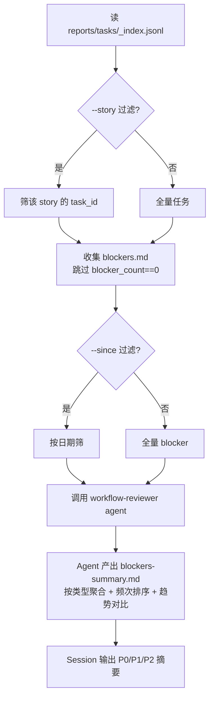

# /workflow-review

> 手动触发工作流审查 Agent，聚合所有 Blocker，输出周/月粒度改进建议。

## 用法

```bash
/workflow-review                          # 全部任务 Blocker
/workflow-review --since 2026-04-01       # 指定日期后
/workflow-review --story 05-27-example    # 指定 Story
/workflow-review --min-count 2            # 只输出 ≥ N 次的（默认 1）
```

## 触发

| 场景 | 行为 |
|------|------|
| 周/月度回顾 | 聚合 Blocker 趋势 + 改进建议 |
| 接到大量 sprint review 后想看全局 | 输出 P0/P1/P2 分级 |

## 流程



**Agent 输入**：
- `blockers_files`：收集到的 blockers.md 路径列表
- `index_file`：`docs/reports/tasks/_index.jsonl`
- `previous_summary`：`docs/reports/workflow/blockers-summary.md`（趋势对比）
- `min_count`：N（从 `--min-count` 读取）

**报告格式**：按类型聚合（环境 / 执行 / 信息 / 流程设计）→ 按频次排序 → 每条含问题/根因/影响/建议/优先级 → 对比上次趋势。

## 输入参数

| 参数 | 必填 | 说明 |
|------|------|------|
| `--since <date>` | 否 | 只分析指定日期之后 |
| `--story <story-id>` | 否 | 只分析指定 Story |
| `--min-count <N>` | 否 | 只输出 ≥ N 次的 Blocker，默认 1 |

## 产出

- `docs/reports/workflow/blockers-summary.md`（覆盖写）
- Session 输出 P0/P1/P2 分级摘要 + 趋势变化

## 失败处理

| 场景 | 行为 |
|------|------|
| `_index.jsonl` 为空 | `ℹ️ 暂无任务记录，无需审查` |
| 所有任务 blocker_count == 0 | `✅ 所有任务无阻塞，无需审查` |
| Blocker 数 < 3 | `⚠️ Blocker 样本不足（< 3 条），趋势分析不可靠` |

## 关联

- Agent: `.claude/agents/workflow-reviewer.md`
- 即时复盘对照: `/sprint-review`（每次 task 结束）
- 实时审查对照: `/session-review`（当前会话）
