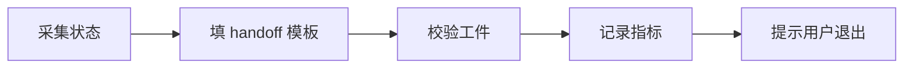

# Context Reset — 结构化交接协议

> 把当前 session 的关键状态固化成 handoff 工件，让新 session 仅凭工件 + AGENTS.md 即可无痕接力。

## 触发

| 场景 | 说明 |
|------|------|
| `ctx-guard` 阻断 | stderr 出现 "Context 占用超过硬阈值" |
| sprint 收尾 | 完成一个 sprint 需要开新 session |
| context 混乱 | 任务跑偏、想"白板" |

与 `/compact` 的区别：compact 压缩保留；reset 是**清空 + 交接工件**。

## 边界

- ✅ 读 transcript + 文件系统采集状态
- ✅ 按模板填 handoff 工件并落盘
- ✅ 校验工件完整性,写指标到 `handoffs.jsonl`
- ✅ 提示用户退出当前 session
- ❌ 不在旧 session 继续推进实质工作
- ❌ 不凭"记忆"重建状态
- ❌ 不省略模板必填字段
- ❌ 不退化为单纯压缩

## Gotchas

1. 误把 `/compact` 当 reset：compact 是压缩保留,reset 是清空 + 交接工件,二者不能互换
2. 凭对话记忆重建状态(应该读 task.json + transcript + 文件系统)
3. handoff 工件必填字段省略 → 下游 session 接不上,**必须**跑 `fitness/handoff-lint.py` 校验
4. 忘记追加 `handoffs.jsonl` 指标 → 后续 review 无数据

## 流程



## 步骤（脚本两阶段 + 主 Claude 补全）

1. **gen** — 脚本采集文件系统状态（task.json snapshot + git status + 最近 commits）生成 draft:
   ```bash
   python .claude/skills/context-reset/scripts/gen_handoff.py gen \
       [--story-id <id>] --reason "<ctx-guard阻断|sprint收尾|context混乱>"
   ```
   输出 draft 路径,含"自动采集"段(已填) + "待补全"段(标 TBD)
2. **补全** — 主 Claude 读 draft,基于 transcript 补全 7 个 TBD 段:任务声明 / 已完成 / 下一步 / 关键约束 / 活跃工件 / 未决问题 / 禁止事项
3. **finalize** — 校验 + 追加指标:
   ```bash
   python .claude/skills/context-reset/scripts/gen_handoff.py finalize <draft_path>
   ```
   任一 TBD 未补全 → 失败并列出 missing_fields
4. **提示** — 输出建议新 session 用 `/context-resume <path>` 接力

## 关联

- 脚本:`.claude/skills/context-reset/scripts/gen_handoff.py`
- 指标日志:`docs/reports/handoffs.jsonl`
- 产出目录:`docs/reports/handoffs/YYYY-MM-DD-HHMM.md`
