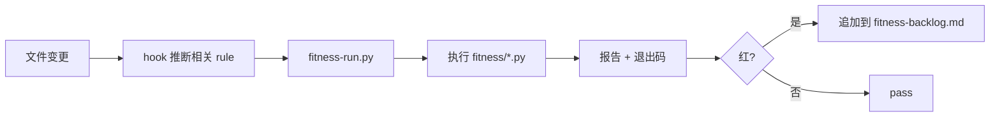

# Fitness Run — 架构适应度函数执行

> 跑确定性、结构性检查（依赖方向 / 契约 / 工件完整性），秒级反馈。

## 触发

| 场景 | 说明 |
|------|------|
| 编码前 | 确认基线（全量跑） |
| 编码后 | 修改结构 / 新增文件后跑相关 rule |
| PreToolUse | Edit/Write 后由 `post-tool-linter-feedback.py` hook 自动触发 |

## 边界

- ✅ 跑结构性检查（layer / openapi / handoff / dep / contract-diff）
- ✅ 任意 rule 红 → 整体红（`fail_fast: true`）
- ✅ 输出 JSON 报告 + 单规则日志
- ❌ 不做行为契约 / 端到端测试（那是 Evaluator 的事）
- ❌ 不替代代码审查

## Gotchas

1. 编码中频繁全量跑(应该让 `post-tool-linter-feedback.py` hook 按文件变更自动触发相关 rule)
2. `fail_fast: true` — 任意 rule 红整体就红,不会跑完所有 rule
3. 误以为 fitness 能替代行为契约测试或代码 review(不能,那是 Evaluator 的事)
4. `contract-diff` 退出码 1 = 有破坏性变更,是**预期结果**不是 bug

## CLI

```bash
python scripts/fitness-run.py                       # 全量
python scripts/fitness-run.py layer-boundary        # 单规则
python scripts/fitness-run.py layer-boundary openapi-lint  # 多规则

/fitness-run [rule-name]                            # Claude Code 内召唤
```

## 规则清单

| Rule | 目的 | 退出码 |
|------|------|--------|
| `layer-boundary` | 目录依赖方向校验 | 0=pass, 1=fail |
| `openapi-lint` | OpenAPI spec 合法性 | 0=pass, 1=error |
| `handoff-lint` | handoff 工件完整性 | 0=pass, 1=fail |
| `dep-scan` | 依赖漏洞 + 过期 | 0=pass, 1=高危, 2=中危 |
| `contract-diff` | OpenAPI 破坏性变更 | 0=无破坏, 1=有破坏 |

## 流程



## 报告

- 全量:`.chatlabs/reports/fitness/fitness-run.json`
- 单规则:`.chatlabs/reports/fitness/<rule>.log`
- backlog:`.chatlabs/reports/fitness/fitness-backlog.md`(hook 失败时追加)

## 关联

- 规则脚本:`fitness/*.py`
- 项目架构红线:`.chatlabs/knowledge/tech/backend/fitness-rules.md`
- hook:`.claude/hooks/post-tool-linter-feedback.py`
