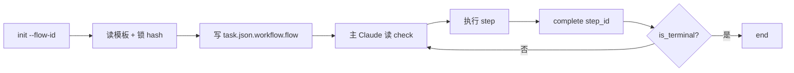

# Flow Engine — 流程编排引擎

> 主流程状态机:读模板 + 写 `task.json.workflow.flow` 推进 step，同步维护 `task.json.events` 任务级事件流。

## 触发

| 场景 | 调用方 | 命令 |
|------|--------|------|
| TAPD 工单开工 | `/tapd start` | `flow_advance init --flow-id tapd-full --story-id <id>` |
| 本地需求开工 | `/story-start` | `flow_advance init --flow-id local-spec --story-id <id>` |
| Bug 修复 | `/bug-fix` | `flow_advance init --flow-id bugfix-{spec,plan,vibe}` |
| Agent 完成 | 主 Claude | `flow_advance complete <step_id>` |
| 状态恢复 | `task resume` | `flow_advance check --story-id <id>` |
| 关键事件 | hook / agent | `emit_event("...", {...})` 或 `events.py emit ...` |

## 边界

- ✅ 推进 `task.json.workflow.flow`(current_step_idx / current_step_id / current_step / next_step / phase / agent 双写)
- ✅ 追加 / 查询 `task.json.events`(append-only, 按 story_id 路由)
- ✅ 加载 `.claude/templates/flows/*.json`(创建时记录 frozen_template_hash, 推进时校验)
- ❌ 不创建 / 删除 task(由 task.py / tapd skill 负责)
- ❌ 不解释业务规则(由 contract.md 负责)
- ❌ 不触发 agent(由主 Claude 按 next_step 决定)
- ❌ 不维护历史 step
- ❌ 不内嵌完整 steps 到 task.json(只存 flow_id 引用 + 当前步/下一步快照, 完整 steps 推进时按 flow_id 实时加载模板)

## Gotchas

1. 误以为 `flow_advance` 会自己触发 agent(其实只更新状态,agent 由主 Claude 按 next_step 触发)
2. `emit_event` 缺 `--story-id` 会直接被拒(必填,不会自动推断)
3. `args_from` 只对 `kind: command` 有效,`kind: skill` 由对应 skill 自读 task.json
4. `complete <step_id>` 中 step_id 不匹配 current 会报错(不能跨步完成,必须按顺序)
5. 旧 `.chatlabs/state/workflow-state.json` 和 `events.jsonl` 已 DEPRECATED,不要再读写
6. **`kind: skill` 步骤必须经 Skill 工具调 `target` 指定的 skill 执行,禁止用同类 MCP/其他工具替代**(如 notify 步禁用 `send_qiwei_message` 替代 notify skill——两者读不同配置)。该 skill 调用失败时,**必先 retry 正确 skill 路径并确认成功,才能 `complete <step>`**;不得"工具报错即就地标完成 + 降级"(本 session notify-qa-test 曾犯此错,见 FB-20260603-cc4d)

## CLI

### flow_advance

```bash
python .claude/skills/flow-engine/scripts/flow_advance.py [--story-id <id>] <sub>
```

| 子命令 | 用法 | 说明 |
|--------|------|------|
| `init` | `init --flow-id <flow> [--task-id <id>] [--force]` | 创建 flow 子对象，锁模板 hash |
| `check` | `check` | 只读输出 current / next / is_terminal |
| `complete` | `complete <step_id> [--result ok\|failed]` | 声明完成,advance 到下一步(幂等) |
| `reset` | `reset` | 重置到 idx=0(debug 用) |
| `refreeze` | `refreeze` | 模板被合法更新后,显式接受当前模板并更新 `frozen_template_hash`,消除推进时的 hash mismatch 持续告警(2026-06-05 加)。锁定语义不变:不 refreeze 仍按 init 时锁定版本告警,防静默换底盘 |

> **frozen_template_hash 告警处理**:`load_steps` 每次推进重算模板 hash 与 init 时锁定值比对,不一致仅 stderr WARN 不阻断(继续用当前模板)。模板稳定时永不触发。若你**有意**改过 flow 模板(如增删步骤),运行中的 task 会持续告警 → 跑一次 `refreeze` 显式接受新版即可清除。

**支持的 flow-id**:`tapd-full / local-spec / local-plan / local-vibe / bugfix-spec / bugfix-plan / bugfix-vibe`

**退出码**:`0=ok / 1=error`(step 不匹配 / flow 未初始化等)

### events

```bash
python .claude/skills/flow-engine/scripts/events.py <sub>
```

| 子命令 | 用法 | 说明 |
|--------|------|------|
| `emit` | `emit <type> --story-id <id> [--data '<json>']` | 追加事件;缺 story_id 直接拒绝 |
| `check` | `check <type> --story-id <id>` | 检查是否存在该类型事件(退出码 0/1) |
| `recent` | `recent --story-id <id> [--type <type>] [--limit 20]` | 读最近事件(JSON) |

### Python import(hook 内部用)

```python
from events import emit_event, check_event, get_recent_events

emit_event("planner:all-cases-ready", {"story_id": "04-30-foo", "actor": "planner"})
if check_event("04-30-foo", "planner:all-cases-ready"):
    ...
```

> hook 走 import(同进程零启动);agent / command 走 CLI(隔离)。

## step JSON 字段约定

step 模板可声明可选字段 `args_from`,让 flow_advance 自动从 task.json 解析参数:

| 字段 | 类型 | 说明 |
|------|------|------|
| `args_from` | `list[str]` | task.json 字段路径列表,支持点号嵌套(如 `tapd.ticket_id`),路径不存在取 `null` |

`check / init / complete` 返回值中,声明了 `args_from` 的 step 会附加 `resolved_args: dict[路径, 值]`。

示例:

```json
{"id": "consensus-push", "kind": "command", "target": "/tapd push", "args_from": ["story_id"]}
```

主 Claude 据此直接拼 `/tapd push <story_id>`,无需自读 task.json。

> 约定:仅 `kind: command` 的 step 用 `args_from`;`kind: skill` 由对应 skill 自读 task.json。

## 流程



## 状态文件

| 路径 | 写入者 |
|------|--------|
| `.chatlabs/task/store/<story_id>/task.json` `workflow` section | flow_advance init/complete/reset |
| `.chatlabs/task/store/<story_id>/task.json` `events[]` | events.emit / emit_event |

`workflow.flow` 子对象结构(只存引用 + 当前步快照, 不含完整 steps):

```json
{
  "flow_id": "local-plan",
  "version": "1.1",
  "frozen_template_hash": "aa06c71f04bf1ca0",
  "current_step_idx": 2,
  "current_step_id": "git-push",
  "current_step": { "id": "git-push", "kind": "skill", "target": "git", "...": "..." },
  "next_step":    { "id": "merge",    "kind": "skill", "target": "git", "...": "..." },
  "started_at": "...",
  "completed_at": null
}
```

> 旧的 `.chatlabs/state/workflow-state.json` 和 `events.jsonl` 已 DEPRECATED。

## 关联

- 脚本:`.claude/skills/flow-engine/scripts/{flow_advance,events}.py`
- 流程模板:`.claude/templates/flows/*.json`
- 共享依赖:`.claude/skills/task/scripts/{paths,task_store}.py`
