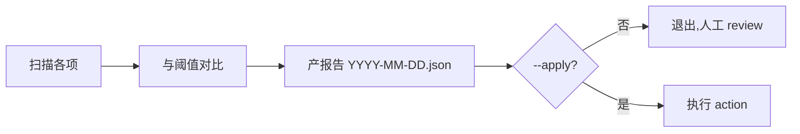

# GC — 工作流熵管理

> 定期清理主流程积累的元数据熵,保持工作流状态可维护。

## 触发

| 方式 | 说明 |
|------|------|
| 每日定时(session-start) | 每天首次 session 自动触发 dry_run |
| 手动 | `python .claude/skills/gc/scripts/gc.py` 或 `/gc` |

## 边界

- ✅ 默认 dry_run,只产报告
- ✅ 报告写到 `.chatlabs/reports/gc/YYYY-MM-DD.json`
- ❌ 永远不删 source 快照(审计链不可破)
- ❌ 永远不自动删除(dry_run 优先)
- ❌ `_index.jsonl orphan` 之外的扫描项默认仅产报告,不自动 apply

## 扫描项

| 扫描类型 | 来源 | 阈值 | 动作 |
|---------|------|------|------|
| `stale_ticket_cache` | `.chatlabs/tapd/tickets/*.json` | 30 天未更新 | `archive_to_reports_gc` |
| `orphaned_index_entry` | `_index.jsonl` 中 task_id 目录不存在 | 7 天持续孤儿 | `remove_from_index`(唯一可自动清理项) |
| `stale_task_report` | `reports/tasks/TASK-*/meta.json` | 60 天未更新 + terminal phase | `archive_to_reports_gc` |
| `stale_source_snapshots` | `tasks/stories/*/source/*.md` | 单 story > 10 快照 | `review_snapshots`(不自动删) |

## Gotchas

1. 默认 dry_run,只产报告不删(新手以为已清理 → 文件并没动)
2. 唯一可自动 apply 的是 `orphaned_index_entry`,其他扫描项都要人工 review
3. 永远不能删 source 快照(审计链不可破,即使 `--apply` 也只 review 不删)
4. `session-start` hook 每日首次自动触发,手动多次跑会重复产报告(覆盖前一份)

## 模式

```bash
python .claude/skills/gc/scripts/gc.py          # dry_run(默认)
python .claude/skills/gc/scripts/gc.py --apply  # 执行清理(需确认)
```

## 流程



## 关联

- 脚本:`.claude/skills/gc/scripts/gc.py`
- 报告:`.chatlabs/reports/gc/`
