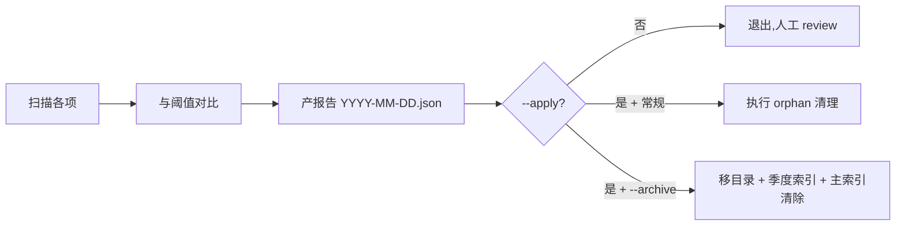

# GC — 工作流熵管理

> 定期清理主流程积累的元数据熵,保持工作流状态可维护。

## 触发

| 方式 | 说明 |
|------|------|
| 每日定时(session-start) | 每天首次 session 自动触发 dry_run |
| 手动 | `python .claude/skills/gc/scripts/gc.py` 或 `/gc` |

## 边界

- ✅ 默认 dry_run,只产报告
- ✅ 报告写到 `.chatlabs/reports/gc/YYYY-MM-DD.json`
- ❌ 永远不删 source 快照(审计链不可破)
- ❌ 永远不自动删除(dry_run 优先)
- ❌ `_index.jsonl orphan` 之外的扫描项默认仅产报告,不自动 apply

## 扫描项

| 扫描类型 | 来源 | 阈值 | 动作 |
|---------|------|------|------|
| `stale_ticket_cache` | `.chatlabs/tapd/tickets/*.json` | 30 天未更新 | `archive_to_reports_gc` |
| `orphaned_index_entry` | `_index.jsonl` 中 task_id 目录不存在 | 7 天持续孤儿 | `remove_from_index`(常规 `--apply` 可自动清理) |
| `stale_task_report` | `reports/tasks/TASK-*/meta.json` | 60 天未更新 + terminal phase | `archive_to_reports_gc` |
| `stale_source_snapshots` | `tasks/stories/*/source/*.md` | 单 story > 10 快照 | `review_snapshots`(不自动删) |
| `archivable_tasks` | 主 `_index.jsonl` 中 `completed_at` | 90 天前完成 | `archive_to_quarter`(需 `--archive --apply` 双开关) |

## Gotchas

1. 默认 dry_run,只产报告不删(新手以为已清理 → 文件并没动)
2. 常规扫描 `--apply` 仅自动处理 `orphaned_index_entry`,其他扫描项都要人工 review
3. **归档动作必须 `--archive --apply` 双开关**——常规 `--apply` 不会触发归档(归档危险性高于 orphan remove)
4. 永远不能删 source 快照(审计链不可破,即使 `--apply` 也只 review 不删)
5. `session-start` hook 每日首次自动触发**常规扫描**,**不自动跑归档**(--archive 必须人工触发)
6. 手动多次跑会重复产报告(覆盖前一份)

## 模式

```bash
# 常规熵扫描(stale ticket / orphan / stale report / 快照超量)
python .claude/skills/gc/scripts/gc.py             # dry_run(默认)
python .claude/skills/gc/scripts/gc.py --apply     # 执行 orphan 清理

# 归档(单独模式,只看 completed_at > 90 天的任务)
python .claude/skills/gc/scripts/gc.py --archive            # dry_run 候选清单
python .claude/skills/gc/scripts/gc.py --archive --apply    # 执行归档:移目录 + 季度索引 + 主索引清除
```

## 归档动作详解

`--archive --apply` 会:
1. 移目录:`.chatlabs/task/{store|bug-fix}/<id>/` → `.chatlabs/task/archive/<YYYY-QN>/<id>/`
2. append entry 到 `.chatlabs/task/archive/<YYYY-QN>/_index.jsonl`(季度索引)
3. 从主 `_index.jsonl` 移除 entry(备份到 `_index.jsonl.archive.bak`)
4. 重建 `.chatlabs/task/archive/_index.jsonl`(跨季度总索引)

归档后用 `task.py search --include-archive` 可继续检索。

## 流程



## 关联

- 脚本:`.claude/skills/gc/scripts/gc.py`
- 报告:`.chatlabs/reports/gc/`(常规)/ `.chatlabs/reports/gc/YYYY-MM-DD-archive.json`(归档模式)
- 归档目录:`.chatlabs/task/archive/<YYYY-QN>/`
- 关联 schema:`.claude/skills/task/references/task-index-entry.schema.md`（task skill 托管）
