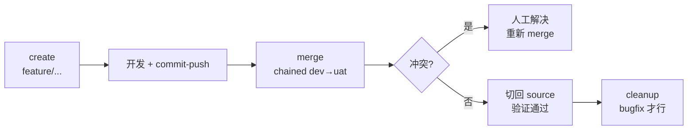

# Git Skill

> 项目内所有 git 写操作的单一入口,按 action 路由。

## 触发

创建分支 / 合并到 dev / 合并到 uat / 删除分支 / 清理分支 / commit / push / worktree / 提交代码。

## 边界

- ✅ 分支生命周期(create / merge / cleanup)
- ✅ worktree 隔离并行
- ✅ Conventional Commits 中文 commit message
- ✅ 配置驱动:行为先读 `.chatlabs/project-config.json` 的 `git` section
- ❌ 不发 PR / 不调外部服务 / 不更新 README
- ❌ 不强推 / 不自动 rebase
- ❌ 默认禁止删除 feature/hotfix/release/无前缀分支
- ❌ 禁止合并到 master / main

## Gotchas

1. 想合并到 `master` / `main` 直接被拒(默认禁止,见 `merge.merge_targets` 配置白名单)
2. `cleanup` 删除 `feature/` / `hotfix/` / 无前缀分支会被拒(仅 `bugfix/` 白名单)
3. merge 链式策略下第二步合的是**上一步 target** 不是原 source(如 dev→uat 合的是 dev 不是 feature)
4. pre-commit hook 失败时禁止 `--no-verify` 绕过(`commit_push.allow_no_verify=false`),应修底层问题
5. commit message 中文 Conventional 强制,反模式:英文描述 / emoji / 多行 body / 无 scope / Co-authored-by
6. 工作区有未提交变更时 create 直接报错,**不自动 stash**(避免误改丢失)

## Action 总览

| action | 用途 |
|--------|------|
| `init-config` | 对齐本地仓库 git 配置(merge.ff / pull.rebase 等) |
| `ensure-branch` | 幂等保证分支存在并 checkout |
| `resolve` | 只读解析某 branch_type 的 prefix/source/merge_targets |
| `create` | 创建分支(feature/bugfix/hotfix/release) |
| `merge` | 链式合并 + push |
| `cleanup` | 删除本地 + 远端分支(仅 bugfix 等白名单) |
| `worktree-create` | 创建独立 worktree(多 bug 并行) |
| `worktree-remove` | 清理已合并 worktree + 分支 |
| `commit-push` | 中文 Conventional Commits 提交 + push |

## 配置驱动(project-config.json `git` section)

| 字段 | 用途 | 默认 |
|------|------|------|
| `branches.<type>.prefix` | 分支前缀 | feature/bugfix/hotfix/release |
| `branches.<type>.source` | 创建分支的 source | feature/hotfix→`master`、bugfix→`current`、release→`develop` |
| `branches.<type>.merge_targets` | merge 目标列表 | feature/hotfix→`["dev","uat"]`、bugfix→`["current-feature"]`、release→`["main","develop"]` |
| `merge.strategy` | `chained`(N 合 N-1) / `fanout`(都合 source) | `chained` |
| `merge.no_ff` | 是否带 `--no-ff` | `true` |
| `merge.pull_before_merge` | merge 前 `pull --ff-only` | `true` |
| `merge.allow_force_push` | 是否允许 `--force` | `false` |
| `merge.return_to_branch` | merge 完后切回:`source`/具体分支 | `source` |
| `commit_push.conventional_zh` | 强制中文 Conventional Commits | `true` |
| `commit_push.allow_no_verify` | 允许 `--no-verify` | `false` |
| `commit_push.auto_set_upstream` | 无 upstream 时 `push -u` | `true` |
| `commit_push.auto_add_all` | 允许 `git add -A` | `false` |
| `worktree.root` | worktree 根目录 | `.chatlabs/worktrees` |
| `cleanup.allowed_prefixes` | cleanup 白名单 | `["bugfix/"]` |
| `cleanup.require_merged_to` | cleanup 前要求已合并到的分支 | `dev` |
| `cleanup.delete_remote` | 是否同时删远端 | `true` |

**特殊 source 取值**:
- `"current"` — `HEAD`
- `"current-feature"` — 沿 git log 找最近的 `feature/*`(找不到报错)

**优先级**:调用方显式参数 > `project-config.json.git` > 内置默认值。

## 分支命名规范

| 类型 | 前缀 | 创建来源 | 合并目标 |
|------|------|---------|---------|
| 功能 | `feature/` | `master` | `dev → uat` |
| 修复 | `bugfix/` | 当前分支 | 关联 `feature/*` |
| 紧急 | `hotfix/` | `master` | `dev → uat` |
| 发布 | `release/` | `develop` | `main` + `develop` |

**命名**:仅 `[a-z0-9-]`,推荐 `{type}/{ticket_id}-{description}`,硬上限 50 字符。

## 流程(典型 feature 全链路)



## merge 链式策略示例

`source=feature/login, targets=["dev","uat"], strategy=chained`:
1. checkout dev → merge `feature/login` → push
2. checkout uat → merge **`dev`**(不是 feature/login)→ push
3. checkout feature/login(`return_to_branch=source`)

## commit-push:Conventional Commits 中文

格式:`<type>(<scope>): <中文描述>`

| type | 含义 |
|------|------|
| `feat` | 新功能 |
| `fix` | 修 bug |
| `refactor` | 重构 |
| `perf` | 性能 |
| `chore` | 杂项 |
| `config` | 配置 |
| `docs` | 文档 |
| `test` | 测试 |
| `style` | 格式 |

示例:`feat(callback): 新增手机号更新和 SF 数据操作功能`

**反模式**:英文描述 / emoji / 多行 body / 无 scope / Co-authored-by footer。

## 错误处理(通用)

| 场景 | 行为 |
|------|------|
| 工作区有未提交变更 | 报错,不自动 stash |
| 目标分支已存在(create) | 报错让人决定 |
| merge 冲突 | 立即终止后续 targets,保留中间状态,输出冲突清单 |
| `pull --ff-only` 失败 | 报错"远端领先,需先同步",不自动 rebase |
| `push` 被拒 | 终止,禁止 `--force`(除非配置允许) |
| cleanup 前缀不在白名单 | 拒绝删除 |
| cleanup 未合并到 target | 拒绝删除 |
| commit-push 无变更 | noop 成功(不阻塞 flow advance) |
| pre-commit hook 失败 | 输出错误,禁止 `--no-verify`(除非配置允许) |

## 入口脚本

```bash
python .claude/skills/git/scripts/init_config.py
python .claude/skills/git/scripts/ensure_branch.py <branch> [--branch-type ...] [--from ...]
python .claude/skills/git/scripts/git_config.py resolve --branch-type <type>
```

各 action 详细输入输出 schema 见 `.claude/skills/git/scripts/*.py` 顶部 docstring。

## 关联

- 配置:`.chatlabs/project-config.json` `git` section
- 脚本目录:`.claude/skills/git/scripts/`
- 规范:`docs/git-brance-spec.md`
- 调用方:flow 模板的 `git-push` / `merge` step、`/tapd start`、`/bug-fix`
