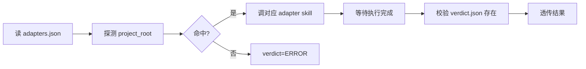

# 统一集成测试入口

> 自动识别项目技术栈 → 路由对应 adapter → 输出统一 schema 的 `verdict.json`。

## 触发

集成测试、跑测试、回归测试、integration test、verify、evaluator 调用。

## 边界

- ✅ 探测项目类型 + 路由到 adapter
- ✅ 等 adapter 执行完成,透传 verdict
- ✅ 统一 schema 写入 `verdict.json`
- ❌ 不自己写测试代码
- ❌ 不绕过 adapter 直接跑 `mvn test` / `npm test`
- ❌ 不修改 adapter 输出
- ❌ 技术栈不匹配时不猜,直接返回 `verdict=ERROR`

## Gotchas

1. 混合栈优先 Java(命中 `pom.xml` 即停),要测前端必须显式 `force_stack="frontend"`
2. 不要绕过 adapter 直接跑 `mvn test` / `npm test`(verdict.json schema 不一致会污染下游)
3. 不要修改 adapter 输出的 `verdict.json`(透传原则,改了就违反 GAN 边界)
4. adapter 不存在 / disabled → 直接 `verdict=ERROR`,不要 fallback 到其他 adapter

## 项目类型探测

按优先级检测,**命中第一个即停**:

| 优先级 | 检测文件 | 项目类型 | adapter |
|-------|---------|---------|---------|
| 1 | `pom.xml` | Java / Spring Boot | `/java-testing` |
| 2 | `package.json` | 前端 | `/frontend-testing`(TBD) |
| 3 | `requirements.txt` / `pyproject.toml` | Python | `/python-testing`(TBD) |
| 4 | `*.http` / `postman_collection.json` | 纯 HTTP API | `/curl-testing`(TBD) |
| 5 | 未匹配 | 未知 | 返回 `verdict=ERROR` |

> 混合栈(如 Java + 前端 monorepo)优先 Java,显式覆盖用 `force_stack`。

## 参数透传

```json
{
  "project_root": "<绝对路径>",
  "spec_path": "<spec.md 绝对路径>",
  "story_id": "<story id>",
  "force_stack": "java | frontend | python | curl"  // 可选,跳过自动探测
}
```

## 输出 schema(adapter 必须遵守)

路径:`<project_root>/.chatlabs/reports/integration-tests/<story_id>/verdict.json`

```json
{
  "verdict": "PASS | FAIL | ERROR",
  "totals": {"tests": 10, "passed": 10, "failed": 0, "errors": 0, "skipped": 0},
  "ac_coverage": {"passed_acs": ["AC-001"], "failed_acs": []},
  "failures": [{"ac": "AC-003", "test_method": "...", "reason": "...", "severity": "major"}],
  "meta": {"test_framework": "junit5", "adapter_used": "java-testing", "test_file_path": "..."}
}
```

**verdict 语义**:
- `PASS` — 所有测试通过(failed=0 + errors=0)
- `FAIL` — 至少一个业务断言失败
- `ERROR` — 基础设施问题(编译失败 / 依赖缺失 / 找不到 adapter)

## 流程



## adapters.json 注册

```json
{
  "adapters": [
    {"name": "java-testing", "detect_files": ["pom.xml"], "skill_name": "/java-testing", "enabled": true},
    {"name": "frontend-testing", "detect_files": ["package.json"], "skill_name": "/frontend-testing", "enabled": false}
  ]
}
```

**新增技术栈**:新建 adapter skill 并保证输出符合 schema → 在 `adapters.json` 加一行 → 完成。

## 错误处理

| 场景 | verdict | meta.error_message |
|------|---------|-------------------|
| 未找到匹配适配器 | `ERROR` | `No adapter found for project type` |
| 适配器 disabled | `ERROR` | `Adapter 'xxx' is disabled` |
| 适配器执行异常 | `ERROR` | 透传底层错误 |
| 未输出 verdict.json | `ERROR` | `Adapter did not produce verdict.json` |

## 关联

- 适配器注册表:`.claude/skills/integration-test/adapters.json`
- 已实现:`java-testing`
- 输出目录:`.chatlabs/reports/integration-tests/<story_id>/`
