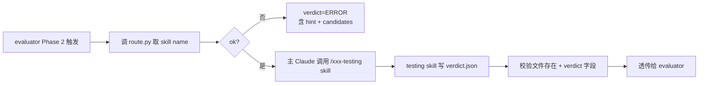

# 统一集成测试入口

> 薄路由 → 委托对应 testing skill 干活,**自己不写测试不跑测试**。输出 schema 由各 testing skill 实现。

## 触发

集成测试、跑测试、回归测试、integration test、verify、evaluator Phase 2 调用。

## 边界

- ✅ 调 `scripts/route.py` 探测应当委托哪个 testing skill
- ✅ 主 Claude 据 route.py 输出调用对应 Skill 工具(`/<skill-name>`)
- ✅ 等被委托的 skill 写出 `verdict.json`,透传给调用方(evaluator)
- ✅ 校验 verdict.json 存在 + schema 字段最低齐全
- ❌ **不自己写测试代码**(委托给 testing skill)
- ❌ **不绕过 route.py 直接调某个 skill**(违反委托契约)
- ❌ **不修改下游 skill 输出的 verdict.json**(透传原则,改了就违反 GAN 边界)
- ❌ **不调 LLM 推测路由**(route.py 是机械路由,失败就 ERROR)

## Gotchas

1. 探测失败 → `verdict=ERROR`,**不要 fallback 到"任意一个 enabled skill"**(随便选就会错)
2. project-config 写错 skill 名(如 `"skill": "java-test"` 缺 `-ing`)→ route 还是返回该名,主 Claude 调用时报 skill 不存在,**让错误暴露不要隐藏**
3. force_stack 仅在主 Claude 明确判断(如混合栈 monorepo 需指定子模块语言)时用,**不要默认传**

## 路由优先级(route.py 实现)

```
0. --force-stack <stack>           (主 Claude 显式覆盖,跳过探测)
1. project-config.json.testing.skill   (项目级显式,优先于约定)
2. 文件名约定 fallback (按 CONVENTION 字典顺序)
3. 都没命中 → ok=false,主 Claude 返回 verdict=ERROR
```

## 文件名约定字典(在 route.py CONVENTION 里维护)

| 文件 | 委托给 |
|------|--------|
| `pom.xml` | `java-testing` |
| `package.json` | `frontend-testing`(未来) |
| `requirements.txt` / `pyproject.toml` | `python-testing`(未来) |
| `go.mod` | `go-testing`(未来) |
| `Cargo.toml` | `rust-testing`(未来) |

**新增语言**: 在 route.py 的 `CONVENTION` 字典加一行 + 新建 `<name>-testing` skill。**SKILL.md 不必动**。

## 调用流程



## 调用方约定

evaluator agent / 其他调用方需:

1. **跑 route.py**:`python .claude/skills/integration-test/scripts/route.py --project-root <abs>`
2. **据 ok 字段决策**:
   - `ok=true`: 用返回的 `skill` 名,通过 Skill 工具调对应 testing skill,**透传** `spec_path / story_id / project_root` 三个上下文
   - `ok=false`: 直接写 `verdict.json` 为 `{"verdict": "ERROR", "meta": {"error_message": <route.error + hint>}}`,不要瞎猜
3. **透传 verdict.json**:不要修改下游 skill 写的内容

## verdict.json 输出 schema(testing skill 必须遵守)

路径: `<project_root>/.chatlabs/reports/integration-tests/<story_id>/verdict.json`

```json
{
  "verdict": "PASS | FAIL | ERROR",
  "totals": {"tests": 10, "passed": 10, "failed": 0, "errors": 0, "skipped": 0},
  "ac_coverage": {"passed_acs": ["AC-001"], "failed_acs": []},
  "failures": [{"ac": "AC-003", "test_method": "...", "reason": "...", "severity": "major"}],
  "meta": {"test_framework": "junit5", "skill_used": "java-testing", "test_file_path": "..."}
}
```

`meta.test_file_path` 必填,单文件模式指该文件、AC-split 并行模式指主支撑类。并行模式下可附**可选** `meta.test_files: []` 列全部分组文件,旧消费者忽略该字段不受影响。

**verdict 语义**:
- `PASS` — 所有测试通过(failed=0 + errors=0)
- `FAIL` — 至少一个业务断言失败
- `ERROR` — 基础设施问题(编译失败 / 依赖缺失 / route 未命中)

## 错误处理

| 场景 | verdict | meta.error_message |
|------|---------|-------------------|
| route.py ok=false | `ERROR` | 透传 `route.error` + `route.hint` |
| 委托的 skill 没产 verdict.json | `ERROR` | `Skill 'xxx-testing' did not produce verdict.json` |
| verdict.json 字段缺失 / 损坏 | `ERROR` | `verdict.json schema invalid: <details>` |
| testing skill 不存在(主 Claude 调用失败)| `ERROR` | `Skill 'xxx-testing' not found` |

## 关联

- 路由器: `.claude/skills/integration-test/scripts/route.py`
- 已实现的 testing skill: `java-testing`
- 输出目录: `.chatlabs/reports/integration-tests/<story_id>/`
- 调用方: `evaluator` agent (Phase 2)

## 历史变更

- v1.0(旧): 中央 `adapters.json` 注册表 + AI 探测
- v2.0(本版): 去中央表,route.py 薄路由,新增语言无需动本 SKILL.md
