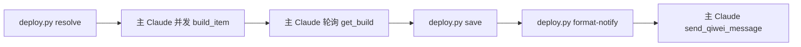

# Jenkins Deploy Skill

> 开发完成后触发 Jenkins 多环境构建,轮询状态并按结果发企业微信通知。

## 触发

jenkins、构建部署、CI/CD、发布、deploy、构建。被 `/tapd start` 或 `start-dev-flow` 在开发完成后自动调用。

## 边界

- ✅ 多环境并发触发 + 状态轮询
- ✅ 企业微信通知(success / failure 可配)
- ✅ 构建结果按 env 聚合写回 `task.json.git.builds`
- ❌ 不动 Jenkins job 配置
- ❌ 不替代 hot-fix 紧急回滚

## Gotchas

1. `mode=task` 时 `envs[0].branch` 与 `task.json.git.branch` 不一致只是 WARN 不阻断(注意是 WARN 不是 FATAL)
2. 配置不存在 / `envs` 为空 → FATAL,**必须先跑 `/init-project`**,不要自己手写 jenkins 配置
3. Jenkins API 失败时不 retry,直接 FATAL(hot-fix 紧急走人工触发,不要让 skill 卡住)
4. `notify_on_success: true` 时**成功也会发企微** —— 长流程时关掉避免刷屏

## 配置(env.yaml `jenkins` section)

```json
{
  "notify_on_success": true,
  "notify_on_failure": true,
  "poll_interval_seconds": 30,
  "timeout_minutes": 15,
  "envs": [
    {"env": "dev", "job": "bde-debeers-be-dev", "branch": "dev"},
    {"env": "uat", "job": "bde-debeers-be-uat", "branch": "uat"}
  ]
}
```

**字段**:
- 顶层参数(`notify_*` / `poll_*` / `timeout_*`)所有环境共享,env 项可覆盖
- `envs[].env` — 标识(dev/uat/prod),用于通知分组
- `envs[].job` — Jenkins job fullname
- `envs[].branch` — 该环境默认部署分支

> 配置不存在或 `envs` 为空 → FATAL,提示 `/init-project`。

## 部署模式

| mode | 触发场景 | 行为 |
|------|---------|------|
| `full`(默认) | 多环境正式部署 | 遍历 `envs[]` 并发触发 |
| `task` | 开发期单环境验证 | 部署到 `envs[0]`,branch 用 `task.json.git.branch` 覆盖 |

`mode=task` 当 `task.json.git.branch` 与 `envs[0].branch` 不一致时输出 WARN。

## 流程（脚本 + MCP 协作）



## CLI（helper 脚本）

```bash
# 1. 解析配置 → 输出待触发 targets 清单（给主 Claude 据此调 build_item）
python .claude/skills/jenkins-deploy/scripts/deploy.py resolve <story_id> [--mode full|task]

# 2. 把 build 聚合结果写回 task.json
python .claude/skills/jenkins-deploy/scripts/deploy.py save <story_id> --builds '<json>'

# 3. 生成企微通知 markdown（输出到 stdout,主 Claude 透传给 send_qiwei_message）
python .claude/skills/jenkins-deploy/scripts/deploy.py format-notify <story_id> --builds '<json>'
```

**builds JSON schema**：
```json
[{"env": "dev", "job": "...", "branch": "...", "build_number": 123,
  "status": "SUCCESS|FAILURE|ABORTED|TIMEOUT",
  "duration_seconds": 180, "console_summary": "...", "deployed_at": "ISO"}]
```

## Blocker 等级

| 等级 | 触发 |
|------|------|
| FATAL | Jenkins API 失败 / 构建超时 / 无配置 |
| WARN | 构建成功但有警告 / mode=task 分支不一致 |

## 依赖 MCP

- `mcp__jenkins__build_item` — 触发构建
- `mcp__jenkins__get_build` — 获取状态
- `mcp__jenkins__get_build_console_output` — 日志摘要
- `mcp__chopard-tapd__send_qiwei_message` — 结果通知

## 输出

按环境聚合 `targets[]`(每项含 `env / job / branch / build_number / status / duration / console_summary / deployed_at`)+ `summary: {total, success, failure}`。

详见 `scripts/deploy.py` 顶部 docstring。

## 关联

- 配置:`docs/env.yaml` `jenkins` section
- 状态写入:`docs/task/store/<story_id>/task.json` `git.builds` section
