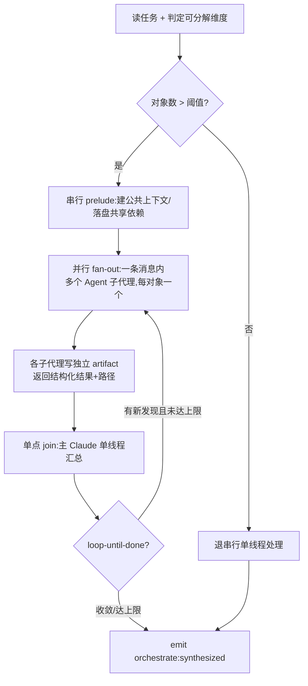

# Orchestrate — 动态编排逃生舱

> 静态 flow 为任务"通吃"而设计;orchestrate 为任务"量身编排"。它不预定义 step,而是指导主 Claude 在运行时按 `protocols/fan-out-synthesize.md` 把不规则大任务拆成并行子代理,再单点汇总。

## 触发

| 场景 | 调用方 |
|------|--------|
| `start-dev-flow` 判定为 orchestrate 档(前缀 `orchestrate:` 或大规模迁移/审计/调研类关键词) | 主 Claude |
| flow 推进到 `orchestrate` step(orchestrate.json) | flow-engine → 主 Claude |

**何时用 orchestrate 而非静态档:**

- 任务含**大量同类可独立处理的对象**(N 个文件迁移 / M 个模块审计 / K 个来源调研),且 vibe/plan/spec 的线性流程套不进去。
- 工作量未知、需循环至完成(loop-until-done)。
- 需要多策略竞争或多假设并行验证。

**何时不用**(退回静态档):单文件改动(vibe)、常规需求(plan/spec)、TAPD 工单(tapd-full)、bug 修复(bugfix-*)。文章警告:workflows 并非每个任务都需要,可能消耗显著更多 token——不规则大任务才值得。

## 边界

- ✅ 指导主 Claude 运行时分解任务 + 并行扇出子代理 + 单点 join 汇总
- ✅ 产物落 `docs/task/store/<story_id>/`(子代理各写独立 artifact)
- ❌ 不预定义中间 step(区别于 7 个静态 flow,编排在运行时决定)
- ❌ 不碰业务规则(规则由任务输入 / contract 决定)
- ❌ 不直接写 living artifact / registry(单点 join 由主 Claude 单线程执行)
- ❌ 不引用其他 skill(引用的是 `protocols/fan-out-synthesize.md` 协议,非 skill)

## 流程

## 执行步骤

1. **判定可分解维度** — 任务能按什么切成独立对象?(文件 / 模块 / 来源 / 假设)。切不开 → 退串行,不强行扇出。
2. **串行 prelude** — 建立子代理共用的公共上下文;有依赖产物(如共享支撑类)先落盘。
3. **并行 fan-out** — 一条消息内并行发起多个 `Agent`(`general-purpose`)调用,每对象一个。prompt 含:本对象子集 + 需读路径 + 边界约束 + 输出路径(契约见协议 § 四)。
4. **单点 join** — 全部返回后,主 Claude **单线程**汇总:写聚合产物 / 批量 INSERT registry(子代理绝不直接写共享状态)。
5. **loop(可选)** — 工作量未知时循环 3~4,至无新发现 / 无错误 / 达上限;上限超出写 Blocker 升级(有界,见 task-lifecycle 迭代上限)。
6. **收尾** — `flow_advance complete orchestrate` 发 `orchestrate:synthesized`,flow 进入 push/deploy/finalize 骨架。

## Gotchas

1. 子代理返回消息回贴整份内容 → 违反 artifact-based-handoff 契约3(消息会被压缩),只返回路径 + 结构化摘要
2. 多子代理并发争抢同一 registry / 汇总文件写权 → 状态冲突,所有共享写收敛到单点 join
3. 无界 loop → 掩盖深层问题,必须有界 + 超限升级
4. 对象数低于阈值仍扇出 → 开销 > 收益,退串行
5. 纯调研/产物类任务(无代码改动)→ orchestrate.json 的 deploy step 走 no-op(主 Claude 据任务性质判定)
6. **本 skill 不实现编排逻辑,是指导主 Claude 按协议编排的说明** — 真正的扇出由主 Claude 的 Agent 工具调用完成,零脚本

## 关联

- 核心协议:`.claude/protocols/fan-out-synthesize.md`(4 模式 + 单点 join 铁律 + 安全阀 + prompt 契约 + worked example 索引)
- flow 模板:`.claude/templates/flows/orchestrate.json`
- 入口:`.claude/commands/start-dev-flow.md`(orchestrate 档判定)
- 产物布局:`.claude/artifacts-layout.md`
