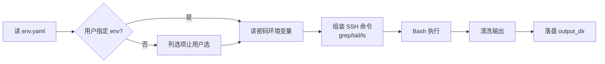

# Remote Log Fetch

> 通过 SSH 连远程服务器,按 traceId / 关键字查询日志并落盘到本地。

## 触发

查询日志、获取日志、远程日志、traceId 查日志、log + 服务器、诊断问题、排查 bug。

## 边界

- ✅ 多环境 SSH 资源池(ssh_servers 通用)
- ✅ grep / tail / ls / cat 命令组装
- ✅ 结果落盘 `log.output_dir`(清洗路径前缀 / 行号 / 警告)
- ❌ 不写远程文件,不动远程服务
- ❌ 密码不入仓:统一走 `password_env` 环境变量

## Gotchas

1. 密码必须走 `password_env` 环境变量,**不入仓**(明文密码会被 hook `block-sensitive-files.py` 拦)
2. SSH 命令内 glob 必须**单引号**防本地 shell 展开(`'/path/*.log'` 而不是 `"/path/*.log"`)
3. GBK 编码日志加 `-C` 或 `iconv` 转 UTF-8(直接读会乱码)
4. 必须 `sshpass -p + StrictHostKeyChecking=no`,避免交互式卡死
5. 落盘前必须三步清洗:路径前缀(`sed 's|.*/log_debug_.*\.log:||'`) / 行号(`sed 's/^[0-9]*://'`) / locale 警告

## 配置(env.yaml)

```json
{
  "ssh_servers": [
    {"env": "dev", "name": "开发环境", "host": "192.168.1.100",
     "port": 22, "user": "deploy", "password_env": "SSH_DEV_PASSWORD"}
  ],
  "log": {
    "paths": [
      {"env": "dev", "dir": "/var/log/myapp", "pattern": "log_debug_{date}.{seq}.log"}
    ],
    "output_dir": "./logs_query"
  }
}
```

**字段**:
- `ssh_servers[]` 通用 SSH 池,可被其他 skill 复用;密码走 `password_env` 指定的环境变量
- `log.paths[].env` 必须对齐 `ssh_servers[].env`
- `log.paths[].pattern` 中 `{date}` → `YYYY-MM-DD`,`{seq}` → `0/1/2...`
- `log.output_dir` 输出目录(相对项目根)

## CLI（helper 脚本)

```bash
# 按 traceId / 关键字搜索（自动清洗 + 落盘）
python .claude/skills/remote-log-fetch/scripts/fetch.py grep <env> \
    --keyword <kw> [--date YYYY-MM-DD] [--output <path>]

# 看最新 N 行
python .claude/skills/remote-log-fetch/scripts/fetch.py tail <env> \
    [--lines 200] [--date YYYY-MM-DD] [--output <path>]

# 列日志目录最新 N 个文件
python .claude/skills/remote-log-fetch/scripts/fetch.py ls <env> [--limit 20]
```

**env 选择**：用户指定 env → 直接用;未指定 → 主 Claude 列 `config.ssh_servers[]` 让用户选。

**输出落盘命名**：`{env}-{date}-{traceId/关键字}.log`(自动清洗路径前缀 / 行号 / locale 警告)。

## 流程



## 实现要点（脚本已内置）

- `sshpass -p "$PASS"` 避免交互式
- `-o StrictHostKeyChecking=no` 跳过首次主机密钥确认
- SSH 命令内 glob 用单引号防本地 shell 展开（脚本内 `sh -c "..."` 包装）
- 输出 errors="replace" 兜底 GBK / 乱码

## 关联

- 配置:`docs/env.yaml` `ssh_servers` + `log` section
- 输出:`<log.output_dir>/*.log`
