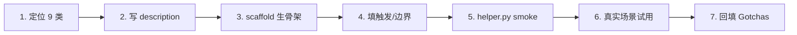

# Skill Author — 创建符合最佳实践的 skill

> 把 Anthropic 6 铁律 + 本项目约定固化为可复用的元 skill。新 skill 调它生成,老 skill 用它体检。

## 触发

新建 skill / 创建 skill / 做一个 X skill / 改 skill 结构 / 体检 skill。

## 边界

- ✅ 生成 skill 骨架（SKILL.md + scripts/ + references/）
- ✅ 评估现有 skill 是否符合 6 铁律
- ✅ 提供本项目特定约定参考
- ❌ 不创建 agent / command（那是 `.claude/agents/` 和 `.claude/commands/` 的入口）
- ❌ 不替用户写 Gotchas（让用户真实踩坑后回填,不空想）
- ❌ 不修改其他 skill 的业务逻辑

## 六铁律（速览）

| # | 铁律 | 一句话 |
|---|------|--------|
| 1 | **Skill 是文件夹** | 不是单文件,配套 scripts/ + references/ 渐进披露 |
| 2 | **Description 是触发器** | USE WHEN/DO NOT USE 风格,不写"能做什么" |
| 3 | **给代码不给死指令** | helper 脚本下沉,避免每次让 Claude 重写胶水 |
| 4 | **Gotchas 是灵魂** | 记录实际踩过的坑(不是空话),持续累积 |
| 5 | **Skill 有记忆** | 读写状态文件实现跨 session 持久化 |
| 6 | **指令留白** | 描述目标而非步骤,让 Claude 适应具体情境 |

详读 [references/six-iron-laws.md](references/six-iron-laws.md)。

## 本项目约定（速览）

| 约定 | 简述 |
|------|------|
| frontmatter 4 字段 | `name` / `description` / `model` / `rules`（可选）|
| 目录结构 | `.claude/skills/<name>/{SKILL.md, scripts/, references/}` |
| Python helper 风格 | argparse 子命令 + `PROJECT_DIR` 顶部硬编码 + JSON 输出 |
| SKILL.md 段结构 | 触发 / 边界 / Gotchas / CLI / 流程 / 关联 |
| 9 类 skill 全景 | 知识/验证/数据/自动化/脚手架/审查/部署/调试/运维 |

详读：
- [references/project-conventions.md](references/project-conventions.md) — 完整约定 + 代码模板
- [references/skill-types-9.md](references/skill-types-9.md) — 9 类全景 + 本项目覆盖情况

## CLI（一键生成骨架）

```bash
python .claude/skills/skill-author/scripts/scaffold.py create <name> \
    --type <knowledge|validation|data-access|automation|scaffold|code-review|deployment|debug|operation> \
    --description "<USE WHEN ... DO NOT USE ...>" \
    [--with-scripts]      # 默认 true
    [--with-references]   # 默认 false
    [--model sonnet]      # haiku|sonnet|opus
    [--rules agent-conventions]
```

输出 JSON：`{"ok": true, "path": "...", "files_created": [...]}`

## 创建流程（7 步）



1. **定位** — 9 类之一确定 skill 类别（参考 skill-types-9.md，避开重复盲区）
2. **写 description** — USE WHEN/OUTPUT/DO NOT USE 三段，不写"能做什么"
3. **跑 scaffold** — `python scaffold.py create <name> ...` 生成骨架
4. **填触发/边界** — 触发关键词最短化，✅/❌ 清单清晰
5. **跑通最简 CLI** — `helper.py --help` 能出，至少一个子命令 smoke test 通过
6. **真实场景试用** — 走一次完整任务，记录踩到的坑
7. **回填 Gotchas** — 把真实坑写入 Gotchas 段（不写"AI 可能"级别的猜测）

## Gotchas

1. **不要照搬 Anthropic 全局 skill** — 命名冲突 + 缺项目约定。本项目 skill 优先级高，覆盖同名
2. **description 别贪长** — 超过 250 字反而让 Claude 索引时分心，关键信息前置
3. **scripts 用 argparse 不用 click** — 项目其他 skill 全用 argparse，保持一致（KISS）
4. **paths import 路径要对** — `sys.path.insert(0, str(Path(__file__).resolve().parents[3] / "scripts"))`,parents[3] 才是 `.claude/`
5. **Gotchas 写之前先空着** — 没真踩过的别瞎写，"AI 可能会..." 级别的猜测不入库

## 自检清单（新 skill 提交前）

- [ ] frontmatter 4 字段齐全（name/description/model/rules）
- [ ] description 是 TRIGGER 风格（含 USE WHEN + DO NOT USE）
- [ ] 至少跑过一次真实场景，Gotchas 段有内容（非空话）
- [ ] helper.py CLI 可用（--help 能出，子命令至少 1 个 smoke test 通过）
- [ ] 边界段 ✅/❌ 清晰
- [ ] SKILL.md 主文件 < 200 行（超出考虑拆 references）
- [ ] 不与现有 11 个 skill 重复职责

## 关联

- 脚本：`.claude/skills/skill-author/scripts/scaffold.py`
- 详细参考：`references/`
- 设计依据：Anthropic 工程师 Thariq 关于 Skills 的实战经验总结
