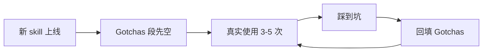

# 本项目 Skill 特定约定

完整约定 + 代码模板。新 skill 必须遵守。

---

## 1. Frontmatter 字段

```yaml
---
name: <skill-name>              # 必填,kebab-case,与目录名一致
description: <TRIGGER 风格>      # 必填,见六铁律 ②
model: sonnet                    # 可选,默认 sonnet。haiku=轻量/sonnet=通用/opus=复杂推理
rules:                           # 可选,引用 .claude/rules/ 下规则
  - agent-conventions
---
```

### 字段约束
| 字段 | 约束 |
|------|------|
| `name` | 仅 `[a-z0-9-]`，与目录名严格一致，否则 Claude Code 加载失败 |
| `description` | TRIGGER 风格（USE WHEN/OUTPUT/DO NOT USE），250 字内 |
| `model` | 默认 sonnet。Gotchas 类纯文本读取用 haiku，复杂推理用 opus |
| `rules` | 引用 `.claude/rules/<name>.md`，自动注入约束 |

---

## 2. 目录结构

```
.claude/skills/<skill-name>/
├── SKILL.md                  # 必有,主文件
├── scripts/                  # 可选,helper 脚本目录
│   ├── __init__.py           # 空文件,标识 Python 包
│   └── <action>.py           # 业务脚本,argparse 子命令风格
└── references/               # 可选,详细参考
    ├── advanced.md
    └── examples.md
```

### 命名约定
- 目录名 = `name` 字段
- scripts 文件按"动作"命名（`fetch.py` / `deploy.py` / `gen_handoff.py`），不按"业务对象"
- references 文件用 kebab-case，可加序号前缀（`01-xxx.md`）

---

## 3. SKILL.md 6 段结构

```markdown
---
<frontmatter>
---

# <Skill Title>

> 一句话定位（slogan-level）

## 触发
<触发关键词列表,最短化>

## 边界
- ✅ <做什么>
- ❌ <不做什么>

## Gotchas
1. <踩坑 1>
2. <踩坑 2>

## CLI（如有 helper 脚本）
```bash
python .claude/skills/<name>/scripts/<file>.py <sub> [args]
```

## 流程（mermaid 图）


## 关联
- 脚本：`...`
- 配置：`...`
- 调用方：`...`
```

### 段落优先级
1. **必有**：frontmatter / 标题 / 触发 / 边界 / Gotchas
2. **大多数有**：CLI（除非纯文本指引）/ 流程图（除非过于简单）
3. **可选**：参考、状态文件、错误处理表

---

## 4. Python helper 脚本风格

### 模板

```python
"""<file>.py — <一句话用途>

CLI:
  python <file>.py <sub1> [args]    # <sub1 描述>
  python <file>.py <sub2> [args]    # <sub2 描述>
"""
from __future__ import annotations

import argparse
import json
import os
import sys
from pathlib import Path

# 项目根（CLAUDE_PROJECT_DIR 优先,否则按 .claude/skills/<x>/scripts/ 回退 4 级）
PROJECT_DIR = Path(os.environ.get(
    "CLAUDE_PROJECT_DIR",
    str(Path(__file__).resolve().parents[4])
))
PROJECT_CONFIG = PROJECT_DIR / "docs" / "env.yaml"

# 如需访问 task.json,加 sys.path + import:
# sys.path.insert(0, str(PROJECT_DIR / ".claude" / "skills" / "task" / "scripts"))
# from task_store import TaskJsonStore


def cmd_<sub1>(args) -> int:
    """<sub1 具体逻辑>"""
    # ...
    print(json.dumps({"ok": True, "result": "..."}, ensure_ascii=False))
    return 0


def main() -> int:
    p = argparse.ArgumentParser(description="<skill 名> helper")
    sub = p.add_subparsers(dest="cmd", required=True)

    p1 = sub.add_parser("<sub1>", help="<help text>")
    p1.add_argument("<arg>")
    p1.set_defaults(func=cmd_<sub1>)

    args = p.parse_args()
    return args.func(args)


if __name__ == "__main__":
    sys.exit(main())
```

### 强制约定
| 约定 | 理由 |
|------|------|
| `argparse` 不用 `click` | 项目其他 skill 全用 argparse，KISS |
| 子命令分发 | 单脚本多动作，便于发现 |
| `print(json.dumps(...))` 输出 | 主 Claude 消费结构化数据 |
| `PROJECT_DIR = Path(os.environ.get("CLAUDE_PROJECT_DIR", parents[N]))` | 项目根计算固定模板(N: hooks=2, skill scripts=4),不依赖中央 paths.py |
| 路径常量在脚本顶部局部定义 | `STORE_DIR = PROJECT_DIR / "docs" / "task" / "store"` 等,用到才定义 |
| `parents[4]` 找项目根 | `.claude/skills/<name>/scripts/<file>.py` → parents[4] = 项目根 |
| 退出码 `0=ok / 1=error / 2=warn` | 主 Claude 分流判断 |
| `from __future__ import annotations` | Python 3.7+ 兼容 |

### 反模式
- ❌ 直接 `json.loads(open("task.json"))` —— 用 `TaskJsonStore.load_by_story()`
- ❌ 字符串字面量绝对路径 —— 用 `PROJECT_DIR / ...` 拼接(保证可移植)
- ❌ 输出非 JSON（plain text）—— 主 Claude 难解析

---

## 5. Description 模板

```yaml
description: "USE WHEN: <场景 1> / <场景 2> / <场景 3>。OUTPUT: <交付物路径或形式>。DO NOT USE: <易混场景 1> / <易混场景 2>。"
```

### 实例
```yaml
# 数据访问类
description: "USE WHEN: 需查询远程服务器日志(按 traceId/关键字/时间窗)。OUTPUT: 清洗后的日志落盘到 logs_query/。DO NOT USE: 本地日志(用 tail 即可) / 写远程文件 / 改远程服务。"

# 部署类
description: "USE WHEN: 开发完成需触发 Jenkins 构建并通知。OUTPUT: build 结果聚合到 task.json.git.builds + 企微通知。DO NOT USE: hot-fix 紧急回滚 / Jenkins job 配置变更 / 单机部署。"
```

### 反模式
```yaml
# ❌ "能做什么"风格
description: "Jenkins 部署工具,支持触发构建/轮询状态/发送通知"
```

---

## 6. Gotchas 写入时机



**禁止**在 skill 上线时凭空写 Gotchas（除非是从既有代码注释里搬运的）。

---

## 7. References 拆分时机

- 主 SKILL.md > 200 行 → 考虑拆 references
- 同一段落出现 ≥ 3 个示例代码块 → 单独拆一个 reference
- 速查表 vs 详解 → 速查留在 SKILL.md，详解去 reference

---

## 8. 与 agent / command 的区别

| 维度 | skill | agent | command |
|------|-------|-------|---------|
| 入口 | `.claude/skills/<n>/SKILL.md` | `.claude/agents/<n>.md` | `.claude/commands/<n>.md` |
| 调用方 | 主 Claude 自动加载 + 用户 `/n` | 主 Claude 用 Agent tool 派 | 用户 `/n` 显式触发 |
| 生命周期 | 短（执行完即结束） | 短（subagent 隔离上下文） | 短（解析后展开为 prompt） |
| 状态 | 通过文件持久化 | 通过 artifact 文件 handoff | 无状态 |
| 适合 | 可复用的工具操作 | 长任务 / 隔离上下文 / 独立判断 | 用户级别快捷指令 |

**判断口诀**：
- 工具型（无独立判断）→ skill
- 角色型（需独立判断 + handoff）→ agent
- 入口型（用户触发的流程） → command
