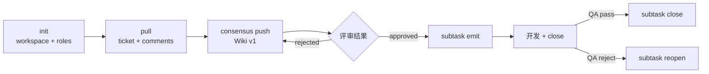

# TAPD Skill

> TAPD 统一入口:init / pull / consensus / subtask / sync 五个能力模块。

## 调用 MCP 前必读:铁律 7 条

所有 MCP 字段、状态枚举、流转矩阵、调用模板 → **`.claude/skills/tapd/references/tapd-api-constants.md`**(业务源 `.chatlabs/knowledge/team/TAPD_Ticket_操作规范.md` v1.0+)。

| 编号 | 铁律 | 详见 |
|------|------|------|
| R-01 | 状态用 `v_status`(中文名),禁用 `status` | constants §1 / §4 |
| R-02 | 创建 ticket 必须两步法(`get_workitem_types` → `workitem_type_id`),禁传 `workitem_type_name` | constants §3 / §7 |
| R-03 | 优先级用 `priority_label`,禁用数字 `priority` | constants §1 |
| R-04 | `entity_type`:工单=`stories`(复数),工时=`story`(单数) | constants §2 |
| R-05 | TAPD API 不强制流转矩阵,AI 必须自检 | constants §4 |
| R-06 | 待确认项必须传 `parent_id` | constants §4.3 / §7.4 |
| R-07 | 写入后必须 `get_stories_or_tasks` 回读校验 | — |

> **强约束**:本 skill 永不调用 `update_story_or_task` 推进 Story(父工单)状态。父状态由 PM/PO 或外部自动化触发。

## Gotchas（铁律之外的易踩坑）

1. `v_status` 用**中文名**(R-01,如"实现中"/"任务/测试完成"),不要用 `status` 英文枚举 —— TAPD 中英文双轨,英文枚举各项目不一致
2. 创建必须**两步法** `get_workitem_types → workitem_type_id`(R-02),禁传 `workitem_type_name`(API 不识别)
3. `entity_type` 工单 = `stories`(复数),工时 = `story`(单数)(R-04)—— 写反 API 直接报 400
4. @ 人必须 HTML `at-who` 三属性齐全(`class` + `data-userid` + `data-type`),**多人用空格不是顿号**(顿号 TAPD 仅识别第一个)
5. TAPD API 不强制流转矩阵,AI 必须自检 `current → target`(R-05)—— 否则状态可能跳过中间态
6. 写入后必须 `get_stories_or_tasks` 回读校验(R-07),不能信任 create/update 返回值(可能延迟生效)
7. 本 skill **永不推进父 Story 状态**(由 PM/PO 触发),只推进子任务和待确认项

## 触发场景

| 场景 | 触发词 |
|------|--------|
| init | tapd 初始化、tapd init、配置 tapd、绑定项目 |
| pull | tapd 拉取、ticket sync、同步工单、拉工单 |
| consensus | TAPD 共识、Wiki 评审、contract 推送、契约评审 |
| subtask | 工时回填、subtask emit、QA 通过、QA 打回 |
| sync | tapd 同步、TAPD 事件、契约推送 |

## 模块化能力

### init

引导式初始化 TAPD 配置:发现项目 → 探测工作流状态 → 智能匹配语义键(to_dev/to_review/to_test/done)→ 获取成员并按角色分类(PM/BE/QA/FE)→ 写 `project-config.json`。

```bash
# 一键完成成员拉取 + 角色猜测 + 配置写入
python .claude/skills/tapd/scripts/init.py setup --workspace-id <wid> --workspace-name "<name>"

# 仅查看成员清单
python .claude/skills/tapd/scripts/init.py members --workspace-id <wid>
```

- 走 HTTP API,需要 `${TAPD_TOKEN}` 环境变量;token 缺失回退到 MCP `get_workspace_members`
- 仅当 `team_roles` 全空才写入(保护已有分类)
- 主流程 Claude **必须**用 `AskUserQuestion` 让用户复核 `other` 桶并修正错分

### pull

工单拉取与本地缓存维护,**直接调 TAPD HTTP API**(脚本 fetch 模式),避开 MCP 工具手抄链路。

```bash
# 拉 description + 元信息
python .claude/skills/tapd/scripts/description.py fetch \
    --story-id <local-id> --ticket-id <tapd-id> [--workspace-id <id>]

# 拉评论
python .claude/skills/tapd/scripts/comments.py fetch \
    --story-id <local-id> [--ticket-id <tapd-id>] [--limit 100]
```

**输出**:
| 路径 | 内容 |
|------|------|
| `task/store/<story_id>/source/description.md` | 工单正文(HTML→Markdown) |
| `task/store/<story_id>/task.json` `tapd` section | ticket_id / workspace_id / local_mapping / comments_cache / raw / last_synced_at |
| `task/store/<story_id>/tapd-comment.md` | 评论汇总(按日期升序,`[CONSENSUS-*]` / `[QA-*]` / `[SUBTASK-*]` 关键评论用 blockquote 突出) |

**关键约束**:
- 所有 tapd 字段写入必须经 `TaskJsonStore.update_tapd`,禁止直接写 task.json
- `local_mapping / subtasks / comments_cache / wiki_id / consensus_*` 是本地累积,partial update 不会覆盖
- 评论基于 `comment.id` 去重

### consensus

共识文档版本管理 + Wiki 驱动的双向同步。**契约推送到 TAPD Wiki**,不是工单评论。

目录结构:`共识文档/{ticket_id}-{slug}/{ticket_id}-{slug} 契约文档 v1.0.0.md`

**版本策略**:

| 场景 | bump_version | 行为 |
|------|--------------|------|
| TBD 答复 / 措辞修订 / §0 增补 / 笔误 | `false`(默认) | 同版本覆盖现有 Wiki(update) |
| 契约业务规则变更(新增/移除 AC / 范围扩展) | `true` | 创建新 v{N+1} 节点(create) |
| 首次推送(无 wiki_id) | — | 创建 v1 |

**Push** 输入:`story_id`(必填)/ `store_name` / `bump_version` / `dry_run`。写入后调 `TaskJsonStore.update_tapd({wiki_id, wiki_url, consensus_version})`。

**Fetch** 流程:读 `wiki_id` → `get_wiki` → `get_comments` → 去重写入 `comments_cache` → 重写 `tapd-comment.md` → 检查 `[CONSENSUS-APPROVED]` / `[CONSENSUS-REJECTED]` → 写回 workflow 状态。

### subtask

TAPD 子任务回填。Emit 批量创建、Close 推到测试完成、Reopen 回退实现中。

**Emit** 输入:`ticket_id` / `force` / `dry_run` / `commit_range`。每个 case → 一个 TAPD subtask(`v_status="任务/测试完成"`,含工时记录)。

工时来源:
- `case.estimate_hours` 非空 → 人工值(`estimate_source=manual`)
- 为空 → 主流程模型按 `affected_files` + `git diff <commit_range>` 自评(`auto`)

**创建强约束**:
- 先 `get_workitem_types(name="子任务")` 拿 `workitem_type_id` 缓存(R-02)
- 标题 `【{role}】{case_title}`(role 映射见 constants §6)
- 必填:`workitem_type_id / owner / priority_label(默认 Middle) / effort / iteration_name(与父 Story 一致) / parent_id`
- 完成态:`v_status="任务/测试完成"`(R-01)
- 工时 `add_timesheets` 用 **`entity_type=story`(单数)**(R-04),先查重再 add 或 update

**Close** 前置 `meta.verdict == "PASS"`,调 `update_story_or_task(..., v_status="任务/测试完成")` 并回读(R-07)。
**Reopen** 前置 `meta.phase == "done"` + `reason.length >= 5`,调 `update_story_or_task(..., v_status="实现中")`。

**工作流自检**(R-05):目标 `v_status` 在 constants §4.2 枚举内 + `current → target` 流转矩阵 ✅ + 已结束状态禁止回到"实现中"。

### sync

事件驱动的 TAPD 适配器。

| 事件 | 动作 |
|------|------|
| `contract:frozen` | 推送契约到 Wiki(若 TAPD enabled) |
| `tapd:consensus-approved` | 更新 phase=planner,自动路由 |

**状态隔离**:TAPD 状态全在 `task.json.tapd` section(per-task SSOT);未启用时静默,不阻断主流程。

## 待确认项(Item / Q&CO)协议

dev-flow 主流程不自动创建 Item,但 AI 被要求创建 Item 时**必须**遵守:

| 项 | 约束 |
|---|------|
| 创建 | 两步法:`get_workitem_types(name="待确认项")` → id → `create_story_or_task(workitem_type_id=...)` |
| 父需求 | **必填** `parent_id`(R-06) |
| 迭代 | 与父需求 `iteration_name` 一致 |
| 标题 | `[Q]`(提问)/ `[CO]`(变更补充) |
| 状态 | 仅 `To do / 进行中 / 已完成` |
| 流转 | **单向不可回退**(constants §4.3),重议→新建 |
| 关闭 | 创建人补结论 → 创建人 close(不是处理人) |

模板见 `references/tapd-api-constants.md §7.4`。

## 流程



## team_roles(项目角色映射)

```json
{
  "pm": [{"user": "许迪智", "nick": "DDXu", "id": "123456"}],
  "be": [...], "fe": [...], "qa": [...], "other": [...]
}
```

## @ 人格式（必须 HTML at-who 标签，否则不通知）

```html
<b class="at-who" contenteditable="false" data-userid="<user>" data-type="user">@<user>(<nick>)</b>
```

三属性缺一不可:`class="at-who"` + `data-userid="<user>"` + `data-type="user"`。`<user>` 取 team_roles 的中文姓名,`<nick>` 取英文/拼音名。

**多人 @ 用空格分隔多个独立标签**(不是顿号),否则 TAPD 仅识别第一个。

**Python 入口**:`scripts/push_wiki.py` 的 `format_user_mention(user_dict)` / `format_user_list_mention(user_list)`。
**MCP 评论拼接**:主 Claude 调 `create_comments` 时按此格式生成 description。

使用场景:consensus push @ pm / subtask emit @ pm + qa / `/tapd close` @ qa / `/tapd reopen` @ be + fe。

## MCP 工具清单

- **初始化**:`get_user_participant_projects` / `get_workspace_info` / `get_workspace_members` / `get_workitem_types` / `get_workflows_status_map` / `get_workflows_all_transitions` / `get_entity_custom_fields`
- **工单**:`get_todo` / `get_stories_or_tasks` / `create_story_or_task` / `update_story_or_task` / `add_timesheets`
- **Wiki**:`create_wiki` / `get_wiki` / `update_wiki`
- **评论/通知**:`get_comments` / `create_comments` / `send_qiwei_message`

## 关联

- Command:`.claude/commands/tapd.md`
- **API 常量速查**:`.claude/skills/tapd/references/tapd-api-constants.md`(强引用源)
- 业务规范:`.chatlabs/knowledge/team/TAPD_Ticket_操作规范.md`
- 配置:`.chatlabs/project-config.json`
- 状态:`.chatlabs/task/store/<story_id>/task.json` `tapd` section
- 索引:`.chatlabs/task/_index.jsonl`
