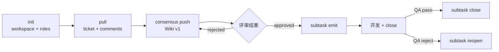

# TAPD Skill

> TAPD 统一入口:init / pull / consensus / subtask / sync 五个能力模块。

## 调用 MCP 前必读:铁律 7 条

所有 MCP 字段、状态枚举、流转矩阵、调用模板 → **`.claude/skills/tapd/references/tapd-api-constants.md`**(业务源 `docs/knowledge/team/TAPD_Ticket_操作规范.md` v1.0+)。

| 编号 | 铁律 | 详见 |
|------|------|------|
| R-01 | 状态用 `v_status`(中文名),禁用 `status` | constants §1 / §4 |
| R-02 | 创建 ticket 必须两步法(`get_workitem_types` → `workitem_type_id`),禁传 `workitem_type_name` | constants §3 / §7 |
| R-03 | 优先级用 `priority_label`,禁用数字 `priority` | constants §1 |
| R-04 | `entity_type`:工单=`stories`(复数),工时=`story`(单数) | constants §2 |
| R-05 | TAPD API 不强制流转矩阵,AI 必须自检 | constants §4 |
| R-06 | 待确认项必须传 `parent_id` | constants §4.3 / §7.4 |
| R-07 | 写入后必须 `get_stories_or_tasks` 回读校验 | — |

> **强约束**:本 skill 永不调用 `update_story_or_task` 推进 Story(父工单)状态。父状态由 PM/PO 或外部自动化触发。

## Gotchas（铁律之外的易踩坑）

1. `v_status` 用**中文名**(R-01,如"实现中"/"任务/测试完成"),不要用 `status` 英文枚举 —— TAPD 中英文双轨,英文枚举各项目不一致
2. 创建必须**两步法** `get_workitem_types → workitem_type_id`(R-02),禁传 `workitem_type_name`(API 不识别)
3. `entity_type` 工单 = `stories`(复数),工时 = `story`(单数)(R-04)—— 写反 API 直接报 400
4. @ 人必须 HTML `at-who` 三属性齐全(`class` + `data-userid` + `data-type`),**多人用空格不是顿号**(顿号 TAPD 仅识别第一个)
5. TAPD API 不强制流转矩阵,AI 必须自检 `current → target`(R-05)—— 否则状态可能跳过中间态
6. 写入后必须 `get_stories_or_tasks` 回读校验(R-07),不能信任 create/update 返回值(可能延迟生效)
7. 本 skill **永不推进父 Story 状态**(由 PM/PO 触发),只推进子任务和待确认项

## 触发场景

| 场景 | 触发词 |
|------|--------|
| init | tapd 初始化、tapd init、配置 tapd、绑定项目 |
| pull | tapd 拉取、ticket sync、同步工单、拉工单 |
| consensus | TAPD 共识、Wiki 评审、contract 推送、契约评审 |
| subtask | 工时回填、subtask emit、QA 通过、QA 打回 |
| sync | tapd 同步、TAPD 事件、契约推送 |

## 模块化能力

### init

引导式初始化 TAPD 配置:发现项目 → 探测工作流状态 → 智能匹配语义键(to_dev/to_review/to_test/done)→ 获取成员并按角色分类(PM/BE/QA/FE)→ 写 `env.yaml`。

```bash
# 一键完成成员拉取 + 角色猜测 + 配置写入
python .claude/skills/tapd/scripts/init.py setup --workspace-id <wid> --workspace-name "<name>"

# 仅查看成员清单
python .claude/skills/tapd/scripts/init.py members --workspace-id <wid>
```

- 走 HTTP API,需要 `${TAPD_TOKEN}` 环境变量;token 缺失回退到 MCP `get_workspace_members`
- 仅当 `team_roles` 全空才写入(保护已有分类)
- 主流程 Claude **必须**用 `AskUserQuestion` 让用户复核 `other` 桶并修正错分

### pull

工单拉取与本地缓存维护,**直接调 TAPD HTTP API**(脚本 fetch 模式),避开 MCP 工具手抄链路。

```bash
# 拉 description + 元信息
python .claude/skills/tapd/scripts/description.py fetch \
    --story-id <local-id> --ticket-id <tapd-id> [--workspace-id <id>]

# 拉评论
python .claude/skills/tapd/scripts/comments.py fetch \
    --story-id <local-id> [--ticket-id <tapd-id>] [--limit 100]
```

**输出**:
| 路径 | 内容 |
|------|------|
| `task/store/<story_id>/source/description.md` | 工单正文(HTML→Markdown) |
| `task/store/<story_id>/task.json` `tapd` section | ticket_id / workspace_id / local_mapping / comments_cache / raw / last_synced_at |
| `task/store/<story_id>/tapd-comment.md` | 评论汇总(按日期升序,`[CONSENSUS-*]` / `[QA-*]` / `[SUBTASK-*]` 关键评论用 blockquote 突出) |

**关键约束**:
- 所有 tapd 字段写入必须经 `TaskJsonStore.update_tapd`,禁止直接写 task.json
- `local_mapping / subtasks / comments_cache / wiki_id / consensus_*` 是本地累积,partial update 不会覆盖
- 评论基于 `comment.id` 去重

### consensus

契约 + spec 文档版本管理,Wiki 驱动双向同步。**两类文档都推 TAPD Wiki**,不是工单评论。

**新结构(2026-05-29 起):**

```
共识文档(root, 全局唯一)
└── {ticket_id}-{slug}(store 节点, ticket_id 完整 19 位)
    ├── 共识文档(leaf, contract.md 正文 + 变更历史段)
    └── spec文档(leaf, spec.md 正文 + 变更历史段)
```

leaf 节点固定名(`共识文档` / `spec文档`),不再含版本号;版本号在正文末尾"变更历史"段维护。

**版本策略**:

| 场景 | --bump-version | 行为 |
|------|--------------|------|
| TBD 答复 / 措辞修订 / 笔误 | `false`(默认) | 同版本覆盖, 不动 change_log |
| 契约业务规则变更 / spec 重大调整 | `true` | version+1, 追加 change_log 一行, 单节点覆盖(不创建新 wiki) |
| 首次推送(无 wiki_id) | — | version=1, change_log 写"初版" |
| PM 评论 `[REQUIREMENT-CHANGE]` + 下方内容 触发 | `true`(主流程触发) | version+1, change_log 写 PM 描述 |

**Push** 输入:`story_id`(必填)/ `--doc-type contract|spec` / `--bump-version` / `--change-desc` / `--roles`。

按 doc_type 写不同字段:
- `contract` → `consensus_wiki_id` / `consensus_wiki_url` / `consensus_version` / `consensus_change_log`
- `spec` → `spec_wiki_id` / `spec_wiki_url` / `spec_version` / `spec_change_log`
- 共享 → `consensus_root_wiki_id` / `consensus_store_wiki_id`

**@ 范围**:由 `task.json.tapd.roles_required` 决定(列表如 `["pm","be","qa"]` 或 `["pm","be","fe","qa"]`)。该字段在 **`/tapd start` 开工时按「免问优先级」求解并写入**(显式 `--roles` > task.json 已有 > **读 ticket 需求语义推断涉不涉 FE** > `env.yaml.tapd.default_roles_required` > 仍判不出才问一次),consensus-push / spec-push **直接读取,不再询问**。

**wiki_review**:`task.json.tapd.wiki_review`(同在 `/tapd start` 求解,默认 `env.yaml.tapd.wiki_review_default`=true)。`false` → consensus-push / spec-push **no-op** 直接 emit 完成事件;consensus-gate 仍跑 `contract_tbd_empty` preflight,通过则主 Claude 直接 emit `tapd:consensus-approved` 自动放行(无人工评审)。只管 wiki 共识/spec 评审三步,末尾 dev-complete 评论 / 子任务两步(subtask-create/complete) 不受影响。

**consensus-gate 放行(wiki_review==true)去人工搬运**:此前需人工三步(跑 fetch → 肉眼找 marker → 手抄 comment_id 构造 flow_advance)。现用一条命令合并前两步:

```bash
python .claude/skills/tapd/scripts/consensus_poll.py --story-id <id>
```

输出 `decision`(approved/rejected/pending/ambiguous)+ 可直接使用的 `evidence_id`(comment_id)+ `next`(现成的 flow_advance 命令)。approved 时把输出的 `evidence_id` 喂给 `flow_advance complete consensus-gate --evidence-type wiki-comment-id --evidence-id <id>` 即放行。脚本**只检测不 emit / 不推进**(放行仍由主 Claude 单点决策),复用 comments.py 的 marker 检测(含"同评论 ≥2 marker=指引评论跳过"防误判)。人保留的动作只剩「在 TAPD 写评审评论」这个真实决策。

**Fetch** 流程:读 wiki_id → `get_wiki` → `get_comments` → 去重写 `comments_cache` → 重写 `tapd-comment.md` → 检查 markers([CONSENSUS-*] / [QA-*] / **[REQUIREMENT-CHANGE]**) → 写回 workflow 状态。

**[REQUIREMENT-CHANGE] 检测**:comments.py 自动扫描评论中独立的 `[REQUIREMENT-CHANGE]` 标签 + 下方变更内容(多行),新条目写入 `task.json.tapd.requirement_changes` 数组(去重 by comment_id,`processed=false`),由主流程在重入时响应(本地 contract/spec 追加变更历史 + 双 wiki bump_version)。

PM 评论格式约定:

```
[REQUIREMENT-CHANGE]

<变更描述,可多行>
```

标签独立一行,后续行为变更内容,直到下一个 `[XXX]` 标签或评论结束。

### subtask（两步：create → complete）

TAPD 子任务两步制：**subtask-create** 共识后建（停 `To do`）、**subtask-complete** 部署后完成（填工时 + 推终态）。Close 推到测试完成、Reopen 回退实现中。

**subtask-create** 输入:`story_id` / `force` / `dry_run`。共识通过后、编码前执行:
- 角色集 = `env.yaml.tapd.subtask_create_roles`(当前 `["be"]`)只决定建哪些角色,默认仅开发本人 BE;不代建 QA/PM
- **按需求拆分(不固定 1 条)**:读 contract.md(功能模块/交付物/AC)把每个配置角色工作拆成 N 条子任务(数量随需求,小需求 1 条/大需求按功能单元多条;不细到 per-AC),拆分源是 contract 非 spec §7
- 每条:`get_workitem_types(name="子任务")` 拿 `workitem_type_id` 缓存(R-02) → `create_story_or_task`(必填 `workitem_type_id / owner / priority_label(默认 Middle) / effort(按该子功能规模分别粗估,此时无 git diff) / iteration_name(与父一致) / parent_id`,标题 `【{ROLE}】{子功能或模块名}`,**停 `To do`**)
- 回读(R-07),全部落 `task.json.tapd.subtasks[]`(`local_phase="created"`) + `subtask_created=true`

**subtask-complete** 输入:`ticket_id` / `force` / `dry_run` / `commit_range`。部署后执行:
- 遍历 `subtasks[]`(`local_phase=="created"`),工时来源:`estimate_hours` 非空→人工(`manual`);为空→主流程按 `affected_files` + `git diff <commit_range>` 自评(`auto`)
- **先** `add_timesheets`(**`entity_type=story` 单数**,R-04,先查重再 add/update) **再** `update_story_or_task(v_status="任务/测试完成",entity_type=stories)`(满足「终态前必有工时」铁律 §4.2)→ 回读(R-07)
- 更新 `subtasks[]`(`local_phase="completed"` / `timespent_h`) + `subtask_completed=true` + 父工单 `[SUBTASK-EMITTED]` 评论(@ pm+qa)

**emit**(手动 alias):create + complete 一次性合并,flow 不用。

**Close** 前置 `meta.verdict == "PASS"`,调 `update_story_or_task(..., v_status="任务/测试完成")` 并回读(R-07)。
**Reopen** 前置 `meta.phase == "done"` + `reason.length >= 5`,调 `update_story_or_task(..., v_status="实现中")`。

**工作流自检**(R-05):目标 `v_status` 在 constants §4.2 枚举内 + `current → target` 流转矩阵 ✅ + 已结束状态禁止回到"实现中"。

### sync

事件驱动的 TAPD 适配器。

| 事件 | 动作 |
|------|------|
| `contract:frozen` | 推送契约到 Wiki(若 TAPD enabled) |
| `tapd:consensus-approved` | 更新 phase=planner,自动路由 |

**状态隔离**:TAPD 状态全在 `task.json.tapd` section(per-task SSOT);未启用时静默,不阻断主流程。

## 待确认项(Item / Q&CO)协议

dev-flow 主流程不自动创建 Item,但 AI 被要求创建 Item 时**必须**遵守:

| 项 | 约束 |
|---|------|
| 创建 | 两步法:`get_workitem_types(name="待确认项")` → id → `create_story_or_task(workitem_type_id=...)` |
| 父需求 | **必填** `parent_id`(R-06) |
| 迭代 | 与父需求 `iteration_name` 一致 |
| 标题 | `[Q]`(提问)/ `[CO]`(变更补充) |
| 状态 | 仅 `To do / 进行中 / 已完成` |
| 流转 | **单向不可回退**(constants §4.3),重议→新建 |
| 关闭 | 创建人补结论 → 创建人 close(不是处理人) |

模板见 `references/tapd-api-constants.md §7.4`。

## 流程



## team_roles(项目角色映射)

```json
{
  "pm": ["许迪智(DDXu)", "郭沅宜(TinaGuo)"],
  "be": [...], "fe": [...], "qa": [...], "other": [...]
}
```

每个成员是 `"中文名(拼音名)"` 字符串(无拼音名时仅 `"中文名"`)。`other` 桶承载未归类成员,emit 遇 UI/AM/DOC 角色从中 `AskUserQuestion` 选 owner。

## @ 人格式（HTML at-who 标签 / 展示留痕用）

**🚨 通知可达性(2026-06-04 debeers 一手实测):开放 API(`create_comments`)发的评论,at-who 即使与界面原生格式逐字节一致(中文名/数字 user_id 变体均实测)也不触发通知——TAPD 通知管线只在网页端发评论时由前端触发,API 仅落库(官方 API 文档亦无 mention 参数)。流程上"必须通知到人"的节点(评审请求/转测/子任务派发),必须同时走 `notify` skill(企微 webhook)主动通知;at-who 标签保留作页面展示 + 留痕。**

```html
<b class="at-who" contenteditable="false" data-userid="<user>" data-type="user">@<user>(<nick>)</b>
```

三属性缺一不可:`class="at-who"` + `data-userid="<user>"` + `data-type="user"`。`<user>` / `<nick>` 由 team_roles 成员串 `"中文名(拼音名)"` 拆出(中文名=user,拼音名=nick;与界面原生格式一致,2026-06-04 界面手动评论对照确认)。

**多人 @ 用空格分隔多个独立标签**(不是顿号),否则 TAPD 仅识别第一个。

**Python 入口**:`scripts/push_wiki.py` 的 `format_user_mention(member)` / `format_user_list_mention(user_list)`(入参为 `"中文名(拼音名)"` 串,内部 `parse_member` 拆解)。
**MCP 评论拼接**:主 Claude 调 `create_comments` 时按此格式生成 description。

使用场景:consensus push @ pm / subtask emit @ pm + qa / `/tapd close` @ qa / `/tapd reopen` @ be + fe。

## MCP 工具清单

- **初始化**:`get_user_participant_projects` / `get_workspace_info` / `get_workspace_members` / `get_workitem_types` / `get_workflows_status_map` / `get_workflows_all_transitions` / `get_entity_custom_fields`
- **工单**:`get_todo` / `get_stories_or_tasks` / `create_story_or_task` / `update_story_or_task` / `add_timesheets`
- **Wiki**:`create_wiki` / `get_wiki` / `update_wiki`
- **评论/通知**:`get_comments` / `create_comments` / `send_qiwei_message`

## 关联

- Command:`.claude/commands/tapd.md`
- **API 常量速查**:`.claude/skills/tapd/references/tapd-api-constants.md`(强引用源)
- 业务规范:`docs/knowledge/team/TAPD_Ticket_操作规范.md`
- 配置:`docs/env.yaml`
- 状态:`docs/task/store/<story_id>/task.json` `tapd` section
- 索引:`docs/task/_index.jsonl`
