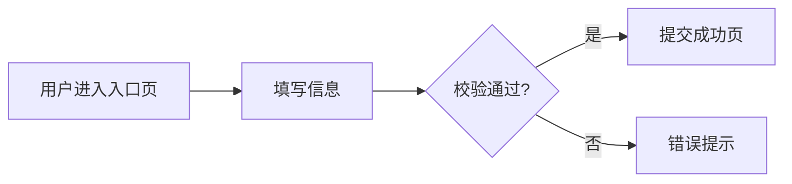
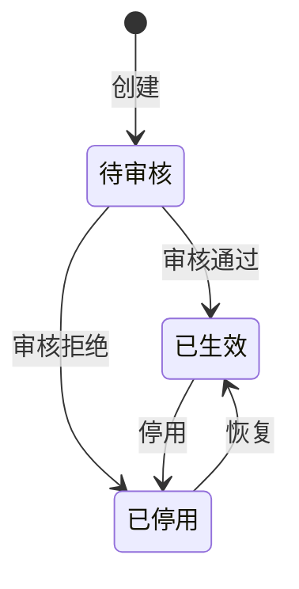

# 共识文档模板（Contract）

> 由 **doc-librarian** 填充。**业务共识文件，不含任何技术实现细节**。
>
> **铁律**：
> 1. 只描述"做什么"（业务行为 / 业务规则 / 验收标准），不描述"怎么做"（数据库表 / HTTP 协议 / 错误码字符串 / 框架代码）
> 2. 未确认的点显式标 `TBD-{ROLE}-{NN}`，不臆造
> 3. 字段类型用业务语言（"唯一标识 / 名称 / 状态 / 时间"），不写 `string(UUID)` / `enum` / `datetime`
> 4. 详细规范见 `.claude/rules/agent-conventions.md`

---

## 模板正文

```markdown
---
story_id: <例：05-27-wechat-login>
title: 一句话业务描述（≤20 字）
version: 0.1.0
status: draft          # draft | review | frozen
owner_pm: <PM 姓名>
owner_be: <后端负责人>
owner_fe: <前端负责人>
owner_qa: <QA 负责人>
tapd_story: <可选：TAPD 工单 URL>
created_at: <ISO8601>
updated_at: <ISO8601>
---

# 1. 需求背景

## 1.1 业务目标
<一段话说明：解决什么业务问题，对谁有价值，预期收益>

## 1.2 使用者
| 角色 | 何时用 | 用来做什么 |
|------|--------|-----------|
| <例：会员用户> | <场景> | <动作> |

## 1.3 范围 / 非范围
- ✅ 本次包含：<能力 1 / 能力 2>
- ❌ 本次不含：<明确排除项>

---

# 2. 业务流程

> 描述用户视角的关键流程。**不要画"系统调用流程图"**，那是 spec 的事。

## 2.1 主流程



## 2.2 异常分支
- **场景 A**：<触发条件> → <业务表现>
- **场景 B**：<触发条件> → <业务表现>

---

# 3. 数据模型（业务视角）

> **只描述业务字段含义和业务约束**，不写技术类型 / 索引 / 表名。

## 3.1 实体：<业务实体名>

| 字段 | 业务含义 | 必填 | 业务约束 | 示例 |
|------|---------|:----:|---------|------|
| 标识 | 唯一识别该实体 | 是 | 全局唯一，不可变更 | — |
| 名称 | 实体展示名 | 是 | 租户内唯一，长度 1-64 字符 | "会员积分计划" |
| 状态 | 当前所处阶段 | 是 | 枚举见 §3.2 | "待审核" |
| 创建时间 | 实体创建时刻 | 是 | 不可修改 | "2026-05-27 10:30" |

## 3.2 枚举：状态

| 业务值 | 业务含义 | 触发条件 |
|--------|---------|---------|
| 待审核 | 已创建，等待审核 | 用户首次创建后 |
| 已生效 | 正常运转中 | 管理员审核通过 |
| 已停用 | 暂停使用 | 管理员主动停用 / 自动过期 |

来源：<2026-05-25 PM 钉钉 / 需求文档 P3 §2.1>

---

# 4. 业务规则

## 4.1 状态流转



**转换权限**：
- `待审核 → 已生效`：仅**管理员**可触发
- `已生效 ↔ 已停用`：**所有者**或**管理员**均可
- 其他转换：业务上不允许

## 4.2 业务校验

| 规则 | 描述 | 违反时业务表现 |
|------|------|---------------|
| 名称唯一 | 创建时名称在租户内唯一 | "该名称已被使用" |
| 操作记录 | 状态变更必须留痕（谁 / 何时 / 从什么变到什么） | — |
| 权限校验 | 非所有者不能修改 | "无权操作" |

## 4.3 数量 / 频率限制

- 单租户最多 <数量> 个实体
- 单用户每分钟最多创建 <数量> 个

---

# 5. 业务能力清单（接口能力）

> **描述"系统对外提供什么业务能力"**，不写 HTTP 方法 / 路径 / JSON。
> 技术接口契约由 planner 在 spec.md 定义。

| 能力 | 业务描述 | 触发者 | 关联 AC |
|------|---------|--------|---------|
| 创建实体 | 用户提交信息创建新实体，进入待审核 | 普通用户 | AC-001, AC-002 |
| 审核实体 | 管理员审核待审核实体 | 管理员 | AC-003, AC-004 |
| 查询详情 | 查看某实体的完整信息 | 所有者 / 管理员 | AC-005 |
| 状态变更 | 在合法状态间流转 | 所有者 / 管理员 | AC-006 |

## 5.x 已有能力复用清单（research-first / 产出契约前 grep 项目现有实现）

> **严禁把已有功能当新需求重写。** 涉及 CDP / CLS / 企微 / SF / 通知 / 审计等能力,先 grep `chopard-component` / `chopard-service` / `chopard-dao`,列出可复用对象;命中即复用,语义不符才新建并说明理由。

| 动作 | 现有可复用实现（类名 + 路径） | 复用方式 / 待 spec 核实 |
|------|----------------------------|------------------------|
| <如 CDP 用户合并> | `DataflowMergeService`（chopard-comp-cld） | 直接复用 `create(masterId, slaveId)` |
| <如 各渠道 SF 映射更新> | `*SfAccountMappingUpdateEventHandler`（chopard-comp-cld） | ⚠️ spec 核实语义匹配度 |
| <如 操作审计> | `DataOperationLogDao`（chopard-dao） | 直接复用 |

---

# 6. 验收标准（AC）

> **业务可验证的标准**，每条对应一个测试场景。
>
> **编号规则**：AC-001 起递增；分配后**永不复用**；删除标 `[DELETED]` 保留编号。
> **拆分原则**：粒度适中——简单参数校验合并为一条 AC，复杂逻辑分支才拆开。

## AC-001 — 创建实体（正常路径）
- **场景**：合法用户提交合法信息创建实体
- **前置**：用户已登录，未达数量上限
- **期望**：
  - 创建成功
  - 实体进入"待审核"状态
  - 返回新实体的唯一标识

## AC-002 — 创建实体（名称冲突）
- **场景**：提交的名称已被同租户其他实体占用
- **前置**：已存在同名实体
- **期望**：
  - 创建被拒绝
  - 业务提示："该名称已被使用"
  - 不产生数据

## AC-003 — 非管理员审核
- **场景**：普通用户尝试审核
- **期望**：
  - 操作被拒绝
  - 业务提示："无权操作"

<!-- AC-004 ~ AC-N 按相同格式追加 -->

---

# 7. TBD 跟踪表

> 详细编号规则与跨角色协作见 `.claude/rules/agent-conventions.md`。

**只列有待确认项的角色子表;无 TBD 的角色不显示(禁止空表格);全部角色都无则本节仅写"✅ 无待确认项"。** 每个 TBD 必含"背景 + 建议答案"。

### PM 待确认（示例：仅 PM 有待确认项,故只列 PM 子表）
| 编号 | 疑问 | 背景 + 建议答案 | 截止 |
|------|------|----------------|------|
| TBD-PM-01 | <待澄清问题> | 背景:<为何不确定>。建议:<doc-librarian 的建议答案> | 2026-XX-XX |

<!-- 全部无待确认项时,本节改为一句:✅ 无待确认项。 不写任何空子表。 -->

---

# 8. 本次需求影响范围

- **新增能力**：<列表>
- **变更能力**：<列表>
- **影响页面**：<列表>
- **影响数据**：<列表>

---

# 附录 A：变更日志

<!-- 冻结后每次变更追加一节，遵循 semver -->

## v0.2.0 (2026-XX-XX)
- [BREAKING] AC-001 的期望调整：xxx
- [ADD] 新增 AC-007（xxx）
- 影响范围：中等（业务规则变化）
- 回溯指令：后端需更新 spec → 实现 → 验收；前端需更新交互
```

---

## 填写自检清单

提交 `review` 前必须自检：

- [ ] 全文**无技术类型**（无 `string(UUID)` / `int` / `datetime` 等）
- [ ] 全文**无 HTTP 协议**（无 GET/POST/PATCH、无 200/404/409、无 `/api/...` 路径）
- [ ] 全文**无 JSON Schema / 错误码字符串**（无 `ERR_NAME_*`、无 `{ "field": "..." }`）
- [ ] 所有业务规则有"来源"标注
- [ ] 所有 TBD 已挂角色编号 `TBD-{PM|BE|FE|QA}-{NN}`
- [ ] AC 编号连续无跳号
- [ ] 状态机覆盖所有合法转换
- [ ] frontmatter 字段齐全（含 4 个 owner）

---

## 冻结后变更

`status: frozen` 后修改：
1. bump `version`（semver：breaking→major / add→minor / fix→patch）
2. 追加附录 A 变更日志
3. 影响范围分级：
   - **小**：文案修正 → 通知
   - **中**：AC 增减 / 业务规则变化 → 通知 planner 重做 spec
   - **大**：状态机 / 核心模型调整 → 重走完整链路

---

## 边界约束（必须遵守）

- ❌ 不写技术实现（HTTP / SQL / 框架 / 代码）
- ❌ 不写错误码字符串（如 `ERR_NAME_DUPLICATED`，由 spec 定义）
- ❌ 不写可观测性技术细节（log/metric/trace 命名由 spec 定义）
- ❌ 不写优先级 / 估时 / 部署环境（由其他工具管理）
- ✅ 只写业务能做什么、不能做什么、什么时候算成功
