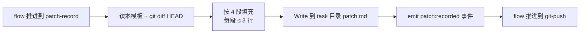

# Patch Record（vibe 档强制痕迹）

> 由主 Claude 在 flow 推进到 `patch-record` step 时填写,产物落地到 `docs/task/{store|bug-fix}/<task_id>/patch.md`。
> 目的:vibe 档不走 contract/spec,但必须留下"为什么改"的最低限度痕迹,半年后可追溯。
>
> **铁律**:
> 1. 4 段全填,不允许任何一段留空
> 2. 每段 ≤ 3 行,超出说明该走 plan/spec 档了(主 Claude 自行判断是否升档)
> 3. 写完即冻结,不允许后续修改(再发现新事实就追加 commit + 新 patch)

---

## 模板正文

```markdown
---
task_id: <例:05-28-fix-token-expire-msg>
task_type: bug-fix | store
mode: vibe
created_at: <ISO8601>
commit_hashes: []      # git-push step 完成后由 hook 或人工回填
---

## 问题
<一句话:用户/系统观察到的现象,不超过两行>

## 根因
<一句话:为什么会出问题,定位到具体代码/配置/数据>

## 修复
<一两句:做了什么改动,涉及哪些文件(粗粒度,不列 diff)>

## 影响面
<一句话:这次改动会波及哪些功能/接口/数据,是否需要回归测试>
```

---

## 主 Claude 填写流程



**判断升档**:任一段落明显超出 3 行,主 Claude 应主动提示用户"建议升档到 plan",而不是硬塞进 vibe。
