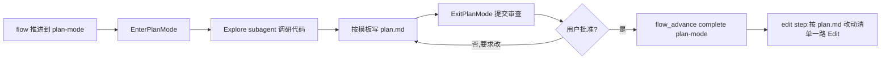

# Plan 档方案模板

> 主 Claude 在 `local-plan` flow 的 `plan-mode` step 内,进入 EnterPlanMode 调研代码后,**按本模板**写 `.chatlabs/task/store/<story_id>/plan.md`,然后调 ExitPlanMode 等用户审查。
>
> **铁律:**
> 1. **Context 段必填** —— 解释为什么做这件事 / 谁提出 / 期望产出
> 2. **修复方案 / 改动清单 必填** —— 每个文件改什么,为什么这么改
> 3. **验证方案 必填** —— 如何端到端验证(含 `mvn verify` 跑通的预期)
> 4. **关键决策必填** —— 任何"为什么选 A 不选 B"的判断都要落地
> 5. **未涉及范围 必填** —— 显式声明本次不动什么,避免范围漂移
> 6. 写完即冻结 —— 用户审查通过后,主 Claude 不再修改 plan.md(新发现走 commit message 或追加版本)

---

## 模板正文

```markdown
---
task_id: <例:ec-user-exists-api(本地) 或 000123-ec-user-exists-api(TAPD)>
task_type: store | bug-fix
mode: plan
created_at: <ISO8601>
branch: <例:feature/ec-user-exists-api 或 feature/000123-ec-user-exists-api>
worktree_path: <例:.chatlabs/worktrees/ec-user-exists-api>
---

## Context

### 需求来源
<一两句:谁提出的、解决什么问题、为什么现在做>

### 期望产出
<对外行为变化的最低描述。例:新增 `GET /open/api/v1/ec/user/exists/{ecUserId}` 接口,返回 Response<Boolean>>

### 现状(代码扫描结果)
<3-5 行:相关模块的当前情况,可复用的现成件清单>

| 现成件 | 路径 | 复用方式 |
|--------|------|---------|
| ... | ... | ... |

---

## 修复方案

### 改动清单

| 文件 | 操作 | 改动要点 |
|------|------|---------|
| `<file1>` | 改 | <1-2 句要点> |
| `<file2>` | 新增 | <1-2 句要点> |

### 关键决策

| 决策点 | 选择 | 理由 |
|--------|------|------|
| <点 1> | <选 A> | <为什么不选 B / C> |
| ... | ... | ... |

---

## 验证方案

### 编译验证
```
mvn -pl <module-path> -am compile
```

### 集成测试(integration-test step 自动跑)
```
mvn verify -DskipTests=false -Dit.test=<生成的测试类>
```
预期 verdict=PASS,覆盖以下 AC:
- AC-001: <描述>
- AC-002: <描述>

### 端到端手测建议
- <场景 1>: <步骤 + 预期响应>
- <场景 2>: <步骤 + 预期响应>

---

## 复用的现成机制

<列出复用的项目内 utils / DAO / Gateway / Skill,避免重复造轮子>

| 复用项 | 来源 |
|-------|------|
| ... | ... |

---

## 不在本次范围内

<显式声明本次不动的部分,避免主 Claude 在 edit 阶段范围漂移>

- 不动 X 模块
- 不补 Y 测试(后续 issue 处理)
- 不改配置 / 不动迁移
```

---

## 主 Claude 填写流程



---

## 反模式

- ❌ Context 段只写"加个接口"——缺动因 / 现状,后续 reviewer 看不懂
- ❌ 改动清单只写"加方法",不说明"为什么放在这一层 / 复用什么"
- ❌ 不写关键决策,plan 完全没法看出权衡
- ❌ "未涉及范围"留空——容易在 edit 阶段范围漂移
- ❌ 验证方案空泛("跑测试")——必须能照着这段端到端跑一遍

---

## 与 patch-template.md 的区别

| 维度 | patch-template(vibe 档) | plan-template(plan 档) |
|------|------------------------|------------------------|
| 触发档位 | vibe(单点小改) | plan(中型任务) |
| 每段长度 | ≤ 3 行 | 视改动量,但章节齐全 |
| 是否需用户审查 | 否(写完即推 push) | **是**(ExitPlanMode 等审查) |
| 是否含测试方案 | 否 | **是**(必填) |
| 是否含复用机制 | 否 | **是**(必填) |
