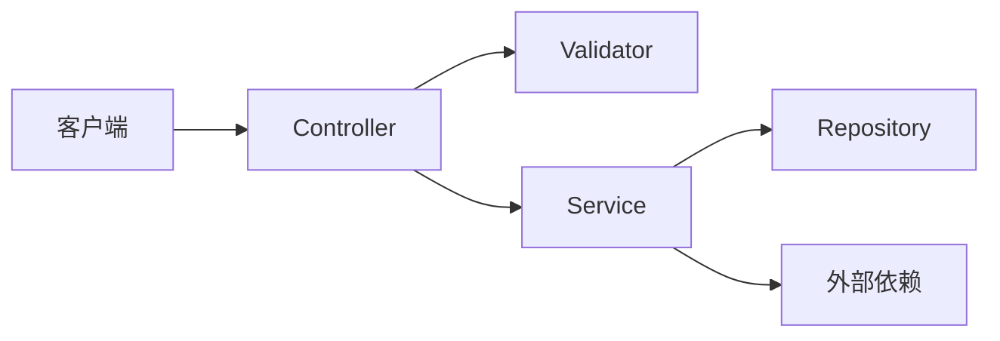

# 技术规格模板（Spec）

> 由 **planner** 填充，置于 `.chatlabs/task/store/<story_id>/spec.md`。
>
> **铁律**：
> 1. **只描述技术规格，不写实现代码**——generator 据此实现，不抄此模板的"代码"
> 2. **不复述契约**——业务规则 / AC / 数据模型用 link 指回 `contract.md`
> 3. **必须包含 AC ↔ 实现位置 + 测试方法的三元映射**（generator / evaluator / subtask-emit 共消费）
> 4. spec 一旦 generator 开始实现，**禁止修改**

---

## 模板正文

```markdown
---
spec_version: 1.0
story_id: <例：05-27-wechat-login>
contract_version: 0.1.0              # 指向的契约版本
phase: draft                         # draft | review | frozen
created_at: <ISO8601>
updated_at: <ISO8601>
---

# 0. 需求概要

> 一句话概括本 spec 让后端做什么（15-30 字）。例："为微信登录添加 token 自动刷新机制"。

---

# 1. 契约引用

- 契约：`.chatlabs/task/store/<story_id>/contract.md` v<contract_version>
- 覆盖 AC：AC-001 ~ AC-NNN（详见 contract §6）

---

# 2. 技术架构

## 2.1 模块划分

| 模块 | 职责 | 物理位置 | 上游依赖 |
|------|------|---------|---------|
| xxx-controller | HTTP 入口 / 入参校验 | `<pkg>/controller/` | xxx-service |
| xxx-service | 业务编排 / 事务边界 | `<pkg>/service/` | xxx-repository |
| xxx-repository | 持久化 | `<pkg>/repository/` | — |
| xxx-validator | 业务校验逻辑 | `<pkg>/validator/` | xxx-repository |

## 2.2 调用链路



> **说明**：用模块名而非类名，描述数据流向。生成具体类由 generator 决定。

---

# 3. 数据库 Schema

> 从 contract §3 数据模型派生。**只描述结构，不写 DDL**。

## 3.1 表：xxx

| 字段 | 技术类型 | 约束 | 索引 | 业务字段对应 |
|------|---------|------|------|------------|
| id | BIGINT | PK, AUTO_INCREMENT | PRIMARY | 唯一标识 |
| name | VARCHAR(64) | NOT NULL | uniq_tenant_name(tenant_id, name) | 名称 |
| status | TINYINT | NOT NULL | idx_status | 状态枚举 |
| tenant_id | BIGINT | NOT NULL | idx_tenant | 租户 |
| created_at | DATETIME | NOT NULL | — | 创建时间 |

**终态 CREATE TABLE**（落 migration 文件,spec 内仅做参考）

```sql
CREATE TABLE `xxx` (
  `id`         BIGINT       NOT NULL AUTO_INCREMENT COMMENT '主键',
  `name`       VARCHAR(64)  NOT NULL                COMMENT '名称',
  `status`     TINYINT      NOT NULL DEFAULT 0      COMMENT '状态:0待审/1生效/2停用',
  `tenant_id`  BIGINT       NOT NULL                COMMENT '租户',
  `created_at` DATETIME     NOT NULL DEFAULT CURRENT_TIMESTAMP COMMENT '创建时间',
  PRIMARY KEY (`id`),
  UNIQUE KEY `uniq_tenant_name` (`tenant_id`, `name`),
  KEY `idx_status` (`status`),
  KEY `idx_tenant` (`tenant_id`)
) ENGINE=InnoDB DEFAULT CHARSET=utf8mb4 COMMENT='xxx 表';
```

**Migration 文件约定**

- `migration/{table}-ddl.sql` — 终态 CREATE TABLE（首次部署用）
- `migration/{table}-vX.X.X-alter.sql` — 增量 ALTER（升级已落盘环境用,由 migration 文件单点维护,spec 不重复粘贴）

## 3.2 状态枚举值映射

| 业务值（契约） | 技术值（DB / 代码） |
|---------------|-------------------|
| 待审核 | 0 |
| 已生效 | 1 |
| 已停用 | 2 |

---

# 4. 接口契约（技术层）

> 业务能力（contract §5）落地为 HTTP 接口的技术规格。**列字段表，不写 record/class 代码**。

## 4.1 端点清单

| 方法 | 路径 | 用途 | 请求 DTO | 响应 VO | 覆盖 AC |
|------|------|------|---------|---------|---------|
| POST | /api/v1/xxx | 创建 | CreateXxxRequest | XxxVO | AC-001, AC-002 |
| GET | /api/v1/xxx/{id} | 详情 | — | XxxVO | AC-005 |
| PATCH | /api/v1/xxx/{id}/status | 状态变更 | StatusChangeRequest | XxxVO | AC-003, AC-004, AC-006 |

## 4.2 DTO 字段表

### CreateXxxRequest

| 字段 | 类型 | 必填 | 校验 |
|------|------|:----:|------|
| name | String | 是 | 非空，1-64 字符 |
| description | String | 否 | 长度 ≤ 256 |

**请求示例**

```json
{ "name": "user-001", "description": "真实业务示例值" }
```

### StatusChangeRequest

| 字段 | 类型 | 必填 | 校验 |
|------|------|:----:|------|
| status | Integer | 是 | 枚举 [0, 1, 2] |

**请求示例**

```json
{ "status": 1 }
```

## 4.3 VO 字段表

### XxxVO

| 字段 | 类型 | 来源 |
|------|------|------|
| id | Long | DB 主键 |
| name | String | DB |
| status | Integer | DB（业务值见 §3.2 映射） |
| createdAt | Instant | DB |

**成功响应示例**（统一 wrapper 格式）

```json
{
  "code": 200,
  "message": "success",
  "data": { "id": 1001, "name": "user-001", "status": 1, "createdAt": "2026-05-28T10:00:00Z" }
}
```

---

# 5. 错误码与状态码

> contract §6 AC 中的业务表现 → 具体技术错误码 / HTTP 状态码映射。

| 业务规则违反 | HTTP 状态 | 错误码 | 对应 AC |
|------------|----------|--------|---------|
| 名称已存在 | 409 | `ERR_NAME_DUPLICATED` | AC-002 |
| 无权操作 | 403 | `ERR_PERMISSION_DENIED` | AC-003 |
| 实体不存在 | 404 | `ERR_NOT_FOUND` | AC-005 |
| 非法状态转换 | 400 | `ERR_INVALID_TRANSITION` | AC-006 |
| 参数校验失败 | 400 | `ERR_INVALID_PARAM` | 全部 |

**统一异常响应格式**（所有错误响应必须符合此结构,QA 按 `code` 字段断言不依赖 `message` 文案）

```json
{
  "code": "ERR_NAME_DUPLICATED",
  "message": "名称已被使用",
  "timestamp": "2026-05-28T10:00:00Z",
  "path": "/api/v1/xxx",
  "traceId": "abc123-def456"
}
```

---

# 6. 关键技术决策

| 决策点 | 选型 | 理由 |
|-------|------|------|
| 缓存 | Redis | 详情查询频次高 / 命中率高 |
| 并发控制 | 乐观锁（version 字段） | 写少读多，避免死锁 |
| 状态机校验 | 状态转换表 + 拦截器 | 集中管理，避免 service 散写 if-else |

---

# 7. AC ↔ 实现 + 测试映射（核心，必填）

> generator 据此实现 + 写单测；evaluator 据此跑集成测试；subtask-emit 据此估工时 + 分发 owner。
> **每个 AC 必须三元齐全**（实现位置 / 建议单测方法名 / 建议集成测试方法名）。
>
> **角色列**（可选,推不出来时留空）枚举:`BE` / `FE` / `QA` / `PM` / `UI` / `AM` / `INFRA` / `DOC`。
> 标准角色 (BE/FE/QA/PM) → emit 时按 `team_roles[role]` 取 owner;
> 特殊角色 (UI/AM/DOC) → emit 时从 `team_roles.other` 候选 `AskUserQuestion` 让用户选 owner。
> **留空意味着 emit 时需人工指定 owner**。

| AC | 角色 | 实现位置 | 建议单测方法名 | 建议集成测试方法名 |
|----|-----|---------|---------------|------------------|
| AC-001 | BE | `XxxController#create` + `XxxService#create` | `should_return_id_When_create_valid` | `should_return_201_When_AC001_CreateValid` |
| AC-002 | BE | `XxxValidator#checkNameUnique` | `should_throw_When_name_duplicated` | `should_return_409_When_AC002_NameDuplicated` |
| AC-003 | BE | `XxxService#changeStatus` + 权限拦截器 | `should_throw_When_non_admin_review` | `should_return_403_When_AC003_NonAdminReview` |
| AC-005 | FE | `XxxController#detail` + 列表页 | `should_return_vo_When_detail_exists` | `should_return_200_When_AC005_DetailExists` |
| AC-006 | BE | `XxxStateMachine#validate` | `should_throw_When_invalid_transition` | `should_return_400_When_AC006_InvalidTransition` |
| AC-007 | UI | (设计走查 - 无代码) | — | — |

---

# 8. 事务边界

| 操作 | 事务策略 | 涉及表 |
|------|---------|--------|
| 创建实体 | `@Transactional` REQUIRED | xxx + xxx_audit_log |
| 状态变更 | `@Transactional` REQUIRED + 乐观锁 | xxx + xxx_audit_log |
| 查询 | 无事务 | xxx |

---

# 9. 可观测性

| 端点 | 日志关键字段 | 监控指标 | 链路追踪 |
|------|------------|---------|---------|
| POST /api/v1/xxx | action / entity_id / user_id / duration_ms | QPS / 5xx 率 | trace_id / span_id / user_id |
| GET /api/v1/xxx/{id} | action / entity_id / hit_miss / duration_ms | P99 延迟 | trace_id / span_id |
| PATCH /api/v1/xxx/{id}/status | action / entity_id / from / to / operator_id | 状态变更次数 | trace_id / span_id |

**通用约定**：
- 所有写操作落审计表 `xxx_audit_log`（who / when / from / to / result）
- 错误响应同时写 ERROR 日志（含 trace_id + 完整异常）
- 告警阈值：5xx > 1% / P99 > 500ms

---

# 10. 安全与性能

| 维度 | 约束 |
|------|------|
| 鉴权 | 所有端点需登录态 |
| 限流 | 写接口 100/min/user，读接口 600/min/user |
| 缓存 | 详情查询缓存 5min，状态变更后失效 |
| 外部依赖超时 | 3s（带 1 次重试） |

---

# 11. 配置项

| 配置 Key | 默认值 | 说明 |
|---------|-------|------|
| xxx.enabled | true | 模块总开关 |
| xxx.cache-ttl-seconds | 300 | 详情缓存 TTL |
| xxx.rate-limit.write | 100 | 写接口每分钟上限 |

---

# 12. 技术风险

| 风险 | 影响 | 缓解 |
|------|------|------|
| 并发写冲突 | 数据不一致 | 乐观锁 + 重试 |
| 缓存击穿 | DB 压力骤增 | 互斥锁 + 空值缓存 |

```

---

## 填写自检清单

提交 `review` 前 planner 必须自检：

- [ ] §0 一句话需求概要已填（15-30 字）
- [ ] **无任何可执行代码块**（无 `@RestController`、无 `record`、无 `public void` 等代码）
- [ ] 数据模型字段表完整，含技术类型 + 索引 + 业务字段对应
- [ ] §3 每张新增/变更表有**终态 CREATE TABLE** + migration 文件名引用
- [ ] §4 每个 DTO 有**请求 JSON 示例**，每个 VO 有**响应 JSON 示例**（含统一 wrapper）
- [ ] §5 有**统一异常响应 JSON 示例**（code/message/timestamp/path/traceId）
- [ ] 接口契约用**字段表**形式，不用 record / class 定义
- [ ] §7 AC 映射**三元齐全**（实现位置 / 单测方法名 / 集成测试方法名）
- [ ] §7 映射覆盖 contract 中**所有 AC**，无遗漏
- [ ] §7 角色列填写完整(BE/FE/QA/PM/UI/AM/INFRA/DOC;留空意味着 emit 时需人工指定 owner)
- [ ] §5 错误码与 contract §6 AC 一一对应
- [ ] §9 可观测性所有端点都已填写
- [ ] 全文用 link 指回 contract，不复述业务规则

---

## 边界约束（必须遵守）

- ❌ 不写完整代码骨架（Controller / Service / DTO 完整类）
- ❌ 不写"// Generator 实现"占位代码
- ❌ 不复述 contract 中的业务规则 / 状态机 / AC 描述
- ❌ 不写架构哲学论证 / 选型对比长段
- ✅ 写技术规格的"是什么 / 在哪里 / 用什么类型 / 走什么策略"
- ✅ 用字段表 / 端点表 / 映射表代替代码块

---

## 与 contract 的分工

| 维度 | contract 写 | spec 写 |
|------|-----------|---------|
| 业务字段 | 业务含义 / 业务约束 / 示例 | 技术类型 / 索引 / 业务字段对应 |
| 接口 | 业务能力清单 | HTTP 方法 / 路径 / DTO 字段表 |
| 错误 | 业务表现（"该名称已被使用"） | HTTP 状态码 / 错误码字符串 |
| 流程 | 用户视角流程图 | 模块调用链路图 |
| 可观测 | 不写 | 日志字段 / 监控指标 / 追踪字段 |
| AC | 业务可验证标准 | AC ↔ 实现位置 + 测试方法映射 |
