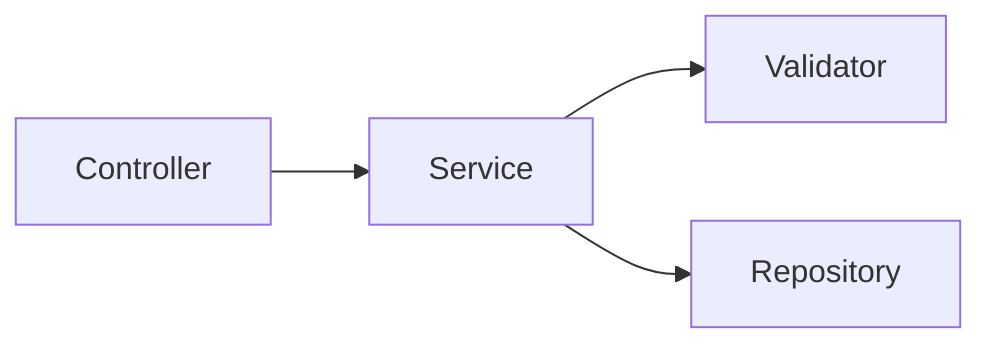

# 技术实现 Spec 模板

> 供 **planner** 填充，置于 `.chatlabs/task/store/<story-id>/spec.md`。
> **设计原则**：
> 1. **不复述契约内容**（用 `links` 指回 contract.md / openapi.yaml）
> 2. 聚焦"技术如何实现"，不写业务逻辑
> 3. spec 一旦 Generator 开始实现，**不再修改**

---

## 模板

```markdown
---
spec_version: 1.0
story_id: STORY-XXX
phase: draft                    # draft → review → frozen
created_at: 2026-04-22
updated_at: 2026-04-22
---

# 技术实现 Spec

## 契约引用

- 契约：`.chatlabs/task/store/STORY-XXX/contract.md` v{version}
- 本 spec 覆盖 AC：AC-001, AC-002（详见契约 §5）

## 模块划分

| 模块 | 职责 | 代码位置 | 依赖模块 |
|------|------|---------|---------|
| xxx-controller | HTTP 入口 | `src/.../xxx/` | xxx-service |
| xxx-service | 业务逻辑 | `src/.../xxx/` | xxx-repository |
| xxx-repository | 数据访问 | `src/.../xxx/` | — |

## 数据库 Schema

> 从 contract.md §2 数据模型派生

| 表名 | 关键字段 | 索引 |
|------|---------|------|
| xxx | id, name, status, created_at | idx_name(status) |

## 核心类骨架样本

> **目的**：给 Generator 看"长什么样"，只示意结构 + 方法签名 + 注解，**实现细节留给 Generator 决定**。
>
> **数量控制**：仅展示 3-5 个关键类（通常是 Controller / Service 编排 / 关键接口或工厂），其余类只在"模块划分"表中列出，不贴代码。
>
> **不写**：具体业务逻辑、字段映射细节、错误处理分支——这些是 Generator 的职责。

### Controller 骨架

```java
@RestController
@RequestMapping("/api/v1/xxx")
@AllArgsConstructor
public class XxxController {
    private final XxxService xxxService;

    @PostMapping
    public Response<XxxVO> create(@RequestBody @Valid XxxDTO dto) {
        // Generator 实现
    }
}

### Service 编排骨架

```java
@Service
@AllArgsConstructor
@Slf4j
public class XxxServiceImpl implements XxxService {
    private final XxxValidator validator;
    private final XxxRepository repository;

    @Override
    public XxxVO create(XxxDTO dto) {
        // 1. 校验
        // 2. 装配
        // 3. 持久化
        // 4. 返回
    }
}
```

### 关键接口或工厂

```java
public interface XxxLoader {
    Profile load(String id);
    Set<String> supportedAppCodes();
}
```

## 实现流程图

> 用 mermaid 描绘核心调用链路或状态流转，单图聚焦一条主路径。



## 关键技术选型

| 选型 | 理由 |
|------|------|
| Redis 缓存 | 热数据频繁读取 |


## 技术风险

| 风险 | 缓解措施 |
|------|---------|
| 并发写入冲突 | 使用乐观锁 |

## OpenAPI 技术扩展

| 端点 | x-cache-ttl | x-rate-limit |
|------|-------------|--------------|
| GET /api/v1/xxx | 300s | 100/min |

## API 端点清单

| 方法 | 路径 | 说明 | 请求 DTO | 响应 VO |
|------|------|------|---------|---------|
| POST | /api/v1/xxx | 创建 | CreateXxxDTO | Response\<XxxVO\> |

## 接口定义

> 从 contract.md §3 接口协议派生，Generator 按此生成 DTO/VO

```java
// 请求 DTO
public record CreateXxxDTO(
    @NotBlank String name,
    @NotNull Integer status
) {}

// 响应 VO
public record XxxVO(
    Long id,
    String name,
    Integer status,
    Instant createdAt
) {}
```

## 事务边界

| 操作 | 事务类型 | 说明 |
|------|---------|------|
| 创建 Xxx | REQUIRED | 主表 + 关联表同事务 |
| 更新 Xxx | REQUIRED | 乐观锁版本控制 |
| 查询 | 无事务 | 只读操作 |

## 异常处理

| 错误码 | 含义 | HTTP Status |
|-------|------|-------------|
| XXX_001 | 资源不存在 | 404 |
| XXX_002 | 业务校验失败 | 400 |

## 安全与性能约束

| 约束项 | 要求 |
|-------|------|
| 鉴权 | 需登录态，所有端点加鉴权 |
| 限流 | 全局 100/min |
| 缓存 | 热点数据 Redis 缓存 5min |
| 超时 | 外部依赖 3s timeout |

## 配置项

| 配置 Key | 默认值 | 说明 |
|---------|-------|------|
| xxx.enabled | true | 功能开关 |
| xxx.cache-ttl | 300 | 缓存 TTL（秒） |

---

## 字段详解

### `phase` 状态机

- **draft**：Planner 编写中
- **review**：等待确认（architect-confirm 等关卡）
- **frozen**：Generator 开始实现后不再修改

---

## 关联

- 契约模板：`.claude/templates/contract-template.md`
- case 模板：`.claude/templates/story/case-template.md`
- 项目规范：`.chatlabs/knowledge/README.md`（渐进式披露入口）