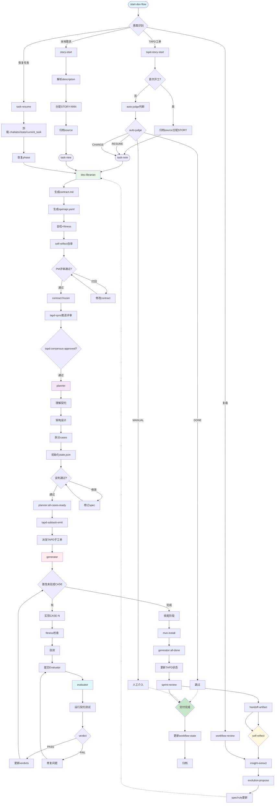

# ChatLabs Dev-Flow — AI 驱动开发工作流

> 一套基于 Claude Code 的 AI Agent Flow 配置（`.claude/`）+ 规范文档（`docs/`），定义从产品需求到代码交付的全流程。
>
> 核心特性：**事件驱动编排** + **AI 自我进化** + **契约测试验收**

---

## 执行流程总览

### 完整流程图



---

## 详细执行步骤

### 步骤 1：入口与意图识别

**入口命令**：`/start-dev-flow`

用户只需描述意图，AI 自动识别并路由到对应流程：

| 用户输入 | 自动路由 | 说明 |
|---------|---------|------|
| `/start-dev-flow 1140062001234567` | tapd-story-start | TAPD 工单 ID |
| `/start-dev-flow https://tapd.cn/xxx` | tapd-story-start | TAPD URL |
| `/start-dev-flow 实现用户登录功能` | story-start | 本地需求 |
| `/start-dev-flow 继续上次的任务` | task-resume | 恢复任务 |
| `/start-dev-flow 复盘一下迭代` | workflow-reviewer | 周期复盘 |

**自动检测流程**：
```
用户意图
    ↓
检测 project-config.json
    ├── 不存在 → 自动调用 tapd-init
    └── 存在 → 继续
    ↓
检测 .chatlabs/state/current_task
    ├── 有 → 提示恢复
    └── 无 → 新建任务
    ↓
检测 git status
    └── 有变更 → 提示确认
```

---

### 步骤 2：TAPD 工单处理（tapd-story-start）

**触发条件**：用户输入包含 TAPD 工单 ID 或 URL

#### 2.1 解析入参
```python
# 支持两种格式
/tapd-story-start 1140062001234567  # 纯数字
/tapd-story-start https://tapd.cn/1140062001234567/bugtrace  # URL
```

#### 2.2 刷新本地缓存

```
1. 读取 .chatlabs/tapd/tickets/<ticket_id>.json
   ├── 不存在 → is_new_ticket = true（首次开工）
   └── 存在 → is_new_ticket = false（重入）
2. 调用 tapd-pull skill 拉最新数据
3. 校验 entity_type == "stories"
```

#### 2.3 流程分支判断

| 情形 | local_mapping.story_id | 分支 |
|------|------------------------|------|
| 首次开工 | null | **BRANCH-A: first-start** |
| 重入 | 非 null | **BRANCH-B: auto-judge** |

#### BRANCH-A: 首次开工
```
1. story_id = ticket_id（直接使用 TAPD ID）
2. 归档 description 到 source/tapd-ticket-<id>-<timestamp>.md
3. 调用 /task-new STORY-NNN --trigger first-start
4. 拉取 TAPD 历史评论
5. 路由到 doc-librarian
```

#### BRANCH-B: 重入自动判断
```
auto_judge(situation):
  ├── 等待评审 + TAPD 有 APPROVED → AUTO_RESUME
  ├── 已完成 + verdict == PASS → ALREADY_DONE
  ├── phase 非 done + verdict == null → AUTO_RESUME
  ├── TAPD description 有更新 → AUTO_CHANGE_CHECK
  └── 其他 → NEED_MANUAL（输出诊断）
```

---

### 步骤 3：本地需求处理（story-start）

**触发条件**：用户直接描述功能需求（无工单）

```
1. 解析 description（纯文本，可多行）
2. 分配 STORY-NNN（本地自增 ID）
3. 归档 source/local-description-<timestamp>.md
4. 调用 /task-new STORY-NNN --trigger first-start
5. 路由到 doc-librarian
```

---

### 步骤 4：doc-librarian 阶段

**职责**：将散乱的需求整理为结构化契约文档

#### 4.1 输入
| 来源 | 文件 |
|------|------|
| TAPD 工单 | fields_cache.description + comments_cache |
| 本地需求 | local-description-*.md |

#### 4.2 产出
| 文件 | 位置 | 说明 |
|------|------|------|
| contract.md | .chatlabs/stories/<story_id>/ | 产品契约文档（6段式） |
| openapi.yaml | .chatlabs/stories/<story_id>/ | OpenAPI 3.0 接口定义 |
| changelog.md | .chatlabs/stories/<story_id>/ | 变更日志（冻结后维护） |

#### 4.3 质量门禁
```
✓ 所有业务规则有来源标注
✓ 所有 TBD 标注"需谁确认、截止时间"
✓ AC 编号连续（1,2,3...无跳号）
✓ openapi.yaml 通过 lint
✓ contract.md §3 端点表 ↔ openapi.yaml 100% 一致
✓ 状态机覆盖所有合法转换
```

#### 4.4 自审触发
```
doc-librarian 完成后 → self-reflect(trigger=story-start)
  → 评估 understanding 维度
  → 评估 compliance 维度
  → 产出 flow-log 条目
  → 若评分 < 6/10，输出警告
```

#### 4.5 等待评审
```
状态: waiting-consensus
    ↓
TAPD: /tapd-consensus-push 推送评审通知
本地: 手动评审
    ↓
PM 评审通过 → 状态更新为 frozen
    ↓
发布 contract:frozen 事件
```

---

### 步骤 5：planner 阶段

**职责**：消费契约，产出技术 spec 和 case 任务清单

#### 5.1 输入
```
contract.md (status: frozen)
openapi.yaml
```

#### 5.2 产出
| 文件 | 说明 |
|------|------|
| spec.md | 技术实现 spec（模块划分、schema、部署拓扑） |
| cases/CASE-01-*.md | 可独立执行的 case 任务清单 |
| state.json | CASE 状态追踪（verdicts） |
| sprint-contract.md | 与 Evaluator 的谈判合同 |

#### 5.3 执行步骤
```
步骤 1: 理解契约
  → 提取领域模型/业务规则/状态机/外部依赖
  → 输出到 spec.md §1 契约引用
  【Gate】: pm-confirm-understand（可选）

步骤 2: 架构设计
  → 模块划分 / 数据库 schema / 技术选型 / 部署拓扑
  → 输出到 spec.md §2-§4
  → 追加 x-* 扩展到 openapi.yaml（如需要）
  【Gate】: architect-confirm（必做）

步骤 3: 拆分 cases
  → 按模块索引（§6）拆分
  → 每个 case 引用具体 AC-NNN
  → 填写 blocked_by 依赖关系
  → 产出 cases/CASE-NN-*.md
  【Gate】: plan-confirm（可选）

步骤 4: 初始化 state.json
  → phase: plan
  → cases 列表（初始 status: pending）
  → gates 列表

步骤 5: 起草 sprint-contract.md
  → 与 Evaluator 谈判
  → 双方达成一致后定稿
  ↓
发布 planner:all-cases-ready 事件
```

---

### 步骤 6：tapd-subtask-emit 阶段

**职责**：自动派发 TAPD 子工单到各 Agent

#### 6.1 触发条件
```
收到 planner:all-cases-ready 事件
    ↓
session-start hook 自动处理
```

#### 6.2 执行流程
```
1. 解析 planner 产出的 cases/*.md
2. 为每个 CASE 创建 TAPD 子任务
3. 设置子任务状态为 open
4. 关联到父 story
5. 更新 task meta
```

---

### 步骤 7：generator 阶段

**职责**：按 spec 实现功能，通过 Evaluator 验收

#### 7.1 三阶段流水线

```
┌─────────────────────────────────────────────────────────────┐
│                    阶段一：实现循环                           │
├─────────────────────────────────────────────────────────────┤
│ [CASE-N 循环 N=1..M]                                         │
│     实现代码（按 spec 分模块）                                  │
│         ↓                                                    │
│     跑 fitness/openapi-lint.py                               │
│         ↓                                                    │
│     写单元测试（自测用）                                       │
│         ↓                                                    │
│     生成 openapi.yaml（与代码同步）                            │
│         ↓                                                    │
│     自测通过                                                  │
│         ↓                                                    │
│     【向 Evaluator 发起验收】→ 等待 verdict                   │
│         ↓                                                    │
│     Evaluator verdict                                        │
│     ├── PASS → 更新 workflow-state.json verdicts，继续下一个   │
│     └── FAIL → 读 verdict.failures → 只修对应问题 → 重提交     │
│                （最多 3 次，超过 → 写 Blocker，人工介入）       │
│ [所有 CASE 收到 PASS verdict]                                │
└─────────────────────────────────────────────────────────────┘
                          ↓
┌─────────────────────────────────────────────────────────────┐
│                    阶段二：收尾                               │
├─────────────────────────────────────────────────────────────┤
│ 【阶段一全部 PASS 才能进入阶段二】                               │
│     mvn install（编译 + 打包验证）                              │
│         ↓                                                    │
│     发布 generator:all-done 事件                              │
│         ↓                                                    │
│     更新 TAPD 父 story 状态 → testing                         │
│         ↓                                                    │
│     调用 /sprint-review（技术债写入 backlog）                   │
│         ↓                                                    │
│     交付（写 handoff-artifact）                               │
└─────────────────────────────────────────────────────────────┘
```

#### 7.2 状态追踪（强制）

```python
# 进入时加载状态
ws = WorkflowState.load(story_id)

# CASE-N 完成后
ws.complete_case("CASE-01", "PASS")
ws.save()

# 检查是否全部完成
if ws.all_cases_complete():
    # 进入收尾阶段
    pass
```

#### 7.3 铁律
```
❌ Evaluator verdict 是唯一关卡
❌ Generator 禁止在所有 CASE PASS 之前做收尾动作
❌ Generator 不修改 spec（发现问题 → 向 Planner 发 issue）
❌ Generator 不自评通过（必须交 Evaluator）
```

---

### 步骤 8：evaluator 阶段

**职责**：独立跑契约测试，对 Generator 产物做无偏验收

#### 8.1 工作流程
```
接收 Generator 的交付（代码路径 + openapi.yaml）
    ↓
读取 sprint-contract.md（谈判结果）
    ↓
读取 evaluator-rubric.md（评分维度）
    ↓
启动被测服务（SpringBoot / FastAPI）
    ↓
运行契约测试 adapter
    ↓
对比 openapi.yaml 与实际响应
    ↓
按 rubric 打分
    ↓
产出 verdict
    ↓
写 reports/metrics/eval-verdicts.jsonl
    ↓
通知 Generator
```

#### 8.2 Verdict 规格
```json
{
  "verdict": "PASS | FAIL",
  "fail_count": 2,
  "failures": [
    {
      "endpoint": "/api/v1/users",
      "method": "GET",
      "reason": "response schema 缺少字段 updated_at",
      "actual": "{\"id\":1,\"name\":\"alice\"}",
      "expected": "应含 updated_at ISO8601",
      "reproduce": "curl -s http://localhost:8080/api/v1/users | jq ."
    }
  ],
  "next_action": "交付 | 修复后重提交"
}
```

#### 8.3 评分维度
| 维度 | 权重 | 通过阈值 |
|------|------|---------|
| functionality | 40% | ≥ 2 |
| contract_compliance | 30% | ≥ 2 |
| code_quality | 20% | ≥ 2 |
| maintainability | 10% | ≥ 2 |

**通过条件**：总分 ≥ 2.5 且每个维度 ≥ 2

---

### 步骤 9：收尾阶段

**触发条件**：所有 CASE 收到 PASS verdict

```
1. mvn install（编译 + 打包验证）
2. 发布 generator:all-done 事件
3. 更新 TAPD 父 story 状态 → testing
4. 调用 /sprint-review
5. 交付（写 handoff-artifact）
```

---

## 事件驱动机制

### 事件总线（events.jsonl）

| 事件 | 发布方 | 消费方 | 说明 |
|------|--------|--------|------|
| `tapd:consensus-approved` | tapd-sync skill | session-start hook | PM 评审通过 |
| `planner:all-cases-ready` | planner agent | session-start hook | 所有 CASE 规划完成 |
| `generator:started` | generator agent | - | 开始实现 |
| `generator:all-done` | generator agent | session-start hook | 全部 CASE 完成 |
| `contract:frozen` | doc-librarian | tapd-sync skill | 契约冻结 |

### Hook 触发链

```
planner:all-cases-ready 事件
    ↓
session-start hook 检测到
    ↓
自动触发 tapd-subtask-emit
    ↓
派发 TAPD 子任务
    ↓
更新 task 状态 → generator
```

---

## 状态管理

### workflow-state.json（单一状态源）

```json
{
  "task_id": "TASK-001",
  "story_id": "STORY-001",
  "phase": "generator",
  "verdicts": {
    "CASE-01": "PASS",
    "CASE-02": "WIP",
    "CASE-03": "pending"
  },
  "integrations": {
    "tapd": {
      "enabled": true,
      "ticket_id": "1140062001234567",
      "subtask_ids": ["subtask-1", "subtask-2"]
    }
  },
  "contract": {
    "version": "1.0.0",
    "hash": "a1b2c3d4e5f6"
  }
}
```

### Phase 流转

```
doc-librarian → waiting-consensus → planner → generator → evaluator → done
                                              ↓
                                    subtask-emit（自动）
```

---

## 核心架构

### AI Agent 三角关系

```
doc-librarian  ──────────▶  planner
    ▲                        │
    │ design-gap             │ spec-issue
    │                        ▼
    │                  generator
    │                      │   │
    │                      │   └──▶ evaluator
    │                      │           │
    └──────────────────────┘           │
            FAIL ◀─────────────────────┘
```

**数据流向**：
- doc-librarian → planner：契约文档（单向，不回写）
- planner → generator：技术 spec + cases
- generator → evaluator：交付物
- evaluator → generator：verdict (FAIL 时打回)

**反馈通道**：
- generator 发现 spec 问题 → 报告给 planner
- planner 发现契约问题 → 反馈给 doc-librarian
- evaluator FAIL → generator 修复后重提

### 职责边界

| Agent | 职责 | 禁止 |
|-------|------|------|
| doc-librarian | 产品契约（业务规则、AC、接口） | 不写代码 |
| planner | 技术 spec（模块、schema、cases） | 不改契约业务字段 |
| generator | 实现代码 + 自测 | 不自评通过 |
| evaluator | 独立契约测试 | 不读 generator 自述 |

---

## 自动机制（Hooks）

| Hook | 触发时机 | 功能 |
|------|----------|------|
| **session-start.py** | 每次新 session | 加载上下文、监听事件、触发 gc |
| **session-end.py** | session 结束 | 保存 flow-logs，触发自审 |
| **ctx-guard.py** | 每次提交前 | Context >40% 阻断 |
| **blocker-tracker.py** | Bash 失败 | 分析错误，追加 blockers |
| **file-tracker.py** | 文件操作 | 追踪到 file-reads/diff-log |
| **post-tool-linter-feedback.py** | Edit/Write 后 | 运行 fitness rule |

---

## AI 自我进化机制

```
触发点（story-start / tapd-reopen / workflow-review / manual）
    │
    ├── 自审（self-reflect）→ 四维度评分
    │                           → .chatlabs/flow-logs/FL-*.json
    │
workflow-review（定期）
    │
    ├── 洞察提炼（insight-extract）→ 跨事件模式
    │                                   → insights/_index.jsonl
    ├── 进化提案（evolution-propose）→ spec 变更提案
    │                                   → evolution-proposals/
    └── /evolution-apply --all → spec/ 规范更新
```

---

## 快速开始

```bash
/start-dev-flow            # 启动主流程（引导式）
/tapd-story-start <ticket>  # TAPD 工单开工
/story-start <描述>        # 本地需求开工
/task-resume               # 恢复任务
/sprint-review             # 即时复盘
```

---

## 目录结构

| 路径 | 职责 |
|------|------|
| `.claude/agents/` | 5 个 agent 定义（doc-librarian/planner/generator/evaluator/workflow-reviewer） |
| `.claude/commands/` | 25 个 slash command（tapd/flow/worktree/task/） |
| `.claude/skills/` | 12 个可复用 skill |
| `.claude/hooks/` | 6 个自动执行 hook |
| `.chatlabs/stories/` | 活跃 story 产物 |
| `.chatlabs/state/` | 状态文件（workflow-state.json、events.jsonl） |
| `.chatlabs/tapd/` | TAPD 工单缓存 |
| `.chatlabs/reports/` | 任务执行报告 |
| `.chatlabs/knowledge/` | 知识库（三层：project/tech/asset） |
| `.chatlabs/flow-logs/` | AI 自审日志 |
| `.chatlabs/insights/` | 洞察提炼结果 |

---

## 扩展指南

- 新增 agent → 在 `.claude/agents/` 放一个 md
- 新增 hook → 在 `.claude/hooks/` 实现 + 配置 `settings.json`
- 新增 fitness rule → 在 `fitness/` 目录放 `{rule}.py`
- 新增 skill → 在 `.claude/skills/<name>/SKILL.md` 定义

---

## 规范文档

| 文件 | 用途 |
|------|------|
| `docs/team-workflow.md` | 团队工作流总纲 |
| `.claude/artifacts-layout.md` | Flow 产物目录布局与常量速查 |
| `.claude/templates/contract-template.md` | 产品契约文档模板 |
| `.chatlabs/knowledge/README.md` | 知识库索引 |
