# ChatLabs Dev-Flow — AI 驱动开发工作流

> 一套基于 Claude Code 的 AI Agent Flow 配置（`.claude/`）+ 规范文档（`docs/`），定义从产品需求到代码交付的全流程。
>
> 核心特性：**流程编排数据化** + **Blocker 驱动的工作流自审** + **契约测试验收** + **CI/CD 自动部署**

---

## 执行流程总览

### 一级路由 + 流程模板

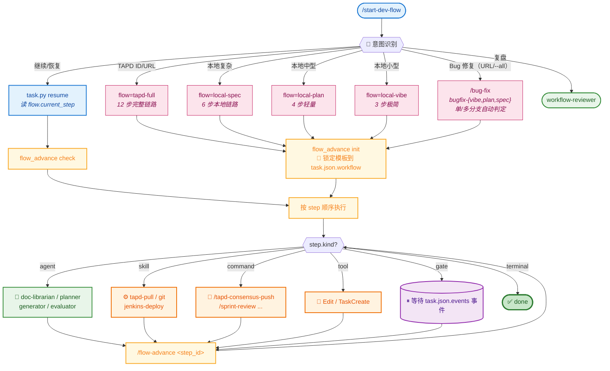
```mermaid
flowchart TD
    START(["/start-dev-flow"]) --> 识别{{"🎯 意图识别"}}

    识别 -->|TAPD ID/URL| F1["flow=tapd-full<br/><i>12 步完整链路</i>"]
    识别 -->|本地复杂| F2["flow=local-spec<br/><i>6 步本地链路</i>"]
    识别 -->|本地中型| F3["flow=local-plan<br/><i>4 步轻量</i>"]
    识别 -->|本地小型| F4["flow=local-vibe<br/><i>3 步极简</i>"]
    识别 -->|"Bug 修复（URL/--all）"| BF["/bug-fix<br/><i>bugfix-{vibe,plan,spec}</i><br/><i>单/多分支自动判定</i>"]
    识别 -->|继续/恢复| RES["task.py resume<br/><i>读 flow.current_step</i>"]
    识别 -->|复盘| REV([workflow-reviewer])

    F1 & F2 & F3 & F4 & BF --> INIT["flow_advance init<br/>📌 锁定模板到 task.json.workflow"]
    RES --> CHECK["flow_advance check"]
    CHECK --> EXEC

    INIT --> EXEC["按 step 顺序执行"]
    EXEC --> KIND{{"step.kind?"}}

    KIND -->|agent| KA["🤖 doc-librarian / planner<br/>generator / evaluator"]
    KIND -->|skill| KS["⚙️ tapd-pull / git<br/>jenkins-deploy"]
    KIND -->|command| KC["📜 /tapd-consensus-push<br/>/sprint-review ..."]
    KIND -->|tool| KT["🔧 Edit / TaskCreate"]
    KIND -->|gate| KG[("⏸ 等待 task.json.events 事件")]
    KIND -->|terminal| END(["✅ done"])

    KA & KS & KC & KT & KG --> ADV["/flow-advance &lt;step_id&gt;"]
    ADV --> KIND

    classDef entry fill:#e3f2fd,stroke:#1976d2,stroke-width:2px,color:#0d47a1
    classDef ctrl fill:#fff8e1,stroke:#f9a825,stroke-width:2px,color:#f57f17
    classDef agent fill:#e8f5e9,stroke:#388e3c,stroke-width:2px,color:#1b5e20
    classDef skill fill:#fff3e0,stroke:#ef6c00,stroke-width:2px,color:#e65100
    classDef gate fill:#f3e5f5,stroke:#8e24aa,stroke-width:2px,color:#4a148c
    classDef done fill:#c8e6c9,stroke:#2e7d32,stroke-width:3px,color:#1b5e20
    classDef tpl fill:#fce4ec,stroke:#c2185b,stroke-width:1px,color:#880e4f

    class START,RES entry
    class INIT,CHECK,EXEC,ADV ctrl
    class KA agent
    class KS,KC,KT skill
    class KG gate
    class END done
    class F1,F2,F3,F4,BF tpl
    class REV agent
```

### 7 个流程模板的步骤展开

| flow_id | 步骤序列 |
|---------|---------|
| **tapd-full** | tapd-pull → doc-librarian → consensus-push → wait-approve(gate) → planner → subtask-emit → generator → evaluator → **git-push** → **deploy** → subtask-close → sprint-review → done |
| **local-spec** | doc-librarian → planner → generator → evaluator → **git-push** → **deploy** → done |
| **local-plan** | todo-write → edit → **git-push** → **deploy** → done |
| **local-vibe** | edit → **git-push** → **deploy** → done |
| **bugfix-spec** | doc-librarian → planner → generator → evaluator → git-push → **merge** → deploy → **tapd-close** → done |
| **bugfix-plan** | todo-write → edit → git-push → **merge** → deploy → **tapd-close** → done |
| **bugfix-vibe** | edit → git-push → **merge** → deploy → **tapd-close** → done |

模板存放：`.claude/templates/flows/<flow_id>.json`。改流程 = 改 JSON,不改代码。

> bugfix-* 模板独有的 `merge` 步骤调用 `git` skill（action=merge）把修复分支合并到目标分支（hotfix → master + 回流 dev；bugfix → 关联的 feature 分支或用户选择）。`tapd-close` 步骤把 TAPD bug 推到"待测试"并回填工时。

---

## 详细执行步骤

> ⚠️ **以下小节描述各 step 内部行为(agent 职责、产物、质量门禁等)**。
>
> 步骤之间的衔接、自动派发、状态推进**已迁移到 flow 模板 + flow_advance.py**(见上方"4 个流程模板"表)。
>
> 历史描述里出现的"自动调 /xxx"、"phase = ..."、"hook 自动检测事件路由"等表述均已废弃,以模板内的 step 顺序为准。

### 步骤 1:入口与意图识别

**入口命令**：`/start-dev-flow`

用户只需描述意图，AI 自动识别并路由到对应流程：

| 用户输入 | 自动路由 | 说明 |
|---------|---------|------|
| `/start-dev-flow 1140062001234567` | /tapd start | TAPD 工单 ID |
| `/start-dev-flow https://tapd.cn/xxx` | /tapd start | TAPD URL |
| `/start-dev-flow 实现用户登录功能` | story-start | 本地需求 |
| `/start-dev-flow 修复登录页 bug https://tapd.cn/bug/xxx` | bug-fix | 单 TAPD bug 修复 |
| `/start-dev-flow 处理所有未处理 bug` | bug-fix --all | 多 bug 并行（worktree 隔离） |
| `/start-dev-flow 继续上次的任务` | task.py resume | 恢复任务 |
| `/start-dev-flow 复盘一下迭代` | workflow-reviewer | 周期复盘 |

**自动检测流程**：

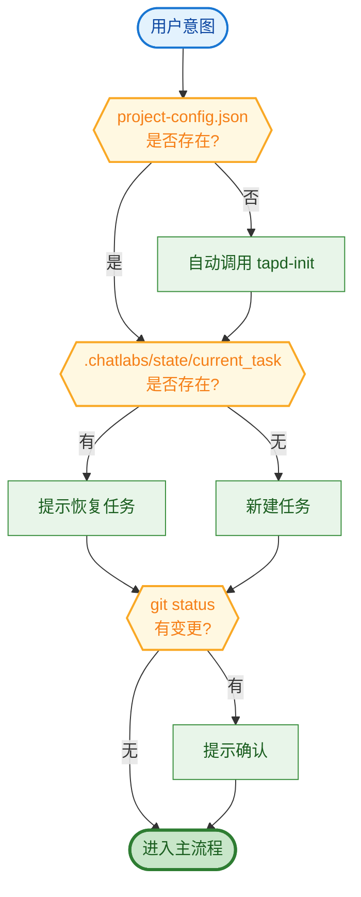
```mermaid
flowchart TD
    A([用户意图]) --> B{{"project-config.json<br/>是否存在?"}}
    B -->|否| B1[自动调用 tapd-init]
    B -->|是| C{{".chatlabs/state/current_task<br/>是否存在?"}}
    B1 --> C
    C -->|有| C1[提示恢复任务]
    C -->|无| C2[新建任务]
    C1 --> D
    C2 --> D{{"git status<br/>有变更?"}}
    D -->|有| D1[提示确认]
    D -->|无| E([进入主流程])
    D1 --> E

    classDef entry fill:#e3f2fd,stroke:#1976d2,stroke-width:2px,color:#0d47a1
    classDef decision fill:#fff8e1,stroke:#f9a825,stroke-width:2px,color:#f57f17
    classDef action fill:#e8f5e9,stroke:#388e3c,stroke-width:1px,color:#1b5e20
    classDef done fill:#c8e6c9,stroke:#2e7d32,stroke-width:3px,color:#1b5e20

    class A entry
    class B,C,D decision
    class B1,C1,C2,D1 action
    class E done
```

---

### 步骤 2：TAPD 工单处理（/tapd start）

**触发条件**：用户输入包含 TAPD 工单 ID 或 URL

#### 2.1 解析入参
```python
# 支持两种格式
/tapd start 1140062001234567  # 纯数字
/tapd start https://tapd.cn/1140062001234567/bugtrace  # URL
```

#### 2.2 刷新本地缓存

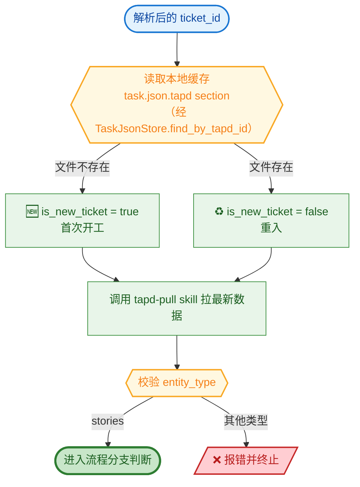
```mermaid
flowchart TD
    A([解析后的 ticket_id]) --> B{{"读取本地缓存<br/>task.json.tapd section<br/>（经 TaskJsonStore.find_by_tapd_id）"}}
    B -->|文件不存在| B1["🆕 is_new_ticket = true<br/>首次开工"]
    B -->|文件存在| B2["♻️ is_new_ticket = false<br/>重入"]
    B1 --> C[调用 tapd-pull skill 拉最新数据]
    B2 --> C
    C --> D{{"校验 entity_type"}}
    D -->|stories| E([进入流程分支判断])
    D -->|其他类型| F[/❌ 报错并终止/]

    classDef entry fill:#e3f2fd,stroke:#1976d2,stroke-width:2px,color:#0d47a1
    classDef decision fill:#fff8e1,stroke:#f9a825,stroke-width:2px,color:#f57f17
    classDef action fill:#e8f5e9,stroke:#388e3c,stroke-width:1px,color:#1b5e20
    classDef done fill:#c8e6c9,stroke:#2e7d32,stroke-width:3px,color:#1b5e20
    classDef fail fill:#ffcdd2,stroke:#c62828,stroke-width:2px,color:#b71c1c

    class A entry
    class B,D decision
    class B1,B2,C action
    class E done
    class F fail
```

#### 2.3 流程分支判断

| 情形 | local_mapping.story_id | 分支 |
|------|------------------------|------|
| 首次开工 | null | **BRANCH-A: first-start** |
| 重入 | 非 null | **BRANCH-B: auto-judge** |

#### BRANCH-A: 首次开工

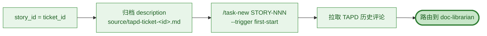
```mermaid
flowchart LR
    A1[story_id = ticket_id] --> A2[归档 description<br/>source/tapd-ticket-&lt;id&gt;.md]
    A2 --> A3["/task-new STORY-NNN<br/>--trigger first-start"]
    A3 --> A4[拉取 TAPD 历史评论]
    A4 --> A5([路由到 doc-librarian])

    classDef action fill:#e8f5e9,stroke:#388e3c,stroke-width:1px,color:#1b5e20
    classDef done fill:#c8e6c9,stroke:#2e7d32,stroke-width:3px,color:#1b5e20

    class A1,A2,A3,A4 action
    class A5 done
```

#### BRANCH-B: 重入自动判断

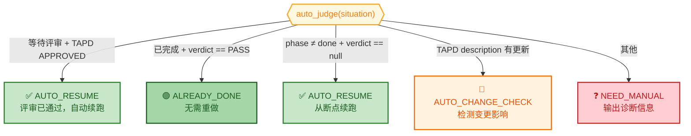
```mermaid
flowchart TD
    J{{"auto_judge(situation)"}}

    J -->|"等待评审 + TAPD APPROVED"| R1["✅ AUTO_RESUME<br/>评审已通过，自动续跑"]
    J -->|"已完成 + verdict == PASS"| R2["🟢 ALREADY_DONE<br/>无需重做"]
    J -->|"phase ≠ done + verdict == null"| R3["✅ AUTO_RESUME<br/>从断点续跑"]
    J -->|"TAPD description 有更新"| R4["🔄 AUTO_CHANGE_CHECK<br/>检测变更影响"]
    J -->|"其他"| R5["❓ NEED_MANUAL<br/>输出诊断信息"]

    classDef decision fill:#fff8e1,stroke:#f9a825,stroke-width:2px,color:#f57f17
    classDef resume fill:#c8e6c9,stroke:#2e7d32,stroke-width:2px,color:#1b5e20
    classDef done fill:#a5d6a7,stroke:#1b5e20,stroke-width:2px,color:#1b5e20
    classDef change fill:#fff3e0,stroke:#ef6c00,stroke-width:2px,color:#e65100
    classDef manual fill:#ffcdd2,stroke:#c62828,stroke-width:2px,color:#b71c1c

    class J decision
    class R1,R3 resume
    class R2 done
    class R4 change
    class R5 manual
```

---

### 步骤 3：本地需求处理（story-start）

**触发条件**：用户直接描述功能需求（无工单）


```mermaid
flowchart LR
    A([纯文本描述<br/>可多行]) --> B[解析 description]
    B --> C[分配 STORY-NNN<br/>本地自增 ID]
    C --> D[归档 source/local-<br/>description-&lt;ts&gt;.md]
    D --> E["/task-new STORY-NNN<br/>--trigger first-start"]
    E --> F([路由到 doc-librarian])

    classDef entry fill:#e3f2fd,stroke:#1976d2,stroke-width:2px,color:#0d47a1
    classDef action fill:#e8f5e9,stroke:#388e3c,stroke-width:1px,color:#1b5e20
    classDef done fill:#c8e6c9,stroke:#2e7d32,stroke-width:3px,color:#1b5e20

    class A entry
    class B,C,D,E action
    class F done
```

---

### 步骤 4：doc-librarian 阶段

**职责**：将散乱的需求整理为结构化契约文档

#### 4.1 输入
| 来源 | 文件 |
|------|------|
| TAPD 工单 | fields_cache.description + comments_cache |
| 本地需求 | local-description-*.md |

#### 4.2 产出
| 文件 | 位置 | 说明 |
|------|------|------|
| contract.md | .chatlabs/task/store/<story_id>/ (或 task/bug-fix/<bug_id>/) | 产品契约文档（6段式） |
| changelog.md | .chatlabs/task/store/<story_id>/ | 变更日志（冻结后维护） |

#### 4.3 质量门禁
```
✓ 所有业务规则有来源标注
✓ 所有 TBD 标注"需谁确认、截止时间"
✓ AC 编号连续（1,2,3...无跳号）
✓ 状态机覆盖所有合法转换
```

#### 4.4 自审触发

> 当前未实现 self-reflect 子流程。理解/合规校验由 doc-librarian / planner / evaluator 各自的 agent 定义内置完成，不再通过独立自审 skill 评分。后续视需要再补。

#### 4.5 等待评审

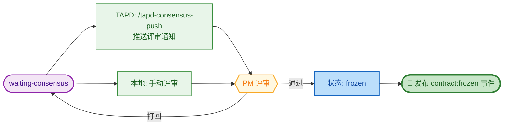
```mermaid
flowchart LR
    A([waiting-consensus]):::gate --> B1["TAPD: /tapd-consensus-push<br/>推送评审通知"]
    A --> B2["本地: 手动评审"]
    B1 & B2 --> C{{"PM 评审"}}
    C -->|通过| D[状态: frozen]
    C -->|打回| A
    D --> E([📡 发布 contract:frozen 事件])

    classDef gate fill:#f3e5f5,stroke:#8e24aa,stroke-width:2px,color:#4a148c
    classDef action fill:#e8f5e9,stroke:#388e3c,stroke-width:1px,color:#1b5e20
    classDef decision fill:#fff8e1,stroke:#f9a825,stroke-width:2px,color:#f57f17
    classDef frozen fill:#bbdefb,stroke:#1565c0,stroke-width:2px,color:#0d47a1
    classDef event fill:#c8e6c9,stroke:#2e7d32,stroke-width:3px,color:#1b5e20

    class A gate
    class B1,B2 action
    class C decision
    class D frozen
    class E event
```

---

### 步骤 5：planner 阶段

**职责**：消费契约，产出技术 spec 和 case 任务清单

#### 5.1 输入
```
contract.md (status: frozen)
```

#### 5.2 产出
| 文件 | 说明 |
|------|------|
| spec.md | 技术实现 spec（模块划分、schema、部署拓扑） |
| cases/CASE-01-*.md | 可独立执行的 case 任务清单 |
| state.json | CASE 状态追踪（verdicts） |

#### 5.3 执行步骤

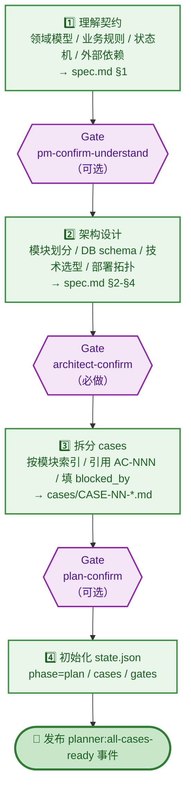
```mermaid
flowchart TD
    S1["1️⃣ 理解契约<br/>领域模型 / 业务规则 / 状态机 / 外部依赖<br/>→ spec.md §1"] --> G1{{"Gate<br/>pm-confirm-understand<br/>（可选）"}}
    G1 --> S2["2️⃣ 架构设计<br/>模块划分 / DB schema / 技术选型 / 部署拓扑<br/>→ spec.md §2-§4"]
    S2 --> G2{{"Gate<br/>architect-confirm<br/>（必做）"}}
    G2 --> S3["3️⃣ 拆分 cases<br/>按模块索引 / 引用 AC-NNN / 填 blocked_by<br/>→ cases/CASE-NN-*.md"]
    S3 --> G3{{"Gate<br/>plan-confirm<br/>（可选）"}}
    G3 --> S4["4️⃣ 初始化 state.json<br/>phase=plan / cases / gates"]
    S4 --> EV([📡 发布 planner:all-cases-ready 事件])

    classDef step fill:#e8f5e9,stroke:#388e3c,stroke-width:2px,color:#1b5e20
    classDef gate fill:#f3e5f5,stroke:#8e24aa,stroke-width:2px,color:#4a148c
    classDef event fill:#c8e6c9,stroke:#2e7d32,stroke-width:3px,color:#1b5e20

    class S1,S2,S3,S4,S5 step
    class G1,G2,G3 gate
    class EV event
```

---

### 步骤 6：tapd-subtask-emit 阶段

**职责**：自动派发 TAPD 子工单到各 Agent

#### 6.1 触发条件

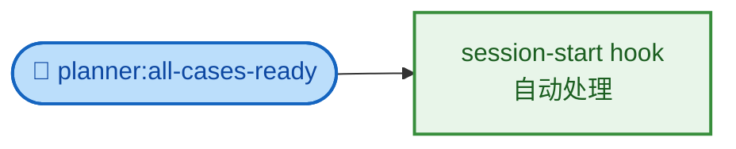
```mermaid
flowchart LR
    A([📡 planner:all-cases-ready]) --> B[session-start hook<br/>自动处理]

    classDef event fill:#bbdefb,stroke:#1565c0,stroke-width:2px,color:#0d47a1
    classDef hook fill:#e8f5e9,stroke:#388e3c,stroke-width:2px,color:#1b5e20

    class A event
    class B hook
```

#### 6.2 执行流程

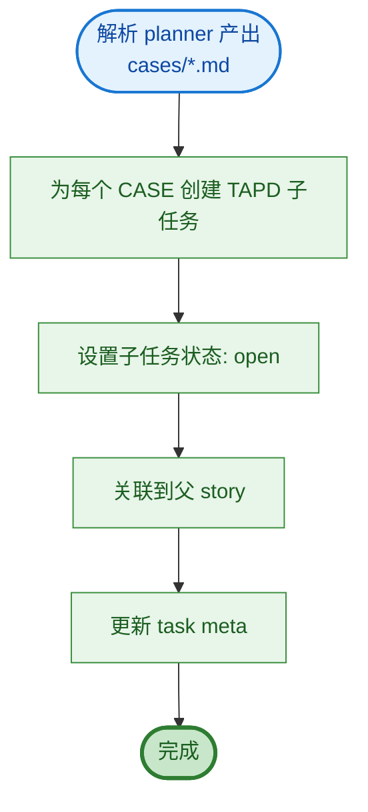
```mermaid
flowchart TD
    A([解析 planner 产出<br/>cases/*.md]) --> B[为每个 CASE 创建 TAPD 子任务]
    B --> C[设置子任务状态: open]
    C --> D[关联到父 story]
    D --> E[更新 task meta]
    E --> F([完成])

    classDef entry fill:#e3f2fd,stroke:#1976d2,stroke-width:2px,color:#0d47a1
    classDef action fill:#e8f5e9,stroke:#388e3c,stroke-width:1px,color:#1b5e20
    classDef done fill:#c8e6c9,stroke:#2e7d32,stroke-width:3px,color:#1b5e20

    class A entry
    class B,C,D,E action
    class F done
```

---

### 步骤 7：generator 阶段

**职责**：按 spec 实现功能，通过 Evaluator 验收

#### 7.1 三阶段流水线

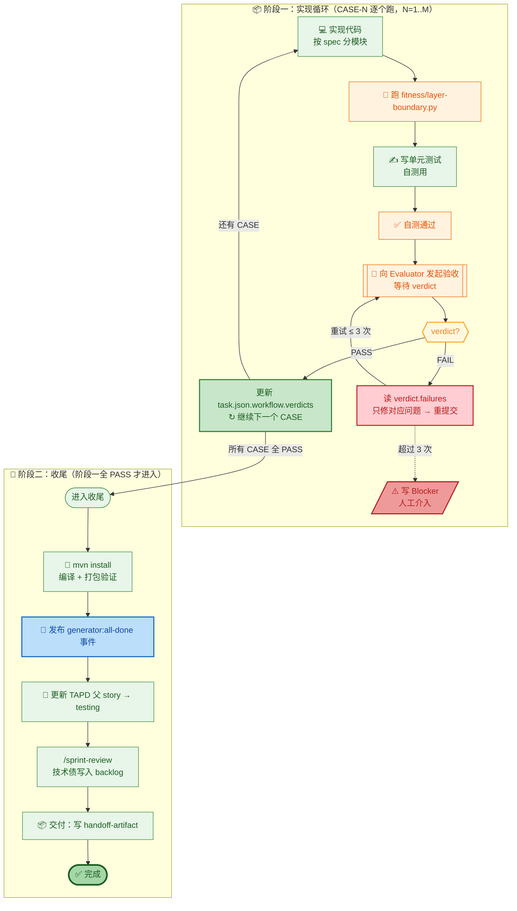
```mermaid
flowchart TD
    subgraph PHASE1["📦 阶段一：实现循环（CASE-N 逐个跑，N=1..M）"]
        direction TB
        P1A[💻 实现代码<br/>按 spec 分模块] --> P1B[🧪 跑 fitness/layer-boundary.py]
        P1B --> P1C[✍️ 写单元测试<br/>自测用]
        P1C --> P1E[✅ 自测通过]
        P1E --> P1F[[🎯 向 Evaluator 发起验收<br/>等待 verdict]]
        P1F --> P1G{{"verdict?"}}
        P1G -->|PASS| P1H[更新 task.json.workflow.verdicts<br/>↻ 继续下一个 CASE]
        P1G -->|FAIL| P1I["读 verdict.failures<br/>只修对应问题 → 重提交"]
        P1I -->|"重试 ≤ 3 次"| P1F
        P1I -.->|"超过 3 次"| BL[/⚠️ 写 Blocker<br/>人工介入/]
        P1H -->|"还有 CASE"| P1A
    end

    P1H -->|"所有 CASE 全 PASS"| PHASE2_ENTRY

    subgraph PHASE2["🚀 阶段二：收尾（阶段一全 PASS 才进入）"]
        direction TB
        PHASE2_ENTRY([进入收尾]) --> P2A[🔨 mvn install<br/>编译 + 打包验证]
        P2A --> P2B[📡 发布 generator:all-done 事件]
        P2B --> P2C[🔄 更新 TAPD 父 story → testing]
        P2C --> P2D["/sprint-review<br/>技术债写入 backlog"]
        P2D --> P2E[📦 交付：写 handoff-artifact]
        P2E --> DONE([✅ 完成])
    end

    classDef impl fill:#e8f5e9,stroke:#388e3c,stroke-width:1px,color:#1b5e20
    classDef test fill:#fff3e0,stroke:#ef6c00,stroke-width:1px,color:#e65100
    classDef decision fill:#fff8e1,stroke:#f9a825,stroke-width:2px,color:#f57f17
    classDef pass fill:#c8e6c9,stroke:#2e7d32,stroke-width:2px,color:#1b5e20
    classDef fail fill:#ffcdd2,stroke:#c62828,stroke-width:2px,color:#b71c1c
    classDef blocker fill:#ef9a9a,stroke:#b71c1c,stroke-width:2px,color:#b71c1c
    classDef event fill:#bbdefb,stroke:#1565c0,stroke-width:2px,color:#0d47a1
    classDef done fill:#a5d6a7,stroke:#1b5e20,stroke-width:3px,color:#1b5e20

    class P1A,P1C,P1D impl
    class P1B,P1E,P1F test
    class P1G decision
    class P1H pass
    class P1I fail
    class BL blocker
    class PHASE2_ENTRY,P2A,P2C,P2D,P2E impl
    class P2B event
    class DONE done
```

#### 7.2 状态追踪（强制）

```python
from task_store import TaskJsonStore

# 进入时加载状态
store = TaskJsonStore.load_by_story(story_id)
wf = store.get_workflow() or {}
verdicts = dict(wf.get("verdicts") or {})

# CASE-N 完成后
verdicts["CASE-01"] = "PASS"
store.update_workflow({"verdicts": verdicts})
store.save()

# 检查是否全部完成
if verdicts and all(v in ("PASS", "FAIL") for v in verdicts.values()):
    # 进入收尾阶段
    pass
```

#### 7.3 铁律
```
❌ Evaluator verdict 是唯一关卡
❌ Generator 禁止在所有 CASE PASS 之前做收尾动作
❌ Generator 不修改 spec（发现问题 → 向 Planner 发 issue）
❌ Generator 不自评通过（必须交 Evaluator）
```

---

### 步骤 8：evaluator 阶段

**职责**：分两阶段独立验收（Phase 1 code review + Phase 2 集成测试），对 Generator 产物做二元判定（PASS/FAIL/ERROR），**评分机制已废弃**。

#### 8.1 工作流程（双阶段，story 级验收）

```mermaid
flowchart TD
    A([📥 接收 Generator 交付<br/>代码 + contract.md + spec.md]) --> B[读取 contract.md<br/>+ 项目规范]

    B --> C[🔍 Phase 1: Code Review<br/>git diff HEAD + 项目规范]
    C --> D{{"code_review verdict"}}
    D -->|FAIL| E[📝 写 eval-verdicts.jsonl<br/>retry_count++]
    D -->|PASS| F[🚀 启动被测服务<br/>SpringBoot / FastAPI / Node]

    F --> G["🧪 Phase 2: 强制委托 /integration-test<br/>route.py 路由 → testing skill<br/>输出 verdict.json"]
    G --> H{{"integration_test verdict"}}
    H --> I[📝 写 eval-verdicts.jsonl<br/>(含 phases 双阶段)]
    I --> J([📨 通知 Generator])

    classDef entry fill:#e3f2fd,stroke:#1976d2,stroke-width:2px,color:#0d47a1
    classDef phase1 fill:#e8f5e9,stroke:#388e3c,stroke-width:2px,color:#1b5e20
    classDef phase2 fill:#fff8e1,stroke:#f9a825,stroke-width:2px,color:#f57f17
    classDef decision fill:#fff3e0,stroke:#ef6c00,stroke-width:2px,color:#e65100
    classDef store fill:#fce4ec,stroke:#c2185b,stroke-width:2px,color:#880e4f
    classDef done fill:#c8e6c9,stroke:#2e7d32,stroke-width:3px,color:#1b5e20

    class A entry
    class C phase1
    class G phase2
    class H decision
    class I store
    class J done
```

> Phase 1 FAIL 时直接返回（不进 Phase 2），节省测试启动时间。
> Evaluator **不读 Generator 的自述/自评**，只基于 git diff + 项目规范 + 集成测试结果判断。
>
> **Phase 2 强制委托纪律**（v2 改造）：evaluator 不自主选测试工具/框架/mock 方案，必走 `python .claude/skills/integration-test/scripts/route.py` 取 skill 名（优先级:`--force-stack` > `project-config.testing.skill` > 文件名约定 fallback），然后通过 Skill 工具调对应 `<lang>-testing` skill。**新增语言只需新建 testing skill + 在 route.py CONVENTION 加一行,不动 evaluator/integration-test SKILL.md**。

#### 8.2 Verdict 规格（双阶段 + 统一 schema）

**Layer 1：集成测试 verdict.json（与技术栈无关）**
```json
{
  "story_id": "STORY001",
  "verdict": "PASS | FAIL | ERROR",
  "totals": {"tests": 10, "passed": 10, "failed": 0, "errors": 0, "skipped": 0},
  "ac_coverage": {"passed_acs": ["AC-001", "AC-002"], "failed_acs": []},
  "failures": [
    {
      "ac": "AC-003",
      "test_method": "should_return_404_When_resource_not_found",
      "reason": "AssertionError: expected status 404 but was 500",
      "stack_trace": "...",
      "severity": "major"
    }
  ],
  "meta": {
    "test_framework": "junit5 | pytest | jest | curl | ...",
    "test_file_path": "src/test/java/.../integration/generated/...",
    "ran_at": "2026-05-15T..."
  }
}
```

**Layer 2：eval-verdicts.jsonl（双阶段聚合）**
```json
{
  "ts": "2026-05-15T...",
  "evaluator": "evaluator",
  "story_id": "STORY001",
  "verdict": "PASS | FAIL | ERROR",
  "phases": {
    "code_review": {
      "verdict": "PASS | FAIL | SKIPPED | ERROR",
      "files_reviewed": ["src/main/java/..."],
      "rules_source": "builtin | project knowledge",
      "failures": [...]
    },
    "integration_test": {
      "verdict": "PASS | FAIL | ERROR | SKIPPED",
      "test_framework": "junit5",
      "totals": {"tests": 10, "passed": 10, "failed": 0},
      "ac_coverage": {"passed_acs": [...], "failed_acs": []},
      "failures": [...]
    }
  },
  "failures": [...],
  "retry_count": 0
}
```

#### 8.3 通过标准（二元聚合）

- **整体 verdict = PASS**：Phase 1 code_review PASS **且** Phase 2 integration_test PASS
- **整体 verdict = FAIL**：Phase 1 FAIL（直接返回不进 Phase 2）或 Phase 2 FAIL，最多 3 次循环，超过写 Blocker
- **整体 verdict = ERROR**：基础设施问题（git 仓库缺失 / 测试环境起不来），不计入 retry

---

### 步骤 9：收尾阶段

**触发条件**：Evaluator verdict = PASS

整个 story 一次性验收通过，无需逐 case 收尾。

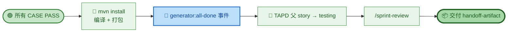
```mermaid
flowchart LR
    A([🟢 所有 CASE PASS]) --> B[🔨 mvn install<br/>编译 + 打包]
    B --> C[📡 generator:all-done 事件]
    C --> D[🔄 TAPD 父 story → testing]
    D --> E["/sprint-review"]
    E --> F([📦 交付 handoff-artifact])

    classDef entry fill:#c8e6c9,stroke:#2e7d32,stroke-width:2px,color:#1b5e20
    classDef build fill:#e8f5e9,stroke:#388e3c,stroke-width:1px,color:#1b5e20
    classDef event fill:#bbdefb,stroke:#1565c0,stroke-width:2px,color:#0d47a1
    classDef done fill:#a5d6a7,stroke:#1b5e20,stroke-width:3px,color:#1b5e20

    class A entry
    class B,D,E build
    class C event
    class F done
```

---

## 事件机制（仅审计 + gate 用）

> **重要变更**：`task.json.events` 中的事件**不再触发自动路由**。流程推进改由 `flow-engine` skill 显式驱动。
>
> 事件保留两个用途:
> 1. **审计日志** — 留存历史轨迹,用于 workflow-review 聚合分析
> 2. **gate step 触发条件** — 例如 `wait-approve` step 等待 `tapd:consensus-approved` 事件出现后才允许 advance

### 事件清单

| 事件 | 发布方 | 用途 |
|------|--------|------|
| `contract:frozen` | doc-librarian | 审计 |
| `tapd:consensus-pushed` | /tapd-consensus-push | 审计 |
| `tapd:consensus-approved` | tapd-sync skill | gate 触发(`wait-approve` step) |
| `tapd:subtask-emitted` | /tapd-subtask-emit | 审计 |
| `planner:all-cases-ready` | planner agent | 审计 |
| `generator:all-done` | generator agent | 审计 |
| `evaluator:done` | evaluator agent | 审计 |
| `git:pushed` | git skill（action=commit-push） | 审计 |
| `jenkins:deployed` | jenkins-deploy skill | 审计 |
| `tapd:subtask-closed` | /tapd-subtask-close | 审计 |

---

## 状态管理

### task.json（per-task SSOT，整合 4 个 section）

每个任务目录（`.chatlabs/task/store/<story_id>/` 或 `.chatlabs/task/bug-fix/<bug_id>/`）下的 `task.json` 是该任务的唯一状态文件，聚合 workflow / git / tapd / bug_fix 四个独立 section：

```json
{
  "task_id": "TASK-04-30-wechat-login-01",
  "task_type": "store",
  "story_id": "04-30-wechat-login",
  "trigger": "first-start",
  "dev_mode": "spec",

  "workflow": {
    "flow": { "flow_id": "tapd-full", "current_step_idx": 6, "steps": [...], "history": [...] },
    "phase": "generator",
    "verdicts": { "CASE-01": "PASS" },
    "blocker_count": 0
  },
  "git": {
    "branch": "feature/12345-wechat-login",
    "branch_type": "feature",
    "worktree_path": null,
    "source_branch": "master",
    "merge_targets": ["dev", "uat"]
  },
  "tapd": {
    "ticket_id": "12345",
    "entity_type": "stories",
    "wiki_id": "...",
    "subtasks": [],
    "subtask_emitted": false,
    "consensus_version": 1
  },
  "bug_fix": null
}
```

> bug-fix 任务的 `bug_fix` section 含 `severity / fix_mode / linked_story_id / target_branch / is_production`。

**单一写者**：所有 task.json 读写经 `task_store.TaskJsonStore` 门面（带 fcntl 锁 + atomic rename），禁止直接写 JSON。

### 旧路径退役

- 旧 `.chatlabs/stories/` → 新 `.chatlabs/task/store/`（`STORIES_DIR` 作为 deprecated 别名保留）
- 旧 `.chatlabs/tapd/tickets/<id>.json` → task.json 的 `tapd` section
- 旧 per-story `workflow-state.json` → task.json 的 `workflow` section
- 全局 `.chatlabs/state/workflow-state.json` 已下线（task.json 为单一状态源，story_id 缺失时直接返回空 state）

### Phase 字段已 deprecated

> `phase` 字段保留为兼容字段,由 `flow_advance.py` 在 advance 时双写(等于 `current_step.phase_alias`)。
>
> **所有路由读取必须走 `flow.current_step`**——不要再基于 `phase ==` 做分支判断,这种代码已彻底清理。

---

## 核心架构

### AI Agent 三角关系

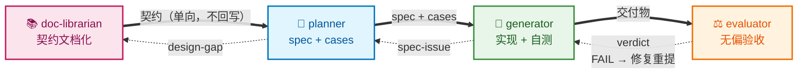
```mermaid
flowchart LR
    DL["📚 doc-librarian<br/>契约文档化"]
    PL["🧭 planner<br/>spec + cases"]
    GE["🔨 generator<br/>实现 + 自测"]
    EV["⚖️ evaluator<br/>无偏验收"]

    DL ==>|契约（单向，不回写）| PL
    PL ==>|spec + cases| GE
    GE ==>|交付物| EV
    EV -.->|"verdict<br/>FAIL → 修复重提"| GE
    GE -.->|spec-issue| PL
    PL -.->|design-gap| DL

    classDef doc fill:#fce4ec,stroke:#c2185b,stroke-width:2px,color:#880e4f
    classDef plan fill:#e1f5fe,stroke:#0277bd,stroke-width:2px,color:#01579b
    classDef impl fill:#e8f5e9,stroke:#388e3c,stroke-width:2px,color:#1b5e20
    classDef eval fill:#fff3e0,stroke:#ef6c00,stroke-width:2px,color:#e65100

    class DL doc
    class PL plan
    class GE impl
    class EV eval
```

**数据流向**：
- doc-librarian → planner：契约文档（单向，不回写）
- planner → generator：技术 spec + cases
- generator → evaluator：交付物
- evaluator → generator：verdict (FAIL 时打回)

**反馈通道**：
- generator 发现 spec 问题 → 报告给 planner
- planner 发现契约问题 → 反馈给 doc-librarian
- evaluator FAIL → generator 修复后重提

### 职责边界

| Agent | 职责 | 禁止 |
|-------|------|------|
| doc-librarian | 产品契约（业务规则、AC、接口） | 不写代码 |
| planner | 技术 spec（模块、schema、cases） | 不改契约业务字段 |
| generator | 实现代码 + 自测 | 不自评通过 |
| evaluator | 独立契约测试 | 不读 generator 自述 |

---

## 自动机制（Hooks）

| Hook | 触发时机 | 功能 |
|------|----------|------|
| **session-start.py** | 每次新 session | 加载上下文、监听事件、触发 gc |
| **session-end.py** | session 结束 | 更新 meta.sessions 会话历史 + 时长统计 |
| **ctx-guard.py** | 每次提交前 | Context >40% 阻断 |
| **blocker-tracker.py** | Bash 失败 | 分析错误，追加 blockers |
| **post-tool-linter-feedback.py** | Edit/Write 后 | 运行 fitness rule |

---

## 工作流自审机制

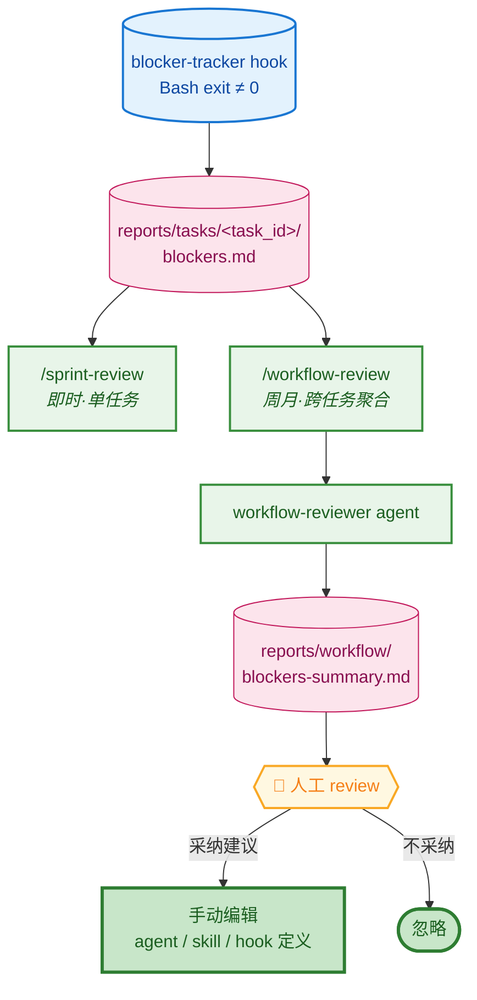
```mermaid
flowchart TD
    HOOK[("blocker-tracker hook<br/>Bash exit ≠ 0")] --> BL[(reports/tasks/&lt;task_id&gt;/<br/>blockers.md)]
    BL --> SR["/sprint-review<br/><i>即时·单任务</i>"]
    BL --> WR["/workflow-review<br/><i>周月·跨任务聚合</i>"]
    WR --> RW[workflow-reviewer agent]
    RW --> SUMOUT[(reports/workflow/<br/>blockers-summary.md)]
    SUMOUT --> HUMAN{{"👤 人工 review"}}
    HUMAN -->|采纳建议| EDIT["手动编辑<br/>agent / skill / hook 定义"]
    HUMAN -->|不采纳| DROP([忽略])

    classDef hook fill:#e3f2fd,stroke:#1976d2,stroke-width:2px,color:#0d47a1
    classDef proc fill:#e8f5e9,stroke:#388e3c,stroke-width:2px,color:#1b5e20
    classDef store fill:#fce4ec,stroke:#c2185b,stroke-width:1px,color:#880e4f
    classDef human fill:#fff8e1,stroke:#f9a825,stroke-width:2px,color:#f57f17
    classDef done fill:#c8e6c9,stroke:#2e7d32,stroke-width:3px,color:#1b5e20

    class HOOK hook
    class SR,WR,RW proc
    class BL,SUMOUT store
    class HUMAN human
    class EDIT,DROP done
```

> **当前实现**：blocker → 聚合 → 人工 review → 改 agent/skill 定义。**未实现**自动洞察提炼、自动提案、提案验证三个环节——等积累足够 blocker 样本后再设计闭环。

---

## 快速开始

```bash
/start-dev-flow             # 启动主流程(自动选 flow_id 并 init)
/tapd start <ticket>        # TAPD 工单开工(走 tapd-full)
/story-start <描述>         # 本地复杂需求(走 local-spec，自动建 feature 分支)
/bug-fix <tapd_bug_url>     # 单个 bug 修复（自动 bugfix/hotfix 分支 + 部署 + TAPD 关单）
/bug-fix --all              # 拉取所有未处理 bug 批量修复（worktree 并行隔离）
python .claude/skills/task/scripts/task.py resume <task-id>  # 恢复任务(读 flow.current_step 路由)
/flow-advance <step_id>     # 推进当前 flow 到下一步
/sprint-review              # 即时复盘
```

---

## 目录结构

| 路径 | 职责 |
|------|------|
| `.claude/agents/` | 6 个 agent 定义（doc-librarian/planner/generator/evaluator/session-auditor/workflow-reviewer） |
| `.claude/commands/` | slash commands(tapd / story-start / **bug-fix** / flow / task / start-dev-flow 等) |
| `.claude/skills/` | 可复用 skill(含 **git**（统一管理分支生命周期 + commit/push） / jenkins-deploy / tapd / fitness-run / gc / context-reset / remote-log-fetch / integration-test / flow-engine) |
| `.claude/hooks/` | 自动执行 hooks |
| `.claude/skills/task/scripts/` | **task skill 共享代码**(task_store.py task.json 门面 / task.py CLI / task_index.py 索引工具)。**路径常量已不集中管理**,每个调用方在自己脚本顶部硬编码。 |
| `.claude/templates/flows/` | **流程模板 JSON**(tapd-full / local-spec / local-plan / local-vibe / **bugfix-spec / bugfix-plan / bugfix-vibe**) |
| `.chatlabs/task/store/` | 业务需求型任务（原 stories/，每任务一份 task.json） |
| `.chatlabs/task/bug-fix/` | 缺陷修复型任务（每 bug 一份 task.json，含 bug_fix section） |
| `.chatlabs/worktrees/` | git worktree 多分支隔离工作树（多 bug 并行修复时使用） |
| `.chatlabs/state/` | 全局状态(current_task / gc_last_run，事件已迁至 task.json.events) |
| `.chatlabs/tapd/_index.jsonl` | TAPD 工单索引（ticket 详情已并入 task.json.tapd） |
| `.chatlabs/reports/` | 任务执行报告 |
| `.chatlabs/knowledge/` | 知识库(三层:project/tech/asset) |

---

## 扩展指南

- 新增 agent → 在 `.claude/agents/` 放一个 md
- 新增 hook → 在 `.claude/hooks/` 实现 + 配置 `settings.json`
- 新增 fitness rule → 在 `fitness/` 目录放 `{rule}.py`
- 新增 skill → 在 `.claude/skills/<name>/SKILL.md` 定义
- **新增 flow 模板** → 在 `.claude/templates/flows/<flow_id>.json` 写 step 列表;在 `/start-dev-flow.md` 加路由判定;`flow_advance.py init --flow-id` 自动支持
- **新增 testing skill(支持新语言集成测试)** → (1) 新建 `.claude/skills/<lang>-testing/SKILL.md`,含"作为 testing adapter 调用"段(参考 java-testing);(2) 在 `.claude/skills/integration-test/scripts/route.py` 的 `CONVENTION` 字典加一行(如 `"go.mod": "go-testing"`);**evaluator 和 integration-test SKILL.md 零改动**
- **调整 worktree / 分支收尾策略** → `project-config.json.git.worktree.{auto_create, skip_for_complexity}` 控制启动时是否开 worktree;`project-config.json.git.cleanup.allowed_prefixes` 控制完成时**哪些前缀的分支删除**(不在白名单的分支保留)。典型默认:`bugfix/` 删,`feature/`/`hotfix/` 保留;`vibe` 档默认豁免 worktree

---

## 规范文档

| 文件 | 用途 |
|------|------|
| `.chatlabs/knowledge/team/team-workflow.md` | 团队工作流总纲 |
| `.claude/artifacts-layout.md` | Flow 产物目录布局与常量速查 |
| `.claude/templates/contract-template.md` | 产品契约文档模板 |
| `.claude/templates/patch-template.md` | vibe 档 patch.md 模板(4 段强制痕迹) |
| `.claude/templates/blockers-summary.md.template` | workflow-review 周/月报告模板(含 verdict 度量) |
| `.claude/skills/task/references/task-index-entry.schema.md` | `_index.jsonl` 字段 schema |
| `.claude/rules/` | 共享规则(agent-conventions / evaluator-rules) |
| `.chatlabs/knowledge/README.md` | 知识库索引 |
