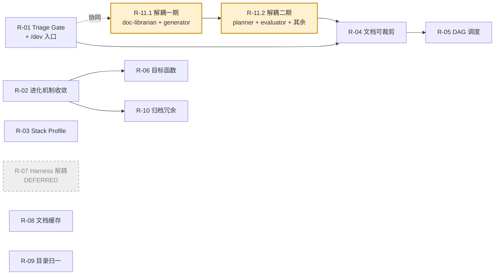

# Flow 重构计划

> 状态：v0.2（决策已对齐，待启动）
> 目标版本：**v2.0**
> 创建：2026-04-26
> 负责人：DD
> 范围：chatlabs-dev-flow 主流程、进化机制、任务编排、知识管理

---

## 1. 背景

当前 flow 在实际使用中暴露出三类根本性问题（详见 §2 诊断），需要系统性重构。本文档列出**重构任务清单**，按优先级排序，每个任务可独立交付。

**重构边界**：
- ✅ 改：入口路由、agent 职责、数据落盘结构、进化机制
- ✅ 改：skill / command / hook / agent 定义文件
- ❌ 不改：已有 stories/ 历史数据、TAPD 集成 API
- ❌ 不做：换 LLM、引入新 harness、重写 LTM 底层

---

## 2. 诊断小结

| 问题域 | 核心症状 | 根因 |
|-------|---------|------|
| **粒度** | 小修改也走全套流程（contract → spec → case → GAN） | 入口无分级机制 |
| **Harness 锁定** | 编排逻辑写在 Claude Code hook 和 `/agent` 路由里，换 Codex 等于重写 | 数据层与编排层未分离 |
| **GAN 单线** | 一个 generator 串行跑所有 case，无冲突检测、无并行 | planner 不输出 case 间依赖图 |
| **Stack 硬编码** | `mvn install`、`rest-assured` 写死在 agent 定义中 | 缺少 stack profile 抽象 |
| **进化机制重叠** | self-reflect / insight-extract / workflow-reviewer / sprint-review / GEPA / LTM 六个机制目标重叠 | 缺少统一目标函数 |
| **第三方文档过时** | Context7 调用不留痕，本地无版本化缓存 | 知识层未设计 |
| **数据目录混乱** | `.chatlabs/` 下 11 个子目录，部分为空（cases/、blockers/） | 历史演进未清理 |

---

## 3. 重构原则

1. **数据与编排分离**：所有"事实"必须在文件层，编排只是渲染器。
2. **可裁剪**：任何模板/文档/流程必须支持按需启用 block，不能"一刀切"。
3. **目标函数先行**：每个机制必须能回答"我在优化什么指标"。
4. **harness 中立**：编排层用 Python CLI 表达，Claude Code 只是其中一个调用方。
5. **先止血再重构**：高频痛点优先，结构性改造放后面。
6. **组件解耦，命令编排**：
   - **agent/skill 是纯组件**：只对自己的输入/输出负责，**不嵌入下游调用**（不调 evaluator、不发 TAPD 评论、不触发 Jenkins）、**不嵌入平台逻辑**
   - **命令是编排器**：决定组件调用顺序、决定挂载哪些平台插件（TAPD/Jenkins/钉钉/无）
   - **平台插件可插拔**：每个平台是一个独立 skill，编排命令按需加载，不集成到组件内部
   - **入口可并存**：`/dev`（平台无关纯净流程）与 `/tapd-story-start`（带 TAPD 插件的编排）都存在，分级与流程**保持一致**
7. **来源无关，业务驱动**：分级粒度只看实际业务改动量（范围、跨角色、复杂度），不看来源平台。同一需求文本无论从哪个入口进入，分级结果必须一致。

---

## 4. 任务总览

| ID | 任务 | 优先级 | 工作量 | 依赖 | 状态 |
|----|------|-------|-------|------|------|
| R-01 | 入口 Triage Gate（LLM 分级 + `/dev` 纯净入口） | P0 | M | - | pending |
| R-02 | 进化机制收敛（6 → 3）+ 砍自动改文件 | P0 | M | - | pending |
| R-11.1 | **组件解耦（一期）**：doc-librarian + generator 抽离平台/下游调用 | P0 | M | - | pending |
| R-11.2 | **组件解耦（二期）**：planner + evaluator + 其余 skill | P0 | M | R-11.1 | pending |
| R-03 | Stack Profile 抽象（解耦后端硬编码） | P1 | M | - | pending |
| R-04 | 共识/spec/case 三层文档可裁剪化 | P1 | M | R-01 | pending |
| R-05 | Case 级冲突检测 + DAG 调度 | P1 | L | R-04 | pending |
| R-06 | 目标函数与评估基准 | P1 | M | R-02 | pending |
| ~~R-07~~ | ~~Task 编排层 harness 解耦~~ | - | - | - | **deferred**（保持现状） |
| R-08 | 第三方文档缓存层（支持人工修订） | P2 | M | - | pending |
| R-09 | 数据目录归一与清理 | P2 | S | - | pending |
| R-10 | 冗余 skill / command 归档 | P2 | S | R-02 | pending |

**工作量符号**：S = 半天-1 天 / M = 2-3 天 / L = 1 周+

---

## 5. 任务详情

### R-01：入口 Triage Gate（粒度分级）

**优先级**：P0
**目标**：新增**平台无关的纯净入口** `/dev`，前置 LLM 分级器（trivial / small / epic 三档）；现有 `/tapd-story-start` 等平台特定入口**保留**，但改为"复用 triage + 编排平台插件"的形式，避免重复实现分级逻辑。

**现状问题**：
- `/start-dev-flow` 只按"是否含 TAPD ID"路由，所有意图都走 doc-librarian → planner → generator → evaluator
- 用户改个字段名也会创建 contract.md、spec.md、cases/
- 没有"我只想做开发，不想要任何平台集成"的入口

**核心原则**：

> 不动现有 TAPD 入口的业务逻辑。新增一个**平台无关**入口 `/dev`，与 `/tapd-story-start` 并存。
> 分级器（triage）是**共享纯组件**，平台入口和纯净入口都调它，分级判据**只看业务改动维度**，不看来源。

**架构关系**：

```
┌──────────────────────────┐    ┌───────────────────────┐
│  /tapd-story-start       │    │  /dev                 │
│  （平台编排：TAPD 插件） │    │  （纯净编排：无平台）│
└────────────┬─────────────┘    └──────────┬────────────┘
             │                              │
             │  pull TAPD ticket            │  从参数/STDIN 读需求
             │  → requirement payload       │  → requirement payload
             │                              │
             └──────────────┬───────────────┘
                            ▼
                    ┌───────────────┐
                    │ triage skill  │  共享纯组件
                    │ (LLM 分级)    │
                    └───────┬───────┘
                            │
                ┌───────────┼───────────┐
                ▼           ▼           ▼
              trivial      small       epic
              直接编辑    case+eval   完整流程
                            │
                            │ （可选：发布事件）
                            ▼
              ┌──────────────────────────┐
              │  TAPD 入口的编排：       │
              │   监听事件 → 推送 TAPD   │
              │  /dev 入口的编排：       │
              │   忽略事件，无平台动作   │
              └──────────────────────────┘
```

**改造方案**：

> **决策记录**：分级算法采用 **LLM 判断**（非纯规则）。
> 理由：意图描述自然语言变化大，规则匹配脆弱；LLM 单次调用成本可控（几百 token）。

1. **新建命令 `/dev <intent>`**（平台无关纯净入口）：
   - 接受需求描述（参数、STDIN、或文件）
   - 输出 `requirement-payload.json` 统一载荷
   - 调 triage → 按结果路由到 trivial/small/epic 编排
   - **不调用任何平台插件**（不推 TAPD、不触发 Jenkins）
   - 后续若需要部署/通知，由用户显式调 `/jenkins-deploy`、`/dingtalk-notify` 等

2. **改造 `/tapd-story-start`**（保留 + 重构）：
   - 拉取 TAPD ticket → 转成 `requirement-payload.json`
   - 调用**共享的 triage**（不再独立判断）
   - 路由到对应档次的编排，**额外挂载 TAPD 插件**（推送评论、subtask 派发、状态推进）
   - 业务逻辑保持现状，只是将分级、组件调用部分抽出共享

3. **`triage` skill**（共享纯组件）：
   ```json
   {
     "tier": "trivial | small | epic",
     "reasoning": "判断理由（不含来源平台）",
     "estimated_files": 2,
     "needs_consensus": false,
     "confidence": 0.85
   }
   ```

4. **LLM Prompt 关键要素**：
   - 输入：**只**包含需求文本（title + description + 必要附件摘要）+ 最近 N 条历史分级日志
   - **绝不**输入"来源平台"作为分级判据
   - 可选输入：`stack-profile` 估算改动复杂度
   - confidence ≤ 0.6 时 AskUser 让用户拍板
   - 明确禁止模型在 trivial 场景建议架构改动

5. **三档定义（仅看业务维度）**：

   | 档次 | 业务改动判据 | 流程 |
   |------|------------|------|
   | `trivial` | 改字段名/文案/配置；单文件 < 30 行；无新增功能；无外部行为变化 | 跳过所有，直接编辑 |
   | `small` | 单接口/单组件；无跨角色协作；影响 1-3 文件；行为变化局限于本模块 | 仅生成 case + evaluator，跳过 contract/spec |
   | `epic` | 跨角色（PM+前端+后端+QA 至少 2 方需对齐）；新功能；影响 > 3 文件；状态机/数据模型变更 | 完整 flow（contract → spec → case → GAN） |

6. **失败兜底**：LLM 调用失败 / confidence 低 → 默认升档为更重的流程
7. **手动覆盖**：`/dev --tier=trivial|small|epic <intent>` 跳过 LLM
8. **学习闭环**：每次分级写入 `flow-logs/triage/`，记录意图 + 决策 + 用户是否覆盖
9. trivial 档不写 stories/、不创建 TASK，只在 git commit message 标记 `[trivial]`
10. small 档创建轻量 story，跳过 doc-librarian + planner，由 triage 直接生成 1-3 个 case

**验收标准**：
- [ ] `/dev <intent>` 命令存在，可以**完全离线**地跑通三档流程（无 TAPD/Jenkins/钉钉调用）
- [ ] `/tapd-story-start` 现有功能保留，但分级逻辑由共享的 triage 提供
- [ ] **同一需求文本**无论从 `/dev` 还是 `/tapd-story-start` 进入，triage 给出的 tier 必须一致
- [ ] trivial 意图（如"修改 user 表 email 字段长度限制"）不触发 doc-librarian——**即使来自 TAPD**
- [ ] small 意图（如"给 /api/users 加分页参数"）只生成 case，不生成 contract.md
- [ ] epic 意图（如"新增订单退款流程"）保持完整流程——**即使来自本地 `/dev`**
- [ ] triage 决策日志（`flow-logs/triage/YYYY-MM-DD.jsonl`）含意图、tier、confidence、是否被覆盖；**不含**"来源决定档次"的判据
- [ ] LLM Prompt 中无"来源是 X 时倾向 Y"类提示词（lint 检查）
- [ ] LLM 调用失败有降级路径，不阻塞用户
- [ ] 用户可手动覆盖（`/dev --tier=epic <intent>`）
- [ ] confidence < 0.6 时 AskUserQuestion 让用户拍板

**影响文件**：
- 新增：`.claude/skills/triage/SKILL.md`
- 新增：`.claude/scripts/triage.py`（封装 LLM 调用 + 兜底逻辑）
- 新增：`.claude/commands/dev.md`（平台无关纯净入口）
- 修改：`.claude/commands/start-dev-flow.md`（变成 `/dev` 的别名 / 提示重定向）
- 修改：`.claude/commands/tapd/tapd-story-start.md`（调 triage，保持 TAPD 插件挂载）

**不在本任务范围**（移到 R-11）：
- agent/skill 内部的"调下游"代码点提取（由 R-11 处理）
- 平台插件接口契约定义（由 R-11 处理）

**风险**：
- LLM 误判 → confidence 阈值 + 用户覆盖 + 学习日志反哺
- LLM token 成本 → 每次 < 500 token；启动单次调用，不在循环里
- trivial 跳过审计 → 在 commit hook 强制 self-reflect 兜底
- **R-01 完成但 R-11 未完成时**：`/dev` 仍可能因 agent 内部硬编码触发 TAPD/Jenkins 调用——需要在 R-11 完成前给 `/dev` 设环境变量 `FLOW_NO_PLATFORM=1` 兜底，跳过组件内的平台调用（临时方案）

---

### R-02：进化机制收敛（6 → 3）+ 砍"自动改文件"

**优先级**：P0
**目标**：把 self-reflect / insight-extract / workflow-reviewer / sprint-review / GEPA / LTM 收敛到 3 个职责清晰的机制；**砍掉所有"自动改 agent/skill/template 文件"的特性**。

**现状问题**：

- 六个机制目标重叠，落点分散（flow-logs / blockers / insights / proposals / ltm 五个数据源）
- LTM 是死端（写不读）
- sprint-review 与 workflow-reviewer 都在"复盘"，前者每 task 后跑、后者周月跑
- GEPA 优化后没有 A/B 验证，不知道是否真的更好
- **sprint-review 会无 review 直接 Edit agent 定义文件 / fitness 脚本**（流程漂移源头）

**决策记录（sprint-review 处置）**：

| 失去能力 | 处置 |
|---------|------|
| 单 task 即时复盘 | 迁移进 `self-reflect(trigger=task-done)`，能力保留 |
| 自动改 agent.md / fitness 脚本 | **砍掉**——所有改 agent/skill/template 必须走 evolution-propose 人工确认 |
| tech-debt-backlog 自动追加 | 迁移到 self-reflect 末尾，能力保留 |
| file-reads.md / diff-log.md 消费 | self-reflect 接管读取这些数据 |
| 每 task 趋势对比 | 砍掉（粒度过细，意义不大；workflow-reviewer 周月级已覆盖） |

**改造方案**：
1. **保留并强化 self-reflect**：
   - 新增 `trigger=task-done`，吸收 sprint-review 的复盘逻辑
   - 读取 task 的 summary.md / blockers.md / file-reads.md / diff-log.md
   - 输出复盘 + 写 tech-debt-backlog（仅追加，不改 agent）
2. **保留 workflow-reviewer**：直接读 flow-logs（不再依赖 insight-extract 中间层），周月跑，输出建议
3. **保留 LTM**：增加**自动注入路径**——agent 启动时按 tag 加载相关记忆到上下文
4. **砍掉 sprint-review**：迁移逻辑到 self-reflect（任务能力保留）；删除"自动改文件"特性
5. **砍掉 insight-extract**：workflow-reviewer 直接做聚合
6. **GEPA 降级为可选**：不进入主流程，仅作为人工触发的优化工具，必须配合 R-06 的目标函数才能跑
7. **新增硬约束（铁律）**：所有对 agent.md / skill.md / template / fitness 脚本的修改，**必须**先走 evolution-propose 写提案，**必须**人工 `/evolution-apply` 才能落地。任何 skill/agent 不得在执行中直接 Edit 这类文件。

**验收标准**：
- [ ] `/sprint-review` command 归档到 `.claude/_archived/`
- [ ] insight-extract/ 归档
- [ ] workflow-reviewer 单一职责：读 flow-logs + blockers，输出 P0/P1/P2 建议
- [ ] self-reflect 支持 task-done trigger，且能写 tech-debt-backlog
- [ ] LTM 注入：generator/evaluator 启动时调用 `ltm.recall(tags=[...])`，加载相关 anti-pattern
- [ ] 每个机制有明确的"我优化什么指标"声明（写入 SKILL.md frontmatter）
- [ ] 数据流单向：信号 → flow-logs → workflow-reviewer → evolution-propose（人工确认）→ 文件
- [ ] 增加 lint 规则：扫描所有 agent/skill 文件，发现"直接 Edit agent.md / fitness 脚本"指令时报错
- [ ] generator.md 中"自动调用 /sprint-review"改为"自动触发 self-reflect(trigger=task-done)"

**影响文件**：
- 归档：`.claude/commands/sprint-review.md`、`.claude/skills/insight-extract/`
- 修改：`.claude/agents/workflow-reviewer.md`（吸收 insight-extract 职责）
- 修改：`.claude/skills/self-reflect/SKILL.md`（新增 task-done trigger，承接 sprint-review）
- 修改：`.claude/skills/ltm/SKILL.md`（增加 recall 注入指引）
- 修改：`.claude/agents/generator.md`、`.claude/agents/evaluator.md`（启动时 recall；调用点改为 self-reflect）

**风险**：
- 砍掉机制后，已积累的 insights/ 数据丢失 → 迁移到 flow-logs 同等位置
- LTM 注入可能爆 token → 限制 recall top-k，按相关性截断
- 失去自动改文件能力 → 改进速度变慢，但换来**流程稳定性**和**可审计性**（值得）

---

### R-03：Stack Profile 抽象

**优先级**：P1
**目标**：把 generator / evaluator 中的 stack 相关命令抽出 profile 配置，支持多技术栈。

**现状问题**：
- generator.md 写死 `mvn install`
- evaluator.md 默认 `rest-assured` adapter
- 切换到 Node/Python/Go 项目时 agent 不可用

**改造方案**：
1. 定义 stack profile schema：

   ```yaml
   # .chatlabs/stack-profile.yaml
   stack: backend-spring  # 或 backend-fastapi / frontend-react / fullstack-next
   build:
     install: "mvn install"
     test: "mvn test"
     lint: "mvn checkstyle:check"
   contract_test:
     adapter: rest-assured  # 或 schemathesis / pact
   fitness:
     - layer-boundary
     - openapi-lint
   ```

2. 内置 profile 模板：`backend-spring` / `backend-fastapi` / `frontend-react` / `fullstack-next`
3. agent 改写：所有命令通过 profile 解析，不硬编码
4. `/init-project` 增加 profile 选择交互
5. fitness-run skill 按 profile 加载规则

**验收标准**：
- [ ] generator.md 中无硬编码命令
- [ ] 切换 profile 后，整套 flow 在 hello-python 项目上跑通
- [ ] profile 缺失时给出清晰报错和初始化提示
- [ ] 至少提供 2 个内置 profile（spring + fastapi）

**影响文件**：
- 新增：`.chatlabs/stack-profile.yaml`（项目级）
- 新增：`.claude/templates/stack-profiles/*.yaml`
- 修改：`.claude/agents/generator.md`、`.claude/agents/evaluator.md`
- 修改：`.claude/skills/fitness-run/SKILL.md`、`.claude/skills/contract-test/SKILL.md`
- 修改：`.claude/commands/init-project.md`

**风险**：
- 现有项目无 profile → 提供 migration script 默认推断
- profile 字段膨胀 → 严格限制为 build / test / contract_test / fitness 四类

---

### R-04：共识/spec/case 三层文档可裁剪化

**优先级**：P1
**目标**：让 contract.md / spec.md / cases/ 支持按需启用模块，避免小变更也填全套字段。

**现状问题**：
- contract.md 模板要求 6 段全填，小变更场景下大半字段是噪音
- spec.md 必走，无论 case 是否需要架构层设计
- 三层文档之间内容容易重复（Planner 复述 contract）

**改造方案**：
1. 模板改写：使用 frontmatter 声明 required / optional blocks

   ```yaml
   ---
   required: [story, acceptance]
   optional: [api_contract, data_model, ui_design, qa_cases, state_machine]
   ---
   ```

2. 三层职责重新定义：

   | 文档 | 受众 | 必填 | 可选 |
   |------|-----|-----|-----|
   | contract.md | 多角色 | story, acceptance | api_contract, data_model, ui, qa |
   | spec.md | 技术 | （仅 epic 强制）architecture | tech_choice, db_schema, deploy |
   | cases/*.md | AI 执行 | scope, files, accept_script | dependencies, fitness_check |

3. small 档（来自 R-01）只生成 cases，跳过 contract/spec
4. epic 档强制 contract + spec，但内部 block 可裁剪
5. doc-librarian / planner 按 required block 检查，缺失才阻断

**验收标准**：
- [ ] 模板支持 frontmatter required/optional
- [ ] doc-librarian 在 small 场景下不要求生成 contract.md
- [ ] 现有 contract-template.md 重写为 block 化版本
- [ ] 文档间引用通过 `link:` 而非 copy

**影响文件**：
- 修改：`docs/contract-template.md`
- 修改：`.claude/templates/spec.md`
- 修改：`.claude/templates/story/case-template.md`
- 修改：`.claude/agents/doc-librarian.md`、`.claude/agents/planner.md`

**风险**：
- 老 stories 不兼容 → 提供向后兼容模式（无 frontmatter 视为全 required）

---

### R-05：Case 级冲突检测 + DAG 调度

**优先级**：P1
**目标**：planner 输出 case 间依赖图和文件触达表，调度器据此判断并行/串行。

**现状问题**：
- generator 单实例 for 循环 case，串行执行
- 无冲突检测：两个 case 改同一个文件可能互相覆盖
- 无并行能力：明明可以并行的 case 也排队

**改造方案**：
1. planner 输出物增加 **`case-graph.json`**：

   ```json
   {
     "cases": [
       { "id": "CASE-01", "files_touched": ["src/User.java"], "depends_on": [] },
       { "id": "CASE-02", "files_touched": ["src/Order.java"], "depends_on": [] },
       { "id": "CASE-03", "files_touched": ["src/User.java"], "depends_on": ["CASE-01"] }
     ]
   }
   ```

2. 调度器（新建 `scheduler.py`）：
   - 拓扑排序得到执行批次
   - 同批次内文件交集为空 → 并行
   - 文件交集非空 → 串行
3. generator 接受 batch 输入，可被调度器并行调用多次（不同 worktree）
4. evaluator 分两级：单 case 级（每个 case 跑契约测试）+ 集成级（全部完成后跑端到端）

**验收标准**：
- [ ] planner 必须输出 case-graph.json，缺失视为不合格
- [ ] 给定 5 个 case 的样例，调度器能正确划分批次
- [ ] 文件冲突的 case 自动转串行
- [ ] 集成级 evaluator 在所有 case PASS 后才跑

**影响文件**：
- 新增：`.claude/scripts/scheduler.py`
- 修改：`.claude/agents/planner.md`（要求输出 case-graph.json）
- 修改：`.claude/agents/generator.md`（接受 batch 模式）
- 修改：`.claude/agents/evaluator.md`（区分单 case / 集成两级）

**风险**：
- worktree 数量爆炸 → 限制最大并行数（默认 3）
- 集成测试可能失败但单 case 都 PASS → 增加回滚机制（标记问题 case，重新走单 case → 集成）

---

### R-06：目标函数与评估基准

**优先级**：P1
**目标**：为所有进化/优化机制定义可量化的目标函数，让 GEPA 等机制有评估基准。

**现状问题**：
- GEPA 改完 SKILL.md 后没有 A/B
- evolution-propose 评估改进效果靠人感觉
- 无法回答"我们这个月 flow 进步了多少"

**改造方案**：
1. 定义 **flow 健康度指标**（写入 `docs/flow-metrics.md`）：

   | 指标 | 计算方式 | 目标 |
   |------|---------|------|
   | `verdict_pass_rate` | evaluator PASS 次数 / 总次数 | ≥ 80% |
   | `blocker_per_task` | 平均每个 task 产生的 blocker 数 | ≤ 0.5 |
   | `tapd_reopen_rate` | TAPD 打回率 | ≤ 10% |
   | `case_retry_avg` | case 平均重试次数 | ≤ 1.5 |
   | `token_per_story` | 每个 story 消耗 token | trending down |
   | `time_to_consensus` | 从 story-start 到 contract frozen 的时长 | trending down |

2. 新建 `metrics-collector.py`：从 flow-logs / verdicts / TAPD 状态聚合
3. 每周自动跑，输出趋势图到 `.chatlabs/reports/metrics/`
4. GEPA / evolution-propose 必须给出"预期改善哪个指标"，应用后对比

**验收标准**：
- [ ] `docs/flow-metrics.md` 定义至少 6 个指标
- [ ] metrics-collector.py 能从现有数据计算
- [ ] workflow-reviewer 报告包含指标趋势对比
- [ ] GEPA 应用后自动记录基线 → 一周后对比

**影响文件**：
- 新增：`docs/flow-metrics.md`
- 新增：`.claude/scripts/metrics-collector.py`
- 修改：`.claude/agents/workflow-reviewer.md`
- 修改：`.claude/skills/gepa/SKILL.md`（强制声明目标指标）

**风险**：
- 指标 gaming（AI 优化指标本身而非问题）→ 指标多元化，单一指标突变触发人工 review

---

### ~~R-07：Task 编排层 harness 解耦~~ — **DEFERRED**

> **决策记录**：本次重构**不做**，保持现状（Claude Code 强绑定）。
>
> **理由**：
> - 工程量大（L 级），影响面广
> - 当前 Claude Code 强绑定不是阻塞性问题
> - 数据层（state / meta / index）已经在文件层，未来切换的成本可控
>
> **何时启动**：当出现以下任一信号时再考虑：
> 1. 团队中有人持续使用 Codex / Cursor 但无法跑 flow
> 2. 出现 Claude Code 不可用的场景（断网、API 限制）
> 3. 需要 CI 流水线自主驱动 flow（无 LLM 介入）
>
> **过渡建议**：在 R-04 / R-09 重构时，**避免新增** Claude Code 专属耦合（如新 hook、新 `/agent` 路由），优先用文件契约。

---

### R-11 系列：组件解耦改造（agent/skill 不嵌下游/平台调用）

> **共同目标**：把组件（agent/skill）里硬编码的"调下游 / 调平台"代码点全部提取出来，交给命令编排器。让 `/dev` 这种纯净入口能在不调任何平台的情况下完整跑通。
>
> **范围限定（决策记录）**：本次重构**只考虑 TAPD 一个平台**（不为 Jira/钉钉等做扩展点）。但仍要把 TAPD 调用从组件中剥离出来——这是为了**关闭 TAPD 时也能纯净开发**，不是为了多平台扩展。
>
> **events.jsonl 角色（决策记录）**：**保留**。组件可以发布"自身完成"类事件（声明性状态通知），命令层订阅事件做编排。组件**禁止**直接调用下游 skill / 平台 skill。

**优先级**：P0（拆分为 R-11.1 + R-11.2，见下）
**整体目标**：把组件（agent/skill）里硬编码的"调下游 / 调平台"代码点全部提取出来，交给命令编排器。让 `/dev` 这种纯净入口能在不调任何平台的情况下完整跑通。

**现状问题**（基于代码扫描）：

| 组件 | 当前嵌入的下游/平台调用 |
|------|----------------------|
| `doc-librarian.md` | 完成后发布 `contract:frozen` 事件 → 触发 TAPD sync 推送评论；触发 self-reflect |
| `planner.md` | 完成后发布 `planner:all-cases-ready` 事件 → 自动派发 TAPD subtask + 路由到 generator |
| `generator.md` | 收尾自动调 `/sprint-review`、自动推 TAPD 状态到 testing、自动调 `jenkins-deploy` |
| `evaluator.md` | 完成后通知 generator（仍然算下游耦合） |

这些"自动调下游"导致：
1. 换掉一个组件就要修上下游所有引用
2. 关闭 TAPD 集成需要改多处 .md 文件
3. `/dev` 这种纯净入口无法绕开平台调用——组件会主动触发 TAPD sync

**核心架构**：组件 = 纯函数；命令 = 编排器；TAPD = 可挂载插件。

```
┌──────────────────────────────────────────────────────┐
│                  命令编排层                          │
│  /dev:                                               │
│    triage → doc-librarian → planner → generator     │
│    → evaluator                                       │
│    （事件总线存在，但无订阅者）                      │
│                                                      │
│  /tapd-story-start:                                  │
│    tapd-pull → triage → doc-librarian               │
│    → planner → generator → evaluator                │
│    （订阅 contract:frozen → 触发 tapd-sync 推评论）  │
│    （订阅 planner:all-cases-ready → 派 subtask）     │
│    （订阅 generator:all-done → 推 testing 状态）     │
│    → jenkins-deploy                                  │
└──────────────────────────────────────────────────────┘
            │ 调用                       │ 订阅
            ▼                            ▼
┌─────────────────────┐       ┌──────────────────────┐
│   纯组件层          │       │  事件总线            │
│ - doc-librarian     │ emit  │  events.jsonl        │
│ - planner           │──────▶│                      │
│ - generator         │       │  contract:frozen     │
│ - evaluator         │       │  planner:all-...     │
│                     │       │  generator:all-done  │
│ ❌ 不直接调下游     │       └──────────┬───────────┘
│ ❌ 不直接调 TAPD    │                  │
└─────────────────────┘                  │
                                         ▼
                            ┌─────────────────────┐
                            │  TAPD 插件 skill    │
                            │  仅由命令订阅触发   │
                            └─────────────────────┘
```

**通用改造原则**（R-11.1 和 R-11.2 都遵守）：

1. **组件契约 frontmatter**（每个 agent/skill 必须声明）：
   ```yaml
   ---
   name: doc-librarian
   inputs:
     - requirement-payload.json
   outputs:
     - contract.md
     - openapi.yaml
   events_emitted:                # 允许发布的事件白名单
     - contract:frozen
   direct_calls: none             # 关键：禁止直接调用下游/平台 skill
   ---
   ```

2. **emit_event 是允许的**，**直接调用 skill 是禁止的**：
   - ✅ `from workflow_state import emit_event; emit_event("contract:frozen", ...)`
   - ❌ `triggers: [tapd-sync, jenkins-deploy]` 或 `自动调用 /sprint-review`

3. **平台插件通过命令层订阅**：命令文件中显式声明事件订阅与插件挂载，可读可审计

4. **lint 检查**：
   - 扫描 agent/skill 中是否出现 `tapd-sync`、`jenkins-deploy`、`/sprint-review`、`/<其他 skill 名>` 等直接调用
   - 扫描 frontmatter 是否完整声明 `events_emitted` 和 `direct_calls`

5. **临时兼容**：未拆完的组件残留调用通过 `FLOW_NO_PLATFORM=1` 环境变量短路；`/dev` 默认设置此变量

---

#### R-11.1：一期 — doc-librarian + generator

**优先级**：P0
**工作量**：M（2-3 天）
**目标**：剥离两个最高耦合度的组件。这两个跑通后，`/dev` 已能跑 trivial / small / 简化版 epic。

**改造范围**：
- `doc-librarian.md`：删除"发布事件并触发 tapd-sync 推评论"的隐含调用，改为**只 emit `contract:frozen` 事件**，不指定下游
- `generator.md`：删除"自动调用 /sprint-review、jenkins-deploy、TAPD 状态推进"，改为**只 emit `generator:all-done` 事件**

**新增编排器**：
- `.claude/commands/dev.md`：纯净流程，订阅 `contract:frozen` / `generator:all-done` 但**不挂任何插件**
- `.claude/commands/tapd/tapd-story-start.md` 改造：
  - 流程组件调用与 `/dev` 完全一致（共享同一组件链）
  - 显式订阅事件，挂载 TAPD 插件（推评论、推状态）
  - 显式调用 jenkins-deploy

**验收标准**：
- [ ] `doc-librarian.md` 内无 `tapd-sync` / `tapd-consensus-push` 等字串
- [ ] `generator.md` 内无 `/sprint-review` / `jenkins-deploy` / `TAPD 状态推进` 字串
- [ ] 两个组件 frontmatter 含完整 `events_emitted` + `direct_calls: none`
- [ ] `/dev <epic-intent>` 能跑通 doc-librarian → generator 链路，无 TAPD 调用
- [ ] `/tapd-story-start <id>` 保留 TAPD 推评论 + 推状态行为（行为对比测试通过）
- [ ] events.jsonl 中能看到 `contract:frozen` / `generator:all-done` 事件被命令层订阅消费

**影响文件**：
- 修改：`.claude/agents/doc-librarian.md`、`.claude/agents/generator.md`
- 新增：`.claude/commands/dev.md`（与 R-01 共建）
- 修改：`.claude/commands/tapd/tapd-story-start.md`（提取共享流程，命令层订阅事件）
- 新增：`docs/component-contract.md`（组件契约定义）
- 新增：`.claude/scripts/lint-component.py`（frontmatter + 直接调用扫描器）

**风险**：
- **行为对比测试缺失** → 在动手前先跑一遍现有 `/tapd-story-start` 完整流程，记录 events.jsonl + TAPD 调用序列，作为基线
- **doc-librarian 的事件发布在多处** → 用 grep 锁定所有 emit 点，集中到组件最末位置一次发出

---

#### R-11.2：二期 — planner + evaluator + 其余 skill

**优先级**：P0
**工作量**：M（2-3 天）
**目标**：清理剩余组件中的耦合，完成整套解耦。

**改造范围**：
- `planner.md`：删除"自动派发 TAPD subtask + 路由到 generator"，改为只 emit `planner:all-cases-ready`
- `evaluator.md`：删除"通知 generator"，改为只 emit `evaluator:verdict-ready`，generator 由命令层在收到事件后再次激活
- 扫描所有 skill 中残留的下游/平台调用，统一改造

**编排器扩展**：
- `/tapd-story-start` 增加订阅 `planner:all-cases-ready` → 触发 tapd-subtask emit
- `/tapd-story-start` 增加订阅 `evaluator:verdict-ready` → 视情况推 TAPD 状态

**验收标准**：
- [ ] `planner.md`、`evaluator.md` 通过 lint 检查（无 direct_calls，frontmatter 完整）
- [ ] 全量 lint 扫描 agent/skill 目录，零违规
- [ ] `/dev` 完整跑通 epic 流程，全程无 TAPD/Jenkins 调用
- [ ] `/tapd-story-start` 行为与重构前完全一致（TAPD 评论、subtask、状态推进时机不变）
- [ ] 所有组件可独立单元测试（mock 输入输出）
- [ ] 关闭 TAPD（移除 project-config.json）后，`/tapd-story-start` 优雅报错，不污染其他流程
- [ ] 移除临时兼容 `FLOW_NO_PLATFORM=1` 短路逻辑（不再需要）

**影响文件**：
- 修改：`.claude/agents/planner.md`、`.claude/agents/evaluator.md`
- 修改：`.claude/skills/` 下所有残留耦合的 skill
- 修改：`.claude/commands/tapd/tapd-story-start.md`（订阅扩展）

**风险**：
- **事件订阅的执行顺序问题** → 编排命令中显式声明事件处理顺序，不依赖发布顺序
- **`evaluator → generator` 的回环（FAIL 重试）** 需要命令层保留循环逻辑 → 命令文件中明确写"FAIL 时重新调用 generator 直至 PASS 或超过 3 次"

**依赖**：R-11.1 完成后启动

---

### R-08：第三方文档缓存层（支持人工修订）

**优先级**：P2
**目标**：本地缓存第三方文档，带版本标记和过期检测，减少重复 Context7 调用；**允许人工修订并保护修订内容不被刷新覆盖**。

**现状问题**：
- 每次问 React/Spring 文档都重新调 Context7
- 无过期判断，可能用旧版本
- 知识没有沉淀，无法离线/弱网工作
- 团队往往有比官方文档更精准的"踩坑笔记"，但无处沉淀

**决策记录**：缓存源**允许人工修订**——团队的工程经验比纯官方文档更有价值。

**改造方案**：
1. 新建 `.chatlabs/knowledge/external/` 目录
2. 缓存条目格式：

   ```
   external/
     react@18.3.0/
       hooks.md          # 主体内容（来自 Context7）
       hooks.notes.md    # 人工修订笔记（不会被刷新覆盖）
       _meta.json
   ```

   `_meta.json`：
   ```json
   {
     "source": "context7:/facebook/react",
     "fetched_at": "2026-04-26T10:00:00",
     "version_pin": "18.3.0",
     "ttl_days": 7,
     "user_edited": false,
     "user_edited_at": null,
     "checksum_at_fetch": "abc123..."
   }
   ```

3. **人工修订策略**：
   - 直接编辑 `hooks.md`：刷新前比对 checksum，若已修改 → 进入"merge 模式"，把官方更新写入 `hooks.upstream.md`，保留用户版本，让用户决定如何合并
   - 编辑 `hooks.notes.md`：永不刷新（专属笔记区）
   - `_meta.json` 标记 `user_edited: true` 后默认禁止自动 TTL 过期
4. 新建 `knowledge-fetch` skill：先查本地 → miss/expired 且未被修订才调 Context7
5. TTL 策略：major 版本固定不过期；patch/minor 7 天 TTL；user_edited 文件需手动 `--force-refresh`
6. 失效信号：lint fail 率突增、API 错误突增 → 触发对应文档刷新（同样尊重 user_edited 标记）

**验收标准**：
- [ ] 同一文档查询第二次走本地缓存（response 时间 < 100ms）
- [ ] `knowledge-fetch --refresh react@18.3.0` 触发刷新；user_edited 文件进入 merge 模式而非覆盖
- [ ] `hooks.notes.md` 永不被自动操作覆盖
- [ ] `_meta.json` 含 user_edited / user_edited_at 字段
- [ ] 至少集成 1 个失效信号

**影响文件**：
- 新增：`.chatlabs/knowledge/external/`
- 新增：`.claude/skills/knowledge-fetch/SKILL.md`
- 新增：`.claude/scripts/knowledge-merge.py`（处理 user_edited 文件的 3-way merge）
- 修改：generator/evaluator 引用文档时通过该 skill

**风险**：
- 缓存失效策略激进 → 提供白名单（不过期的核心文档）
- 磁盘占用 → 限制每个文档最大 N MB
- 人工修订 vs 上游更新冲突 → 强制 merge 模式，不静默覆盖

---

### R-09：数据目录归一与清理

**优先级**：P2
**目标**：清理 `.chatlabs/` 下混乱的子目录结构，统一命名约定。

**现状问题**：
- 11 个子目录，部分为空（cases/、blockers/）
- reports/ 下分 workflow / gc / members / flow-check，命名不一致
- ltm/ 三层嵌套（ltm/ltm/ltm/）

**改造方案**：
1. 重新规划目录：

   ```
   .chatlabs/
     stories/<sid>/         # 所有 story 相关产物（contract/spec/cases/source）
     state/                 # 全局状态（current_task, workflow-state.json, events.jsonl）
     tasks/<task_id>/       # 每个 task 的 meta/blockers/summary  ← 原 reports/tasks
     metrics/               # 指标数据  ← 原 reports/metrics
     reports/               # 人工 review 报告（workflow-summary、gc、member 活动）
     flow-logs/YYYY-MM/     # AI 自审日志
     ltm/{stm,itm,ltm}/     # 修复扁平结构
     knowledge/             # 内部知识 + external/ 外部缓存
     tapd/tickets/          # TAPD 缓存（保持）
   ```

2. 提供 migration script
3. 更新所有引用路径
4. 清理空目录、孤儿文件

**验收标准**：
- [ ] 目录结构图写入 `docs/data-layout.md`
- [ ] migration script 在测试 repo 上跑通
- [ ] 所有 SKILL.md / agent.md 中的路径引用更新
- [ ] 老路径短期保留 symlink，下版本删除

**影响文件**：
- 新增：`docs/data-layout.md`
- 新增：`.claude/scripts/migrate-data-layout.py`
- 修改：所有引用 `.chatlabs/reports/tasks/` 等的文件

**风险**：
- 历史数据迁移失败 → migration 保留 backup，dry-run 优先

---

### R-10：冗余 skill / command 归档

**优先级**：P2
**目标**：清理在 R-02 中被收敛掉的机制对应的文件，归档而非删除。

**改造方案**：
1. 新建 `.claude/_archived/` 目录
2. 把 `sprint-review.md`、`insight-extract/` 等迁移过去
3. 保留 README 说明归档原因和恢复方式
4. 从 settings.json 中移除对应的自动触发

**验收标准**：
- [ ] `_archived/` 含 README 说明每个归档项
- [ ] settings.json 不再引用归档项
- [ ] git log 保留迁移记录便于回溯

**依赖**：R-02 完成后才能跑

---

## 6. 任务依赖图



---

## 7. 执行节奏建议

**Phase 1（止血 + 解耦一期）**：R-01 + R-02 + R-11.1 — 入口分级 + 进化收敛 + doc-librarian/generator 解耦
**Phase 1.5（解耦二期）**：R-11.2 — planner/evaluator 解耦（在 Phase 1 验证通过后立刻接上）
**Phase 2（结构）**：R-03 + R-04 + R-06 — 奠定可裁剪 + 多栈基础
**Phase 3（深化）**：R-05 + R-08 + R-09 — 性能与知识层
**Phase 4（清理）**：R-10 — 归档冗余

> **R-07 已 deferred**，不进入本次重构。

每个 phase 结束后跑 workflow-reviewer 评估指标，再决定是否进入下一 phase。

---

## 8. 进度追踪

每个任务完成时：
1. 更新本文档的"状态"列（pending / in-progress / done）
2. 在对应任务下追加 `## 实施记录` 小节，记录关键决策和偏差
3. 在 `flow-logs/` 写一条 trigger=refactor 的 self-reflect

---

## 9. 决策记录（已对齐 2026-04-26）

| # | 议题 | 决策 | 影响任务 |
|---|------|------|---------|
| 1 | R-01 分级算法 | **LLM 判断**（confidence < 0.6 时 AskUser；失败时降级为重档兜底） | R-01 |
| 2 | R-02 砍 sprint-review | **拆解砍**：复盘能力迁移进 self-reflect(task-done)；**砍掉**自动改 agent/skill/template 的危险特性；所有改 spec 必须走 evolution-propose 人工确认 | R-02 |
| 3 | R-07 harness 解耦 | **deferred**，保持 Claude Code 强绑定现状；过渡期避免新增专属耦合 | R-07 |
| 4 | R-08 缓存权威源 | **允许人工修订**，引入 user_edited 标记 + merge 模式，永不静默覆盖用户内容 | R-08 |
| 5 | 版本号 | **v2.0**（重构完成后发布） | 全局 |
| 6 | **入口与来源** | **来源无关原则**：分级只看业务改动维度，不看来源平台。同一需求文本无论从 `/dev` 还是 `/tapd-story-start` 进入，分级结果一致。 | R-01、§3 原则 7 |
| 7 | **组件耦合** | **组件解耦 + 命令编排**：agent/skill 是纯组件，**禁止**嵌入下游/平台调用；命令是编排器，决定调用顺序与平台插件挂载。`/dev` 与 `/tapd-story-start` 并存（前者纯净，后者带 TAPD 插件），共享同一组组件。 | R-11.1/R-11.2、§3 原则 6 |
| 8 | **平台范围** | **只支持 TAPD**。组件解耦不为多平台扩展（不预留 Jira/钉钉接入点），目的是让 `/dev` 能在关闭 TAPD 时纯净运行。未来若需支持新平台，再单独评估。 | R-11 系列 |
| 9 | **R-11 拆分策略** | **二期推进**：R-11.1 先做 doc-librarian + generator（高耦合 + 主路径），验证 `/dev` 跑通；R-11.2 再做 planner + evaluator + 其余 skill。 | R-11.1、R-11.2 |
| 10 | **events.jsonl 角色** | **保留**。组件可发布"自身完成"声明性事件（白名单），命令层订阅事件做编排。组件**禁止**直接调用下游 skill 或平台 skill。lint 检查兜底。 | R-11 系列 |

---

## 10. 启动前的最后一道闸

**Phase 1 启动前 checklist**：

- [ ] 本文档 review 通过
- [ ] 备份当前 `.claude/` + `.chatlabs/`（创建 `pre-v2-backup` 分支）
- [ ] 在新分支上重构（`refactor/v2.0-phase1`）
- [ ] R-01 + R-02 完成后跑一个 small 场景 + 一个 epic 场景，验证两端都能走通
- [ ] 决定是否进入 Phase 2

---

**附录 A：当前 flow 真实状态图** — 见 session 讨论记录
**附录 B：诊断详细分析** — 见 session 讨论记录
