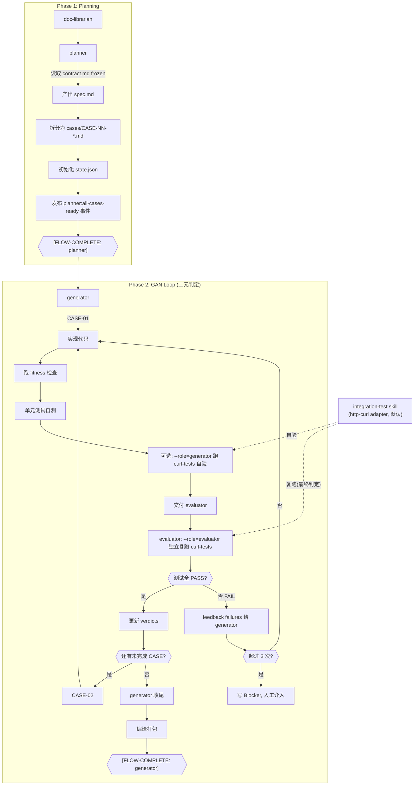
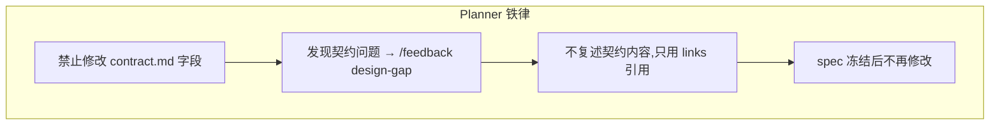
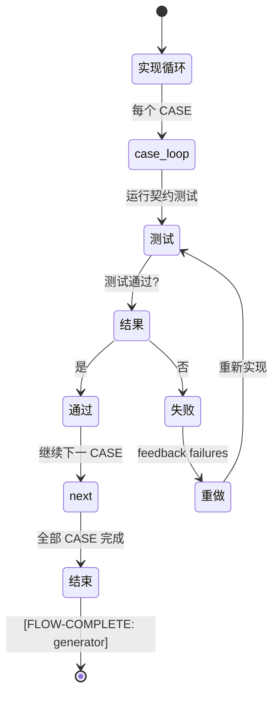
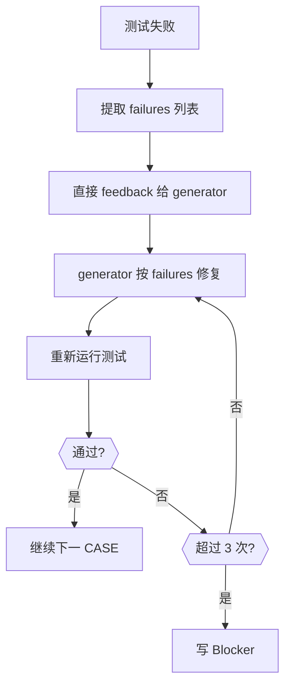
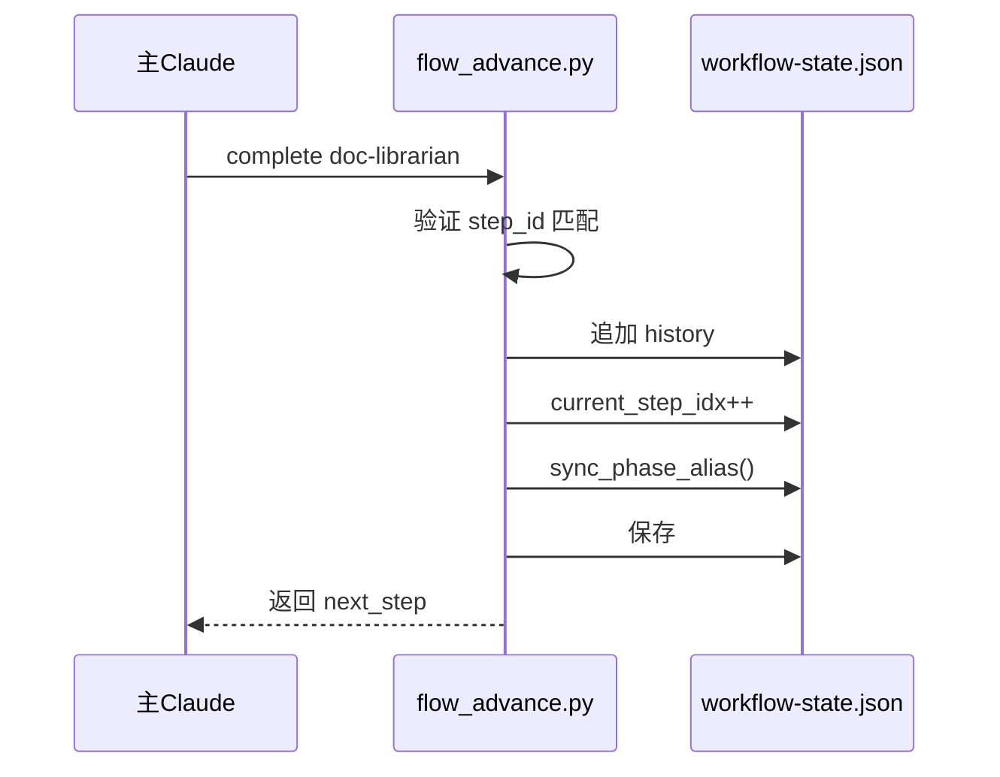

# Planner + GAN 阶段执行分析

> 本文档基于代码研究得出，不依赖 README.md 的描述。

## 整体流程图



## Planner 阶段执行详解

### 输入输出

| 输入 | 输出 |
|------|------|
| `.chatlabs/task/store/<story_id>/contract.md` (status=frozen) | `spec.md` + `cases/CASE-NN-*.md` |
| `.claude/templates/spec.md` 模板 | `cases/<case_id>.tests.yaml`（curl 验收用例，GAN 判定依据） |
| `.claude/templates/story/curl-tests-template.yaml` 模板 | `state.json` |
| `.claude/templates/sprint-contract.md` 模板 | |

### 核心约束



### 关键质量门禁

1. **contract.md 的 status 必须是 frozen**（draft/review 不接单）
2. **每个 case 必须引用 AC-NNN**（无法引用 → 要求 doc-librarian 补 AC）
3. **`affected_files.primary` 非空**（subtask-emit 工时估算依赖此映射）
4. **同一 story 至多 1 个 `kind: setup`**（用于搭骨架）
5. **`<case_id>.tests.yaml` 已生成且 AC 覆盖完整**（kind=feature 必填；yaml 的 ac 集合 ⊇ case.acceptance_criteria；无空 expect.json 用例）

## GAN 循环执行详解

### Generator 两阶段



### 状态追踪机制

**workflow-state.json 结构：**
```json
{
  "story_id": "STORY-123",
  "flow": { "current_step_idx": 3, "current_step_id": "generator" },
  "verdicts": {
    "CASE-01": "PASS",
    "CASE-02": "PASS",
    "CASE-03": "FAIL"
  },
  "phase": "generator",
  "agent": "generator"
}
```

**状态更新规则：**
- 每个 CASE PASS 后立即通过 `TaskJsonStore.update_workflow({"verdicts": {...}})` 写回 task.json
- 不维护 task.json.workflow.verdicts 视为铁律违反

### 测试失败处理



**简化原则（二元判定 + AC 覆盖率）：**
- 测试 PASS/FAIL/ERROR 三态，**无评分、无阈值、无主观维度**
- PASS = `<case>.evaluator.json` 中所有 yaml 用例 status + json 断言全过；FAIL = 任一用例失败；ERROR = 基础设施问题
- ac_coverage 由 yaml 中 `ac` 字段聚合得出（passed_acs / failed_acs），但 verdict 仍以测试结果为准
- Generator 收到 failure 列表后只修复指出的问题，不猜测、不发散
- 超过 3 次循环视为 Blocker，通知人工介入
- Evaluator 必须**独立启服务复跑**，不复用 generator 自验产出（防止环境/数据漂移）

## flow_advance.py 推进机制



**关键点：**
- `sync_phase_alias()` 双写 `phase`/`agent` 字段（兼容旧代码）
- 幂等检查：step 已完成的重复调用返回 noop
- 新代码路由判断使用 `flow.current_step.id`

## TAPD 解耦设计

```
┌─────────────────────────────────────────────────────────────┐
│                    GAN 链路（完全解耦）                       │
├─────────────────────────────────────────────────────────────┤
│  doc-librarian → planner → generator → done                │
│                                                             │
│  GAN 内不感知 TAPD，不触发任何 TAPD 操作                       │
│  TAPD 状态推进只在部署后 flow 自动触发（subtask-emit）        │
└─────────────────────────────────────────────────────────────┘
```

## 关键文件索引

| 文件 | 用途 |
|------|------|
| `.claude/agents/planner.md` | Planner Agent 职责定义 |
| `.claude/agents/generator.md` | Generator Agent 职责定义 |
| `.claude/agents/evaluator.md` | Evaluator Agent 职责定义（独立复跑，二元判定） |
| `.claude/skills/integration-test/SKILL.md` | 集成测试 skill（http-curl 默认 + http-schemathesis fallback） |
| `.claude/skills/integration-test/scripts/adapters/http_curl.py` | curl 显式用例 adapter（二元判定核心） |
| `.claude/scripts/flow_advance.py` | 流程推进器（complete/init/check/reset） |
| `.claude/scripts/workflow-state.py` | 状态读写 + verdict 追踪 |
| `.claude/templates/flows/*.json` | flow 模板定义 |
| `.claude/templates/story/case-template.md` | case 模板（含 quality checklist） |
| `.claude/templates/story/curl-tests-template.yaml` | curl 用例 yaml 模板（GAN 验收依据） |